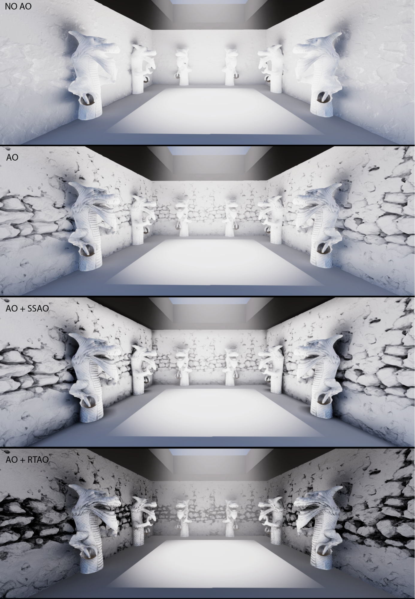

# Ambient occlusion

Ambient occlusion (AO) darkens corners in areas where surfaces are close to each other and difficult for indirect light to reach.

The High Definition Render Pipeline (HDRP) can create ambient occlusion by reducing how much light a surface gets from indirect ambient light sources. For more information about indirect ambient light, refer to [Environment lighting](environment-lighting.md).

**Note:** Ambient occlusion doesn't affect direct lighting.

To enable ambient occlusion, use one of the following methods:

- [Assign an ambient occlusion texture](Ambient-Occlusion.md) for each GameObject.
- [Screen space ambient occlusion (SSAO)](Override-Ambient-Occlusion.md), which uses information from the whole screen. SSAO is enabled by default.
- [Ray-traced ambient occlusion (RTAO)](Ray-Traced-Ambient-Occlusion.md), which uses information from beyond the screen.

If you create an ambient occlusion texture, HDRP also uses it to calculate specular occlusion, by reducing the intensity of reflections in corners.

 
Four versions of a scene with dragon statues in a brick dungeon, lit brightly from above. With no ambient occlusion, there are no shadows in corners and crevices. Ambient occlusion, SSAO with ambient occlusion, and RTAO with ambient occlusion give progressively better results.

## Additional resources

- [Ambient light](https://docs.unity3d.com/Manual/lighting-ambient-light.html)
- [Reflection and refraction](Reflection-in-HDRP.md)
