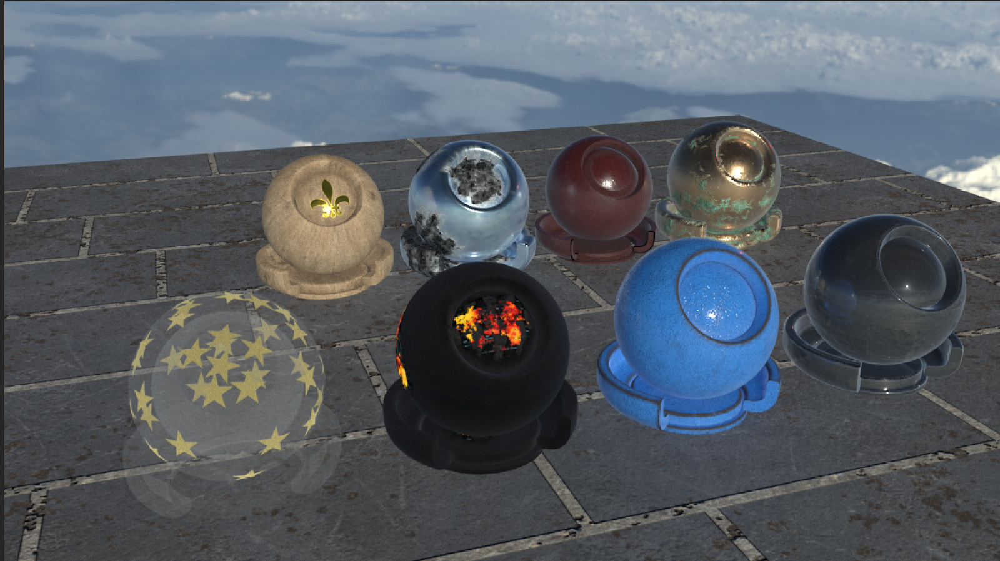
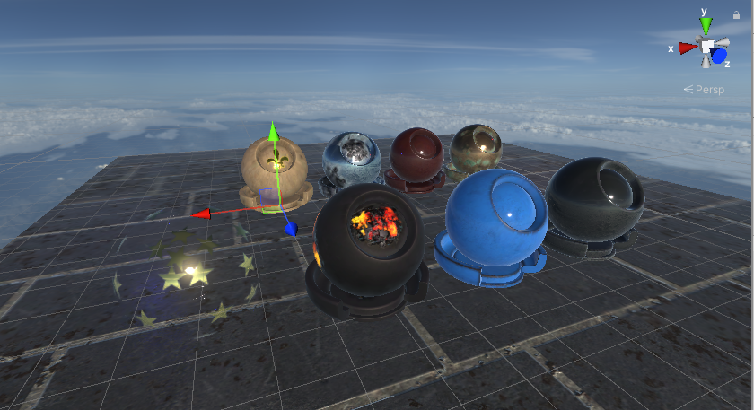

# Arnold Standard Surface shader

The Arnold Standard Surface shader replicates the Arnold Standard Surface shader available in Autodesk® 3DsMax and Autodesk® Maya for the High Definition Render Pipeline (HDRP). When Unity imports an FBX that includes a material using Autodesk's Arnold Standard Surface shader, it applies HDRP's Arnold Standard Surface shader to the material. The material properties and texture inputs are identical between the Unity and Autodesk versions of this shader. The materials themselves also look and respond to light similarly.

**Note**: There are slight differences between what you see in Autodesk® Maya or Autodesk® 3DsMax and what you see in HDRP and HDRP doesn't support some material features.

Arnold Standard materials seen in **Autodesk® Maya** viewport.

The same materials imported from FBX seen in Unity.

Note that the HDRP implementation of this shader uses a Shader Graph.

## Creating an Arnold Standard Surface material

When Unity imports an FBX with a compatible Arnold shader, it automatically creates an Arnold material. If you want to manually create an Arnold Standard Surface material:

1. Create a new material (menu: **Assets** > **Create** > **Material**).
2. In the Inspector for the Material, click the Shader drop-down then click **HDRP** > **ArnoldStandardSurface** > **ArnoldStandardSurface**.

## Properties

### Surface Options

**Surface Options** control the look of your Material's surface and how Unity renders the Material on screen.

<table>
<tr>
<th>Property</th>
<th>Description</th>
</tr>
[!include]
[!include]
[!include]
[!include]
[!include]
[!include]
[!include]
[!include]
[!include]
[!include]
[!include]
[!include]
[!include]
[!include]
[!include]
[!include]
</table>

### Exposed Properties

<table>
<tr>
<th>Property</th>
<th>Description</th>
</tr>
[!include]
[!include]
[!include]
[!include]
[!include]
[!include]
[!include]
[!include]
[!include]
[!include]
[!include]
[!include]
[!include]
[!include]
[!include]
[!include]
[!include]
[!include]
[!include]
[!include]
[!include]
[!include]
[!include]
[!include]
[!include]
</table>

### Advanced Options

<table>
<tr>
<th>Property</th>
<th>Description</th>
</tr>
[!include]
[!include]
[!include]
[!include]
</table>
