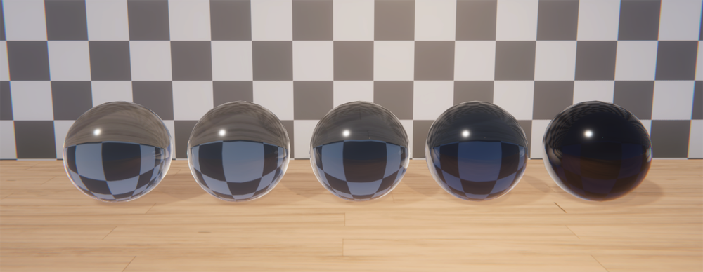
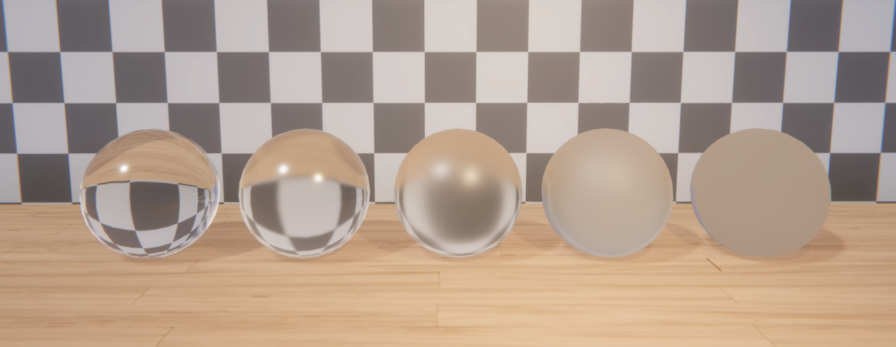

# Create a refractive material
To create a refractive Material:

1. Make sure the Material uses the [HDRP Lit Shader](lit-material.md#creating-a-lit-material).
2. In the [Surface Options](lit-material-inspector-reference.md#surface-inputs) section, set **Rendering Pass** to **Default**.
3. In the Surface Options section, set **Surface Type** to **Transparent**.
4. In the [Surface Inputs](lit-material-inspector-reference.md#surface-inputs) section, select the **Base Map** color picker, then set **Alpha** to a value smaller than 1 to make the Material transparent. Or set **Base Map** to a texture that uses the alpha channel to indicate transparency. A value of 0 means the Material is fully transparent.
5. In the [Transparency Inputs](Surface-Type.md#transparency-inputs) section, select a **Refraction Model** other than **None**.

To create a refractive ShaderGraph:

1. Create a [Lit Shader Graph](lit-material.md).
2. In the [Graph Inspector](https://docs.unity3d.com/Packages/com.unity.shadergraph@15.0/manual/Internal-Inspector.html), in the **Graph Settings** tab, in the **Surface Options** section, set the **Surface Type** to **Transparent**. This adds Transparency settings to the Graph Inspector.
3. Set **Rendering Pass** to **Default**.
4. In the Master Stack, set **Alpha** to a value smaller than 1 to make the Material transparent. A value of 0 means the Material is fully transparent.
5. Select a **Refraction Model** other than **None**. This adds new properties to the Master Stack.

You can now use the Shader Graph to [create a Material](Customizing-HDRP-materials-with-Shader-Graph.md#creation) that's refractive.

## Control refraction

To make refraction more accurate or visible, do the following:

1. [Set the approximate shape of the object](#set-shape), to make light bend accurately.
2. [Set the index of refraction](#set-ior), to control how much light bends.
3. [Set color tint and light absorption](#set-absorption).
4. [Set the smoothness of the material](#set-smoothness), to control blurriness.
5. [Add a Reflection Probe](#add-probe), so you see accurate scene colors through the transparent pixels.
6. [Use an appropriate Proxy Volume shape](#use-proxy-volume).

For information on other properties that control refraction, see [Surface Type](Surface-Type.md).

### Set the approximate shape of the object

Set a refraction model to enable refraction. The refraction model tells HDRP which simple shape most closely matches the internal shape of the object. HDRP uses the shape to calculate how light bends and how far it travels inside the object to the rear surface.

See [refraction models](refraction-models.md) for more information about which model to use.

To set the refraction model:

- In a Material's settings, in the [Transparency Inputs](Surface-Type.md#transparency-inputs) section, select **Refraction Model**.
- In Shader Graph, in the **Graph Inspector**, select **Refraction Model**.

If you [create a Material from a Shader Graph](Customizing-HDRP-materials-with-Shader-Graph.md#creation), you can override the Shader Graph refraction model in the Material's settings.

### Set the index of refraction

Set the correct index of refraction value for your object's material, so light bends accurately when it enters the object.

The index of refraction defines the ratio between the speed of light in a vacuum and the speed of light in the medium of the Material. HDRP uses this as part of the calculation for how much the light bends.

To set the index of refraction:

- In a Material's settings, in the [Transparency Inputs](Surface-Type.md#transparency-inputs) section, set **Index of Refraction**.
- In Shader Graph, in the Master Stack, set **Index of Refraction**.

You can use the following physical values, no matter the object shape.

| **Medium** | **Index of Refraction (IoR)** |
| ---------- | ----------------------------- |
| Air | 1 |
| Water | 1.33 |
| Ice | 1.31 |
| Glass | 1.52 |
| Plastic - plexiglass | 1.49 |
| Plastic - polystyrene | 1.59 |
| Diamond | 2.41 |
| Sapphire | 1.77 |

### Set color tint and light absorption

You can control the color of the refraction effect, and the visibility relative to the object's thickness.

Set the transmission color to control the color tint of the refraction effect. For example for a blue marble, set **Transmission Color** to blue, because the marble transmits blue light but absorbs other colors.

Set the absorption distance to control when the refraction effect becomes fully colorized by the **Transmission Color**. Beyond the absorption distance, the object looks darker until it eventually absorbs all the light.

To make sure absorption distance works, use a **Transmission Color** where the red, green and blue values are below 1.

To set color tint and light absorption:

- In a Material's settings, in the [Transparency Inputs](Surface-Type.md#transparency-inputs) section, set **Transmission Color** and **Absorption Distance**.
- In Shader Graph, in the Master Stack, input a value or map into **Absorption Distance** and **Transmittance Color**.

 
Materials with the same transmission color but decreasing absorption distance from left to right.

### Set smoothness

Use a low smoothness value to create a rough surface. Rough surfaces such as a frosted window produce a blurrier refraction effect than smooth surfaces, because microscopic roughness (asperity) spreads the light and reduces its focus.

To set smoothness:

- In a Material's settings, in the [Surface Inputs](Surface-Type.md) section, set **Smoothness**.
- In Shader Graph, in the Master Stack, set **Smoothness**.

 

### Add a Reflection Probe

To create more accurate reflections, place the object inside the **Influence Volume** of a [Reflection Probe](Reflection-Probe.md).

When a vector leaves the object, it intersects with a point somewhere in the scene.

By default, HDRP uses screen space refraction. This means that HDRP samples the color buffer to find the color at the intersection point. That color becomes the color you see as you look through the transparent pixel on the object.

The color buffer HDRP uses is the first color pyramid that contains only opaque objects, so refractive objects won't be visible through other refractive objects. See [Depth pyramid and color pyramid generation in HDRP](Custom-Pass-buffers-pyramids.md#depth-pyramid-and-color-pyramid-generation-in-hdrp) for more information.

If the intersection point is outside screen space, HDRP tries to fall back to the cubemap texture in a Reflection Probe. If there's no Reflection Probe, HDRP falls back to other sources.

See [How HDRP calculates color for reflection and refraction](how-hdrp-calculates-color-for-reflection-and-refraction.md) for more information.

Use the [Screen Space Refraction override](Override-Screen-Space-Refraction.md) to control how quickly HDRP fades between different sources for the color and avoid visible seams.

### Use an appropriate Proxy Volume shape

To create more accurate reflections, check which Proxy Volume the object uses. See [Proxy Volume](Reflection-Proxy-Volume.md#how-reflection-and-refraction-use-a-proxy-volume) for more information.

If you place the object inside the [Influence Volume](Reflection-Probe-Usage.md) of a Reflection Probe, HDRP uses the Proxy Volume from the probe. For more information about the size and shape of a Proxy Volume in a probe, see [Assign a custom Proxy Volume to a Reflection Probe](Reflection-Proxy-Volume.md#assign-a-custom-proxy-volume-to-a-reflection-probe).

Note: Refraction might not be noticeable if your Material uses the planar refraction model and the probe's Proxy Volume uses the **Infinite** shape.

If the object isn't inside the Influence Volume of a Reflection Probe, HDRP uses the following:

- The **Sphere** Proxy Volume shape with a 10 meter radius, if the Material uses the [sphere refraction model](refraction-models.md#sphere-refraction-model).
- The **Box** Proxy Volume shape with the same dimensions as the Renderer's bounding box, if the Material uses the [planar refraction model](refraction-models.md#planar-refraction-model) or the [thin refraction model](refraction-models.md#thin-refraction-model).

You might see seams or artifacts on the object, because the shape of the environment usually doesn't exactly match the shape of the Proxy Volume. You should try to use a Proxy Volume shape that matches your environment as closely as possible.

## Other types of refraction

You can also use the following:

- [Recursive rendering](Ray-Tracing-Recursive-Rendering.md), which allows refractions to include more than one refractive surface per pixel.
- [Path tracing](Ray-Tracing-Path-Tracing.md), which creates accurate refraction using only indices of refraction and material properties, but is usually too slow for real time rendering because the path tracer casts an actual light path and doesn't approximate shapes or distances.

## Disable refraction

To disable refraction on all Materials, go to **Edit** > **Project Settings** > **Graphics** > **Pipeline Specific Settings** > **HDRP** > **Frame Settings** > **Rendering** and disable **Refraction**.

If you disable **Refraction**, refractive Materials fall back to being opaque.

## Additional resources

- [Reflection probe usage](Reflection-Probe-Usage.md)
- [Proxy Volume](Reflection-Proxy-Volume.md)
