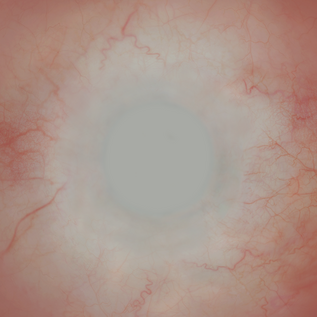
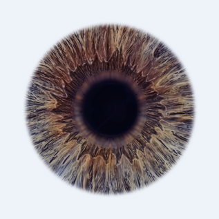

# Create an eye material

## Create an Eye shader material

New Materials in HDRP use the [Lit Shader](lit-material.md) by default. To create an Eye Material:

1. In the Unity Editor, navigate to your Project's Asset window.
2. Right-click the Asset Window and select **Create > Material**. This adds a new Material to your Unity Project’s Asset folder.
3. Click the **Shader** drop-down at the top of the Material Inspector, and select **HDRP > Eye**.

This Eye Material uses the sample Eye Shader Graph. You can only use this Material with the built-in Eye mesh in the [Eye Prefab](#eye-prefab). To create a new Eye Shader graph from scratch, see [Eye Master Stack](create-an-eye-material.md).

## Create an Eye Shader Graph

To create an Eye material in Shader Graph, use one of the following methods:

* Modify an existing Shader Graph:
    1. Open the Shader Graph in the Shader Editor.
    2. In **Graph Settings**, select the **HDRP** Target. If there isn't one, go to **Active Targets,** click the **Plus** button, and select **HDRP**.
    3. In the **Material** drop-down, select **Eye**.

* Create a new Shader Graph:
    * Go to **Assets > Create > Shader Graph > HDRP** and click **Eye Shader Graph**.

## Eye Prefab

To use the sample Eye Shader Graph, you need to use the Eye Prefab from HDRP’s sample Eye scene in your own project. This is because the Eye Shader Graph is dependent on vertex positions in the sample eye mesh which exists in the Eye Prefab. Because of this, HDRP’s Eye Shader Graph isn’t compatible with custom meshes.

To use the sample Eye Shader Graph:

- [Install the Material Samples project](#material-samples).
- [Open the Eye sample scene](#eye-sample-scene).
- [Import the Eye Prefab into your project](#import-eye-prefab).

You can also create your own custom Textures for the Eye Shader Graph. For more information see [Eye Textures](#eye-textures).

### Install the Material Samples project

HDRP includes four sample eyes of different sizes in the Eye sample scene. This scene exists in HDRP’s Material Samples. To install the Material Samples:

1. Open the Package Manager window (**Window** > **Package Management** > **Package Manager**).
2. Open the **Packages** menu and select the **In Project** context.
3. Select the **High Definition RP** package.
4. Expand the **Samples** dropdown.
5. Next to **Material Samples**, select **Import**.

### Open the Eye sample scene

To open the Eye sample scene:

1. In the Project window, go to the **Assets** > **Samples** > **High Definition RP**. Open the folder that matches your current Unity version number, then open **Material Samples.**
2. Right-click the **Eye** scene and select Open.

### Import the Eye Prefab into your project

To import one of the HDRP sample Eye Prefabs into your scene:

1. Open your own scene from the Hierarchy window (if you don’t have a scene, go to **Assets** > **Scene** and give it a name in the Project window).
2. In the Project window, go to **Assets** > **Samples** > **High Definition RP.**  Open the folder that matches your current Unity version number, then open **Material Samples > Prefabs.**
3. Click and drag one of the four Eye Variant Prefabs into the Hierarchy window.

**Tip:** When the eye appears in your scene, it might have a green tint. To remove this green tint, fix the Eye Material’s diffusion profiles:
1. Select the Eye Prefab in the Hierarchy window.
2. In the Inspector window, find the Material that  begins with M_EyeSG and open the dropdown underneath it.
3. Expand **Exposed Properties** > **Sclera**
4. In the information box below **Sclera Diffusion Profile**, click **Fix.**
5. Repeat these steps for the **Iris Diffusion Profile** in the Inspector under **Exposed Properties.**

Inspector window with the **Sclera Diffusion Profile** fix option highlighted.

## Eye Textures

You must provide seperate Texture maps for the Iris and Sclera. This is because of the way that properties for subsurface scattering, limbal ring, smoothness, and other surface information blends between the Iris and Sclera. This means you need to create a Sclera map with no Iris information, and an Iris map with no Sclera information:

