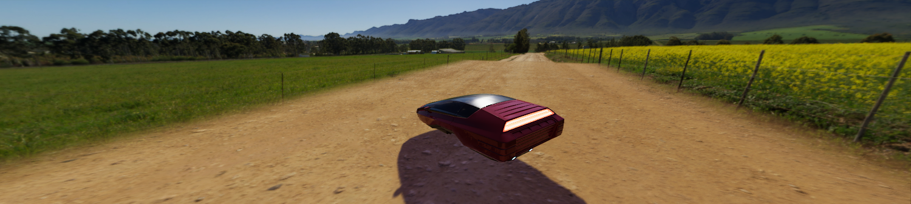

# Create an HDRI sky

A High-dynamic-range imaging (HDRI) Sky is a simple sky representation that uses a cubemap texture. You can define how HDRP updates the indirect lighting the sky generates in the Scene.

Tip: [Unity HDRI Pack](https://assetstore.unity.com/packages/essentials/beta-projects/unity-hdri-pack-72511) is available on the Unity Asset Store and provides 7 pre-converted HDR Cubemaps ready for use within your Project.

## Using HDRI Sky

**HDRI Sky** uses the [Volume](understand-volumes.md) framework, so to enable and modify **HDRI Sky** properties, you must add an **HDRI Sky** override to a [Volume](understand-volumes.md) in your Scene. To add **HDRI Sky** to a Volume:

1. In the Scene or Hierarchy view, select a GameObject that contains a Volume component to view it in the Inspector.
2. In the Inspector, go to **Add Override** > **Sky** and select **HDRI Sky**.

After you add an **HDRI Sky** override, you must set the Volume to use **HDRI Sky**. The [Visual Environment](visual-environment-volume-override-reference.md) override controls which type of sky the Volume uses. To set the Volume to use **HDRI Sky**:

1. In the **Visual Environment** override, go to **Sky** > **Sky Type**.
2. Set **Sky Type** to **HDRI Sky**.

HDRP now renders an **HDRI Sky** for any Camera this Volume affects.

Refer to the [HDRI Sky Volume Override Reference](hdri-sky-volume-override-reference.md) for more information.

[!include]
