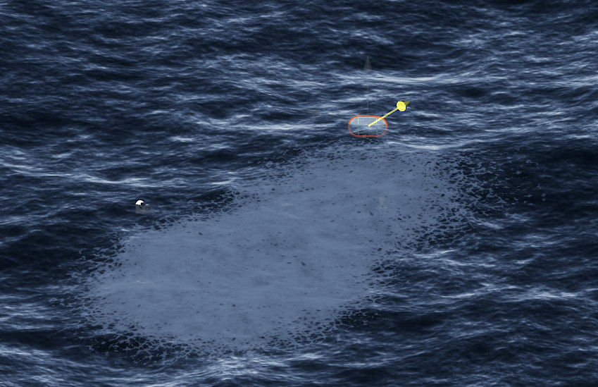

# Create local foam near a GameObject

To create foam on a water surface near a GameObject, follow these steps:

1. In the **Hierarchy** window, open the context menu (right-click) and select **Water** > **Surface**, then create a water surface.

1. In the **Inspector** window of the water surface, in the **Water Decals** section, enable **Foam**.

1. In the **Hierarchy** window, right-click a GameObject and select **Water** > **Surface** > **Water Decal**.

	The new water decal is now a child of the GameObject.

1. In the **Scene** view, move the water decal close to the GameObject.

1. Move the GameObject along the water surface and notice how a trail of foam forms in its wake.

