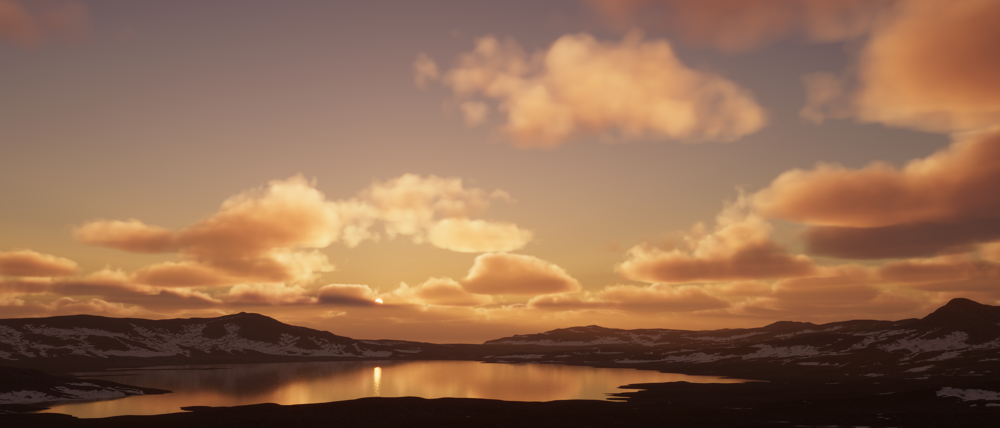

# Create realistic clouds (volumetric clouds)

Volumetric clouds are interactable clouds that can render shadows, and receive fog and volumetric light.

Refer to [Understand clouds](understand-clouds.md) for more information about clouds in the High Definition Render Pipeline (HDRP).

## Enabling Volumetric Clouds

The [**Volumetric Clouds** Volume component override](volumetric-clouds-volume-override-reference.md) controls settings relevant to rendering volumetric clouds.

[!include[](snippets/Volume-Override-Enable-Override.md)]

* In your [HDRP Asset](HDRP-Asset.md) go to **Lighting > Volumetrics > Volumetric Clouds**.

* In your [Frame Settings](Frame-Settings.md) go to **Lighting > Volumetric Clouds**.

## Using Volumetric Clouds

**Volumetric Clouds** uses the [Volume](understand-volumes.md) framework, so to enable and modify **Volumetric Clouds** properties, you must add a **Volumetric Clouds** override to a [Volume](understand-volumes.md) in your Scene. To add a **Volumetric Clouds** override to a Volume:

1. In the Scene or Hierarchy view, select a GameObject that contains a Volume component to view it in the Inspector.
2. In the Inspector, navigate to **Add Override > Sky** and click on **Volumetric Clouds**.

**Note**: When editing Volumetric Cloud properties in the Editor, set **Temporal Accumulation Factor** to a lower value. This allows you to see changes instantly, rather than blended over time.



Refer to the [Volumetric Clouds Volume Override reference](volumetric-clouds-volume-override-reference.md) for more information.

**Note**: The volumetric clouds depend on the planet settings that are set in the [Visual Environment override](visual-environment-volume-override-reference.md).
When **Rendering Space** is set to **World**, the camera can navigate inside the clouds and the clouds are positioned around the planet.
When **Rendering Space** is set to **Camera**, the clouds are always located above the camera.

[!include[](snippets/volume-override-api.md)]

By default, animation data for clouds gets incremented automatically depending on the wind parameters.
In some cases, it can be useful to manually set the animation time, which can be done by using the following script on a Camera:

```cs
using UnityEngine;
using UnityEngine.Rendering;
using UnityEngine.Rendering.HighDefinition;

public class CloudSync : MonoBehaviour
{
    VolumetricClouds.AnimationData data;

    void Update()
    {
        // Save animation data
        if (Input.GetKeyDown(KeyCode.A))
            data = VolumetricClouds.animationData;

        // Set animation data
        if (Input.GetKeyDown(KeyCode.B))
        {
            var camera = this.GetComponent<Camera>();
            var hdCamera = HDCamera.GetOrCreate(camera);
            VolumetricClouds.animationData = data;
            // We reset the camera to discard the history buffer manually 
            hdCamera.Reset(); 
        }
    }
}
```
