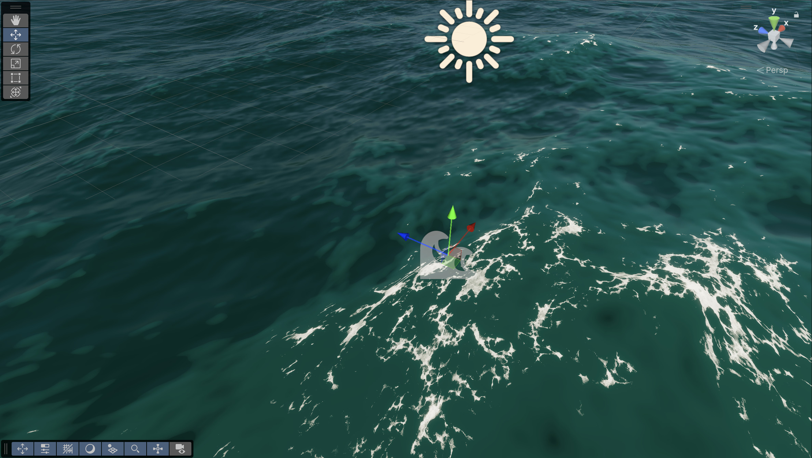

# Create wind-driven foam on the entire water surface

You can create foaming whitecaps to simulate waves breaking when wind speeds exceed a certain threshold.

Simulation foam automatically appears on local maximum on high wave crests depending on the properties set below.

To create foam on the entire water surface:

- In the **Hierarchy** window, open the context menu (right-click) and select **Water** > **Surface**, then create a river, an ocean, a sea, or a lake.

- To create more deep foam, increase the Distant Wind Speed in the **Simulation** section of the **Inspector** window of the water surface.

    
	
    Distant Wind Speed set to 250.

- To create more surface foam, also increase the foam amount in the **Foam** section of the **Inspector** window of the water surface.

    
	
    Distant Wind Speed set to 250 and foam amount set to 1.

- To fine-tune foam generation across wind conditions, edit the Wind Speed Dimmer curve in the **Foam** section of the **Inspector** window of the water surface.

	This control determines the amount of foam that Distant Wind Speed values produce.

	 
	* A: Distant Wind Speed values at the bottom of the curve don't produce any foam.
    * B: Distant Wind Speed values in the range where the curve rises produce some foam.
	* C: Distant Wind Speed values in the range at the top of the curve produce lots of foam.
    * D: The x-axis of this graph represents normalized Distant Wind Speed.
    * E: The y-axis of this graph represents the percentage of the maximum foam amount.
