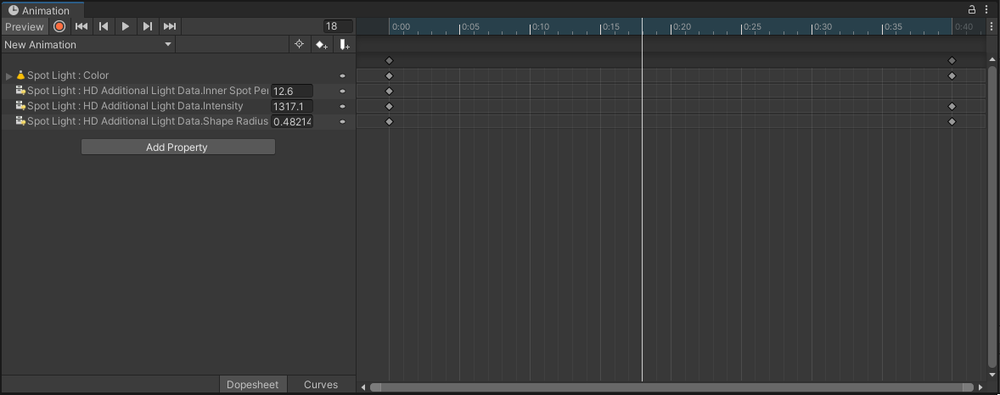

# Create and edit lights at runtime

The High Definition Render Pipeline (HDRP) extends Unity's [Light](https://docs.unity3d.com/Manual/class-Light.html) component with additional data and functionality. To do this, it adds the [HDAdditionalLightData](xref:UnityEngine.Rendering.HighDefinition.HDAdditionalLightData) component to the GameObject that the Light component is attached to. Because of this, you cannot create and edit Lights at runtime in the usual way. This document explains how to create an HDRP [Light](Light-Component.md) at runtime and how to edit its properties.

## Create a new light

HDRP provides a utility function that adds both the Light and HDAdditionalLightData components to a GameObject, and sets up its dependencies. The function is `AddHDLight` and it takes an [HDLightTypeAndShape](xref:UnityEngine.Rendering.HighDefinition.GameObjectExtension.AddHDLight(UnityEngine.GameObject,UnityEngine.Rendering.HighDefinition.HDLightTypeAndShape)) as a parameter which sets the Light's type and shape. The light unit for the intensity will be determined depending on the light type and shape. To learn more about light units and shapes, see the [Light documentation](https://docs.unity3d.com/Packages/com.unity.render-pipelines.high-definition@latest?subfolder=/manual/Light-Component.html).

```cs
using UnityEngine;
using UnityEngine.Rendering.HighDefinition;

public class LightScript : MonoBehaviour
{
    void Start()
    {
        var light = gameObject.AddHDLight(HDLightTypeAndShape.ConeSpot);

        // Setup light parameters here
    }
}
```

There is also a [RemoveHDLight]((https://docs.unity3d.com/Packages/com.unity.render-pipelines.high-definition@latest?subfolder=/api/UnityEngine.Rendering.HighDefinition.GameObjectExtension.html#UnityEngine_Rendering_HighDefinition_GameObjectExtension_AddHDLight_UnityEngine_GameObject_UnityEngine_Rendering_HighDefinition_HDLightTypeAndShape_)) method to remove the light created with AddHDLight.

Note: Another good way of spawning lights is simply by spawning prefabs of lights you configured in the editor, this is also more efficient than manually adding components and setting values.

## Edit an existing Light

HDRP does not use the data stored in the Light component. Instead it stores Light data in another component called `HDAdditionalLightData`. To access a property, use the `HDAdditionalLightData` component, even if the property is visible in the Light component Inspector.

### Change the intensity and color

There are multiple ways of changing the intensity of a light by script. You can either use the **SetIntensity** or assign directly the intensity value but keep in mind that the value you set will use the current light unit of the light component.

Set light intensity in a specified unit:

```cs
light.SetIntensity(5000, LightUnit.Lumen); // Intensity for a street lamp
```

Set light intensity using the current light unit:

```cs
light.intensity = 1200;
```

Set light color:

```cs
light.color = Color.red;
```

Set light color temperature in Kelvin:

```cs
light.SetColor(Color.white, 1900); // 1900K is the color of a candle
```

Note: when you set the color/intensity of the light, it also affects the emissive plane color of area lights if enabled.

## Animate lights

Light in HDRP can be animated like regular lights, though an important thing to note is that the values recorded in the animation are coming from both the HDAdditionalLightData component and Light component as you can see in the image below.



Also, animated lights have a slightly more expensive cost on the CPU because of the additional calculation that needs to be made when light values are changing.
