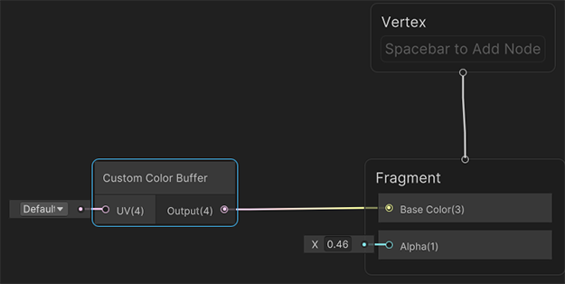

# Create a Custom Pass GameObject

To create a Custom Pass, add a Custom Pass Volume component to your scene using **GameObject > Volume > Custom Pass.** This creates a GameObject called Custom Pass which includes the **Custom Pass Volume** component. You can use this component to create and configure Custom Passes.

<a name="Full-Screen-Custom-Pass"></a>

## Full-screen Custom Pass

A full-screen Custom Pass applies an effect to the whole screen. To achieve this, it renders a full-screen quad using a material that is configured for use with a full-screen Custom Pass, and executes a fragment shader for every pixel on the screen.

To create a full-screen Custom Pass, click the Add (**+**) button at the bottom right of the [**Custom Pass Volume**](Custom-Pass-Volume-Workflow.md) component and select **FullScreeenCustomPass**.

For information about the Full-screen Custom Pass properties, refer to [Custom pass reference](custom-pass-reference.md).

### Create a material to use with a full-screen Custom Pass

To use a full-screen Custom Pass, you need to create a material for your Custom Pass to use. You can do this in one of the following ways: 

- [Create a Material from a full-screen shader graph](#material-from-fullscreen-shadergraph).
- [Create a Material from a full-screen Custom Pass shader](#material-from-fullscreen-custompass).

<a name="material-from-fullscreen-shadergraph"></a>

### Create a Material from a full-screen Shader graph

HDRP includes the [Fullscreen Master stack](fullscreen-master-stack-reference.md) to create a full-screen shader graph that you can use with a custom pass.

To use a Fullscreen shader graph in a custom pass:

1. Create a Fullscreen shader graph (Menu: **Assets** > **Create** > **Shader Graph** > **HDRP** > **Fullscreen Shader Graph**) or use one of the [Fullscreen Samples](create-a-fullscreen-material.md#fullscreen-samples).
2. Create a Material from the Fullscreen Shader Graph. In the **Project** window:
   1. Right-click the Fullscreen Shader graph.
   2. Select **Create** >  **Material.**
3. Create a [Fullscreen Custom Pass](custom-pass-create-gameobject.md#full-screen-custom-pass) and open it in the inspector.
4. In the **Project** window, select the arrow next to the full-screen shader graph.
5. Drag the FullScreen material to the **Fullscreen Material** field.

**Important:** If you use a C# custom pass script that uses the `Blit()` function, you need to take extra steps to make the full screen shader work. For more information, see [Make a Fullscreen material Blit compatible](create-a-fullscreen-material.md#fullscreen-blit-compatible).

<a name="material-from-fullscreen-custompass"></a>

### Create a Material from a full-screen Custom Pass shader

HDRP includes a compatible shader for full-screen custom passes. To create and apply a full-screen shader:

1. Create a full-screen Custom Pass shader. To do this, go to **Assets >** **Create > Shader > HDRP Custom FullScreen Pass.** 
2. Go to the **Hierarchy** and right click on the **Custom FullScreen Pass** shader, then select **Create > Material.** Unity creates a new material with the prefix “FullScreen_”.
3. In the Custom Pass component, select **Add** (**+**) to create a Custom Pass and select **FullScreenCustomPass.**
4. To assign this material to your **FullScreenCustomPass,** open the material picker using the icon at the right of the **FullScreen Material** box and select your “FullScreen_...” material.
5. If you have multiple shader passes, select the **Pass Name** you would like this pass to use.

### Modify a full-screen Custom Pass shader in code

When Unity creates a material for use with a full-screen Custom Pass, it also creates default template code for a Unity shader.

To edit the Unity shader:

1. Select the material in the **Assets** window.
2. Navigate to the **Inspector**.
3. Select **Open**.

This Unity shader source file contains the `FullScreenPass` method where you can add custom shader code for your full-screen Custom Pass:

```c#
float4 FullScreenPass(Varyings varyings) : SV_Target
{
    float depth = LoadCameraDepth(varyings.positionCS.xy);
    PositionInputs posInput = GetPositionInput(varyings.positionCS.xy, _ScreenSize.zw, depth, UNITY_MATRIX_I_VP, UNITY_MATRIX_V);
    float3 viewDirection = GetWorldSpaceNormalizeViewDir(posInput.positionWS);
    float4 color = float4(0.0, 0.0, 0.0, 0.0);

    // Load the camera color buffer at the mip 0 if not currently in the BeforeRendering injection point
    if (_CustomPassInjectionPoint != CUSTOMPASSINJECTIONPOINT_BEFORE_RENDERING)
        color = float4(CustomPassLoadCameraColor(varyings.positionCS.xy, 0), 1);

    // Add your custom pass code here

    // Fade value allows you to increase the strength of the effect while the camera gets closer to the custom pass volume
    float f = 1 - abs(_FadeValue * 2 - 1);
    return float4(color.rgb + f, color.a);
}
```

In your custom code, you can use the following inputs:

- `depth`, which is the depth of the fragment, as a float2.
- `viewDirection` which is the view direction, as a float3.
- `posInput` which is a struct that contains the world space position, as a float3.
- `color`which is the RGBA color value, as a float4.

The `FullScreenPass` method also uses the `_FadeValue` variable, which allows you to increase the strength of an effect as the Camera gets closer to the Custom Pass Volume. This variable only works on local Custom Pass Volumes that have a **Fade Radius** value above 0.

<a name="Draw-Renderers-Custom-Pass"></a>

<a name="readwrite-color-buffer"></a>

## Write to and read from a custom color buffer

To create a full-screen material for a custom pass that uses the Camera color buffer, you need to read from and write to a custom color buffer. This is useful to create effects like blur, color correction or chromatic aberration.

However, you can’t read and write to the same render target in a custom pass. This means you need to create two full-screen custom passes: 

- [A custom pass that writes the Camera’s color buffer into a temporary (custom) color buffer.](#write-custom-buffer)
- [A custom pass that reads from the temporary color buffer.](#read-custom-buffer)

**Note**: If a custom pass adjusts the color of each pixel and not their position, then you can read and write to the color buffer in a single pass. To do this, write a [compute shader](https://docs.unity3d.com/Manual/class-ComputeShader.html) and dispatch it in a custom pass C# file. This method uses fewer resources on the GPU, but it is more complex.

<a name="write-custom-buffer"></a>

### Write to a custom color buffer

To write to the custom color buffer in a full-screen custom pass:

- Create a [full-screen Custom Pass](#Full-Screen-Custom-Pass).
- Assign a Full Screen shader to the **Fullscreen Material** field. For example a shader graph that uses [HD Scene Color node](https://docs.unity3d.com/Packages/com.unity.shadergraph@latest/index.html?preview=1&subfolder=/manual/HD-Scene-Color-Node.html) to write to the Base Color.
- Enable **Fetch Color Buffer.**
- Set the **Target Color Buffer** to **Custom**.

<a name="read-custom-buffer"></a>

### Read from the custom color buffer

To create and assign  a full-screen shader graph that reads from the custom color buffer:

1. [Create a new full-screen shader graph](create-a-fullscreen-material.md#create-fullscreen-shadergraph).
2. Press the Spacebar to open the **Create Node** window
3. In the **Create Node** window, search for the [**Custom Color Buffer**](https://docs.unity3d.com/Packages/com.unity.shadergraph@latest?subfolder=/manual/HD-Custom-Color-Node.html) node
4. Double-click the **Custom Color Buffer** node to create it in your shader graph.
5. Connect the Output port of the **Custom Color Buffer** to the **Base Color** block in the **Fragment** context.
6. In the Custom Pass Volume component that samples from the color buffer, select **Add** (**+**).
7. Select **Full Screen Custom Pass.**
8. In the **FullScreen Material** property, select the material picker (circle).
9. Set the **Target Color Buffer** to **Camera**.
10. Select the material that reads from the color buffer.

This copies the contents of the custom color buffer to the Camera color buffer.



For more information on how to modify a full-screen Shader Graph, see the [full-screen master stack](fullscreen-master-stack-reference.md).

## Draw renderers Custom Pass

Use a draw renderers Custom Pass to apply an effect to GameObjects that are in the Camera’s view.

You can also use this Custom Pass to apply an effect to objects outside of the camera’s view using the options in the **Culling Mask** drop-down property in the [HD Camera](https://docs.unity3d.com/Packages/com.unity.render-pipelines.high-definition@7.1/manual/HDRP-Camera.html) component.

To create a draw renderers Custom Pass, click the Add (**+**) button in the [**Custom Pass Volume**](Custom-Pass-Volume-Workflow.md) component and select **DrawRenderersCustomPass**.

For information about the Draw renderers Custom Pass properties, refer to [Custom pass reference](custom-pass-reference.md).

### ForwardOnly support

Unity uses the **Pass Name** to select which pass of the shader it renders on an HDRP material. To render the object color, select **Forward** or **ForwardOnly**. Use the **DepthForwardOnly** Pass Name if you only want to render the depth of the object.

If you see the "Your HDRP settings do not support ForwardOnly, some objects might not render." warning when you create a new draw renderers CustomPass, this might be due to your [HDRP Asset](https://docs.unity3d.com/Packages/com.unity.render-pipelines.high-definition@10.3/manual/HDRP-Asset.md) settings.

To fix this, navigate to your HDRP Asset in your **Assets** folder (if you are using the HDRP template, this is in **Assets > Settings**) and change the **Lit Shader Mode** to **Both**. For more information, see [Changing the depth of a renderer in your scene](#Changing-Renderer-Depth).

<a name="Material-Injection-Point-Compatibility"></a>

## Material and injection point compatibility

[Injection Points](Custom-Pass-Injection-Points.md) determine when Unity executes a Custom Pass Volume in the render loop.

However, HDRP does not support all materials in every injection point in a draw renderers Custom Pass. The following table lists the materials that each injection point supports for a draw renderers Custom Pass:

| **Injection Point**           | **Material Type(s) supported**                        |
|-------------------------------|-------------------------------------------------------|
| Before Rendering              | Unlit forward but without writing to the Camera color |
| After Opaque Depth And Normal | Unlit                                                 |
| After Opaque Color            | Unlit and Lit, `ForwardOnly`                          |
| Before PreRefraction          | Unlit and Lit, `ForwardOnly`                          |
| Before Transparent            | Unlit and Lit, `ForwardOnly`                          |
| Before Post Process           | Unlit and Lit, `ForwardOnly`                          |
| After Post Process            | Unlit and Lit, `ForwardOnly`                          |

**Note**: You can only render Materials that use refraction at the Before Transparent, Before Post Process, and After Post Process injection points because this is when the refraction color pyramid is available.

When Unity renders a material that isn't supported by the current injection point, it results in an undefined behavior. For example, rendering GameObjects with lit shaders in the **After Opaque Depth And Normal** injection point produces unexpected results.

**Note**: HDRP doesn't support decals on GameObjects rendered in the DrawRenderers pass.

**Note**: When rendering a [Terrain](https://docs.unity3d.com/Manual/terrain-UsingTerrains.html) with the DrawRenderers custom pass, only the override mode "Shader" is supported. Also, the replacement shader must be compatible with terrain rendering (like the HDRP/TerrainLit shader).

<a name="Object-ID-Custom-Pass"></a>

## Object ID Custom Pass

The **Object ID Custom Pass** draws GameObjects in the scene with a unique color controlled by the `Object ID`. It uses a built-in Material to draw the Object ID colors.

For information about the Draw renderers Custom Pass properties, refer to [Custom pass reference](custom-pass-reference.md).

### Generate Object IDs for a custom pass

HDRP generates Object IDs before executing an Object ID custom pass.

If you use a script to generate new GameObjects procedurally, call `AssignObjectIDs` to generate new Object IDs.

The following script example shows the default `AssignObjectIDs` implementation that assigns Object ID colors incrementally:

```c#
public virtual void AssignObjectIDs()
{
    var rendererList = Resources.FindObjectsOfTypeAll(typeof(Renderer));

    int index = 0;
    foreach (Renderer renderer in rendererList)
    {
        MaterialPropertyBlock propertyBlock = new MaterialPropertyBlock();
        float hue = (float)index / rendererList.Length;
        propertyBlock.SetColor("ObjectColor", Color.HSVToRGB(hue, 0.7f, 1.0f));
        renderer.SetPropertyBlock(propertyBlock);
        index++;
    }
}
```

### Generate a Custom Object ID

To customize the way Unity generates a Object ID, override the `AssignObjectIDs` method. The following script example uses this method to assign Object ID colors randomly:

```c#
class RandomObjectIDs : ObjectIDCustomPass
{
    public override void AssignObjectIDs()
    {
        var rendererList = Resources.FindObjectsOfTypeAll(typeof(Renderer));
        System.Random rand = new System.Random();

        int index = 0;
        foreach (Renderer renderer in rendererList)
        {
            MaterialPropertyBlock propertyBlock = new MaterialPropertyBlock();
            float hue = (float)rand.NextDouble();
            propertyBlock.SetColor("ObjectColor", Color.HSVToRGB(hue, 0.7f, 1.0f));
            renderer.SetPropertyBlock(propertyBlock);
            index++;
        }
    }
}
```

<a name="Custom-Renderers-Pass-shader"></a>

## Custom Renderers Pass shader

You can create advanced Custom Pass effects using a Custom Renderers Pass shader. To create this shader, navigate to **Assets > Create > Shader > HDRP > Custom Renderers Pass**. This creates an unlit HDRP shader named **New Renderers CustomPass**. This Unity shader has one ShaderLab pass.

### Use a Custom Renderers Pass shader to create advanced effects

HDRP includes a specific shader structure to store the data that the render pipeline uses to render materials in your scene. The Fragment shader code section describes these structures.

### Fragment shader code

To write fragment shader code in the Custom Renderers Pass shader, use the `GetSurfaceAndBuiltinData` method.

This method accepts the following inputs:

1. A `FragInputs` structure that contains all the geometry inputs passed into the fragment shader. For information about the properties in this structure, see [FragInput](#Fraginputs).
2. A `float3` that contains the current pixel's view direction.
3. A `PositionInputs` structure that contains position-based utility properties you might require in your shader. For information about the properties in this structure, see [PositionInputs](#PositionInputs).

The `GetSurfaceAndBuiltinData` method does not use `return` to output results. Instead, it has two parameters that use the [out](https://docs.microsoft.com/en-us/dotnet/csharp/language-reference/keywords/out-parameter-modifier) modifier. The reason for this is to support different outputs depending on the shader's surface type. The outputs are:

1. A `SurfaceData` structure that contains the final color. For information about the properties in this structure, see [SurfaceData](#SurfaceData).
2. A `BuiltinData` structure that contains additional information that HDRP can use to calculate particular effects. For information about the properties in this structure, see [BuiltinData](#BuiltinData).

The following example demonstrates how to use the `GetSurfaceAndBuiltinData` method to write fragment shader code. This example samples the color of the `_ColorMap` texture, uses the alpha channel to perform an alpha test, then outputs the texture color for the surface:

```c#
// Put the code to render the GameObjects in your Custom Pass in this method
void GetSurfaceAndBuiltinData(FragInputs fragInputs, float3 viewDirection, inout PositionInputs posInput, out SurfaceData surfaceData, out BuiltinData builtinData)
{
    float2 colorMapUv = TRANSFORM_TEX(fragInputs.texCoord0.xy, _ColorMap);
    float4 result = SAMPLE_TEXTURE2D(_ColorMap, s_trilinear_clamp_sampler, colorMapUv) * _Color;
    float opacity = result.a;
    float3 color = result.rgb;

#ifdef _ALPHATEST_ON
    DoAlphaTest(opacity, _AlphaCutoff);
#endif

    // Write back the data to the output structures
    ZERO_INITIALIZE(BuiltinData, builtinData); // No call to InitBuiltinData as we don't have any lighting
    builtinData.opacity = opacity;
    builtinData.emissiveColor = float3(0, 0, 0);
    surfaceData.color = color;
}
```

<a name="Fraginputs"></a>

#### FragInputs

`FragInputs` is a structure that stores all the geometry inputs passed to the fragment stage:

```c#
struct FragInputs
{
    float4 positionSS; // In case depth offset is use, positionRWS.w is equal to depth offset
    float3 positionRWS; // Relative camera space position
    float4 texCoord0; // UV0
    float4 texCoord1; // UV1
    float4 texCoord2; // UV2
    float4 texCoord3; // UV3
    float4 color; // vertex color
    float3x3 tangentToWorld;
    bool isFrontFace;
};
```

<a name="PositionInputs"></a>

#### PositionInputs

`PositionInputs` provides another set of properties you may need to use in your shaders. You can think of it as a utility structure to access position-related properties. The depth comes from the current camera depth buffer and `tileCoord` is not available (it’s only used in compute shaders):

```c#
struct PositionInputs
{
    float3 positionWS;  // World space position (could be camera-relative)
    float2 positionNDC; // Normalized screen coordinates within the viewport    : [0, 1) (with the half-pixel offset)
    uint2  positionSS;  // Screen space pixel coordinates                       : [0, NumPixels)
    uint2  tileCoord;   // Screen tile coordinates                              : [0, NumTiles)
    float  deviceDepth; // Depth from the depth buffer                          : [0, 1] (typically reversed)
    float  linearDepth; // View space Z coordinate                              : [Near, Far]
};
```

<a name="SurfaceData"></a>

#### SurfaceData

The `SurfaceData` structure allows you to set the color of an object’s surface. It has a different representation for each material type. For an unlit shader, it only includes a single field that represents the color of the unlit object:

```c#
struct SurfaceData
{
    float3 color;
};
```

<a name="BuiltinData"></a>

#### BuiltinData

The `BuiltinData` structure contains additional information you can pass on to HDRP:

```c#
struct BuiltinData
{
    real opacity; // Translucency of your object
    real alphaClipTreshold; // The threshold for alpha clipping
    real3 bakeDiffuseLighting;
    real3 backBakeDiffuseLighting;
    real shadowMask0;
    real shadowMask1;
    real shadowMask2;
    real shadowMask3;
    real3 emissiveColor; // Emissive color
    real2 motionVector; // Not yet supported
    real2 distortion; // Distortion vector
    real distortionBlur; // Distortion blur level [0, 1]
    uint renderingLayers;
    float depthOffset; // Depth offset
    real4 vtPackedFeedback;
};
```

### Vertex shader code

To write vertex shader code in the Custom Renderers Pass shader, use the ApplyMeshModification method . By default, the shader comments this method out, so to use it, remove the comment slashes (//). You can use this method to add vertex deformation or vertex animation to your Unity shader.

For its input, this method takes:

1. An AttributesMesh structure that contains the current vertex and its properties. For information about the properties in this structure, and which defines they map to, see [AttributesMesh](#AttributesMesh).
2. A float3 that contains the current `timeParameters`. In this float, the **x** value refers to time in seconds, the **y** value is sin(x) and the **z** value is cos(x).

For its output, this method returns an `AttributesMesh` that represents the modified vertex. The usual workflow is to modify the input `AttributesMesh` and return that.

Note that transformations in this method are in object space. If you want to apply transformations in world space:

1. Convert the object space data to world space. Use the `TransformObjectToWorld` method to convert position data and `TransformObjectToWorldDir` to convert normal data.
2. Apply the transformations.
3. Convert the world space data back to object space. Use the `TransformWorldToObject` method to convert position data and `TransformWorldToObjectDir` to convert normal data.

For an example on how to use this method to write vertex shader code, see the following code sample. This example modifies the vertex data to slightly enlarge the mesh and avoid [z-fighting](Glossary.md#ZFighting):

```c#
#define HAVE_MESH_MODIFICATION
AttributesMesh ApplyMeshModification(AttributesMesh input, float3 timeParameters)
{
    input.positionOS += input.normalOS * 0.0001; // Enlarges the mesh slightly to avoid z-fighting.
    return input;
}
```

<a name="AttributesMesh"></a>

#### AttributesMesh

The `AttributesMesh` structure has the following definitions:

```c#
struct AttributesMesh
{
    float3 positionOS   : POSITION;
    float3 normalOS     : NORMAL;
    float4 tangentOS    : TANGENT; // Store sign in w
    float2 uv0          : TEXCOORD0;
    float2 uv1          : TEXCOORD1;
    float2 uv2          : TEXCOORD2;
    float2 uv3          : TEXCOORD3;
    float4 color        : COLOR;
};
```

### Sample UVs in the fragment shader

Unity uses the following defines to send data to the vertex and fragment shaders:

- `ATTRIBUTES_NEED_TEXCOORD0`
- `VARYINGS_NEED_TEXCOORD0`

You can use the `ATTRIBUTES_NEED` and `VARYINGS_NEED` systems to determine what data Unity sends to the vertex and fragment shader. `ATTRIBUTES_NEED` controls the vertex data and `VARYINGS_NEED` controls the fragment data. You can control this data using the following list of defines:

```c#
#define ATTRIBUTES_NEED_NORMAL
#define ATTRIBUTES_NEED_TANGENT
#define ATTRIBUTES_NEED_TEXCOORD0
#define ATTRIBUTES_NEED_TEXCOORD1
#define ATTRIBUTES_NEED_TEXCOORD2
#define ATTRIBUTES_NEED_TEXCOORD3
#define ATTRIBUTES_NEED_COLOR

#define VARYINGS_NEED_POSITION_WS
#define VARYINGS_NEED_TANGENT_TO_WORLD
#define VARYINGS_NEED_TEXCOORD0
#define VARYINGS_NEED_TEXCOORD1
#define VARYINGS_NEED_TEXCOORD2
#define VARYINGS_NEED_TEXCOORD3
#define VARYINGS_NEED_COLOR
#define VARYINGS_NEED_CULLFACE
```

You can access UV 0 and normals by default using `ATTRIBUTES_NEED_TEXCOORD0` and `ATTRIBUTES_NEED_NORMAL`.

<a name="Changing-Renderer-Depth"></a>

### Change the depth of a renderer in your scene

You can override the depth state of any renderer component in your Custom Pass. This replaces the depth states of the GameObjects rendered in your scene with the depth render states assigned in the [Custom Pass Volume](Custom-Pass-Volume-Workflow.md) component. You might want to use this to make some GameObjects in your scene invisible in a Custom Pass.

You can also use this method to render GameObjects in a Custom Pass that are not in the Camera culling mask. Unity renders opaque GameObjects that are not in the Camera [Culling Mask](https://docs.unity3d.com/Packages/com.unity.render-pipelines.high-definition@10.2/manual/HDRP-Camera.html) in the **Equal** depth test. You can only change the depth state of a renderer if the GameObject is in the depth buffer. To include these opaque GameObjects in the depth buffer, go to the Custom Pass Volume component and set the **Depth Test** property to **Less Equal**.

Unity renders all objects in a Custom Pass using the Forward rendering path**.** This can cause issues if your scene is set to render using **Deferred Only**. In the [**HDRP Asset**](https://docs.unity3d.com/Packages/com.unity.render-pipelines.high-definition@10.3/manual/HDRP-Asset.md), change the **Lit Shader Mode** to **Both** to avoid issues when you build your project.

### Use the Custom Buffer

You can use custom buffers to store the result of your passes, and execute that later in the rendering process, or between two Custom Passes. You can sample these custom buffers in any kind of Custom Pass shader using the following functions:

- `SampleCustomColor(float2 uv)`
- `SampleCustomDepth(float2 uv)`

You can also load custom buffers using the following functions:

- `LoadCustomColor(uint2 pixelCoords)`
- `LoadCustomDepth(uint2 pixelCoords)`

Note that depending on the injection point used for the Fullscreen custom pass, sampling the custom buffer can result in incorrect scaling. Thus it's recommended to use these functions instead:

- `CustomPassSampleCustomColor(float2 uv)`
- `CustomPassLoadCustomColor(uint2 pixelCoords)`

HDRP sets the custom pass target buffers to the Camera buffers by default. However, you can select a custom buffer in the UI of the Custom Pass. To do this, go to your Custom Pass component and change the **Target Color Buffer** or **Target Depth Buffer** properties.

To change the buffer format of the Custom Pass component in your HDRP asset, go to **Rendering > Custom Pass > Custom Buffer Format** and select one of the following formats from the drop down menu:

| **Format**   | **Bits Per Pixel** | **Description**                                              |
| ------------ | ------------------ | ------------------------------------------------------------ |
| R8G8B8A8     | 32                 | This format is the most resource efficient, but it might cause banding issues. HDRP uses this format by default. |
| Signed R8G8B8A8 | 32              | This format is similar to R8G8B8A8 but you can store unsigned data. |
| R11G11B10    | 32                 | This format has a higher precision than R8G8B8A8 but does not support alpha channels. |
| R16G16B16A16 | 64                 | This format has the highest precision but uses twice as much memory as R8G8B8A8 and R11G11B10. |

You can sample the custom color and depth buffers in Shader Graph using the following nodes:
- [Custom Color Node](https://docs.unity3d.com/Packages/com.unity.shadergraph@latest?subfolder=/manual/HD-Custom-Color-Node.html)
- [Custom Depth Node](https://docs.unity3d.com/Packages/com.unity.shadergraph@latest?subfolder=/manual/HD-Custom-Depth-Node.html)

## Disable custom passes

You can disable Custom Passes in one of the following ways:

- In [Frame Settings](Frame-Settings.md): Go to **Edit** > **Project Settings** > **Graphics** > **Pipeline Specific Settings** > **HDRP**. You can then disable custom passes in one of the following places:

- - To disable custom passes in the Camera, go to **Frame Settings > Rendering** section and disable the **Custom Pass** property. This disables custom passes in the Camera, but not for reflection probes.
  - To disable custom passes for planar reflection probes and reflection probes that are not baked, go to **Frame Settings > Realtime Reflection** and disable the **Custom Pass** property.
  - To disable custom passes for baked reflection probes, go to **Frame Settings > Baked** and disable the **Custom Pass** property.

* [HDRP Asset](HDRP-Asset.md): Open the HDRP Asset, navigate to **Rendering** and disable the **Custom Pass** property. This automatically disables the custom buffer allocation.
