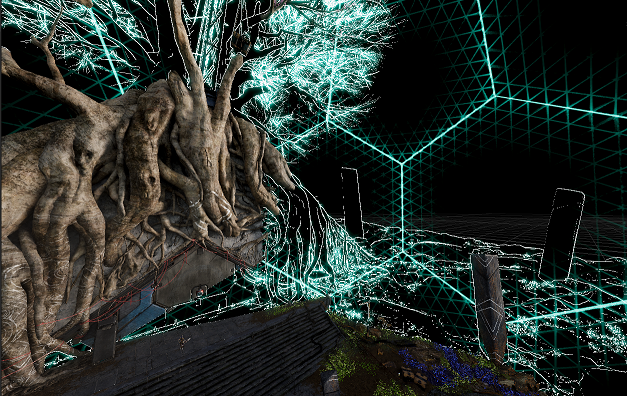

# **Understand Custom Passes**

A **Custom Pass** controls how Unity renders the objects in a scene. You can configure a Custom Pass using a Custom Pass Volume. Custom pass Volumes function in a similar way to [HDRP Volumes](https://docs.unity3d.com/Packages/com.unity.render-pipelines.high-definition@10.0/manual/Volumes.html). A Custom Pass allows you to do the following:

- Change the appearance of materials in your scene.
- Change the order that Unity renders GameObjects in.
- Allows Unity to read camera buffers to shaders.

For example, you can use a Custom Pass to blur the background of a camera’s view while the in-game UI is visible.

Unity executes a Custom Pass at a certain point during the HDRP render loop using an [Injection Point](Custom-Pass-Injection-Points.md). You can change the injection point to control how the Custom Pass affects the appearance of your scene.

You define the visual effect of a Custom Pass in a Unity shader, and then assign a material that uses that Unity shader to the Custom Pass Volume. You can create a Unity shader to use in a Custom Pass using Shader Graph, or you can write a Unity shader using C# and HLSL. For information about writing your own Custom Pass Unity shader, see [Custom Renderers Pass shader](custom-pass-create-gameobject.md#custom-renderers-pass-shader).

