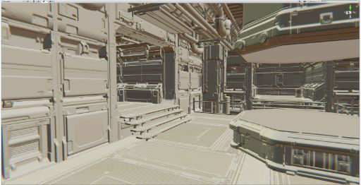

# Debug materials and shaders (MatCap mode)

In MatCap mode, the High Definition Render Pipeline (HDRP) replaces the functionality of the Scene view's Lighting button with a material capture (MatCap) view. MatCap mode uses an image that completely captures a Material, including baked-in lighting. When using MatCap mode, HDRP replaces all the Materials and lighting in the Scene with what's in the MatCap.

MatCap mode is useful to navigate and get a sense of the Scene without setting up the Scene lighting. For example, if you were to edit a dark area, like the inside of a cave, MatCap mode makes it much easier to navigate in this low lighting.

## Using MatCap

To activate MatCap mode, disable the Lighting toggle in the [Scene view Debug Mode overlay](https://docs.unity3d.com/Manual/ViewModes.html).

MatCap mode preserves the normal maps and you can use the original Material albedo. To configure MatCap mode, go to **Edit** > **Preferences** > **HD Render Pipeline** and use the following properties.

## Properties

1. Open the **Graphics** tab in the **Preferences** window (menu: **Edit > Preferences > Graphics**).
2. Under **High Definition Render Pipeline** and **MatCap Mode**:

| **Property**              | **Description**                                              |
| ------------------------- | ------------------------------------------------------------ |
| **Mix Albedo** | Enable to make HDRP mix the albedo of the Material with its material capture. |
| **Intensity Scale** | Set the intensity of the material capture. This increases the brightness of the Scene. This is useful if the albedo darkens the Scene considerably. |

## Default material captures

HDRP provides neutral and metallic default MatCaps. You can change the MatCap in your [HDRP Asset's](HDRP-Asset.md) **HDRenderPipelineResources**. To do this:

1. Select the HDRP Asset in the Project window to view it in the Inspector.
2. Enter [Debug mode](https://docs.unity3d.com/Manual/InspectorOptions.html) then find the **Render Pipeline Resources** property.
3. Double-click the asset assigned to the **Render Pipeline Resources** property to view it in the Inspector.
4. Go to the **Textures** section and assign your custom MatCap Texture to the **MatCap Tex** property.

You can also activate MatCap view as a **Lighting Debug Mode** in the [Rendering Debugger](use-the-rendering-debugger.md).

## MatCap examples

 
MatCap off

 
MatCap on

 
MatCap on with albedo
