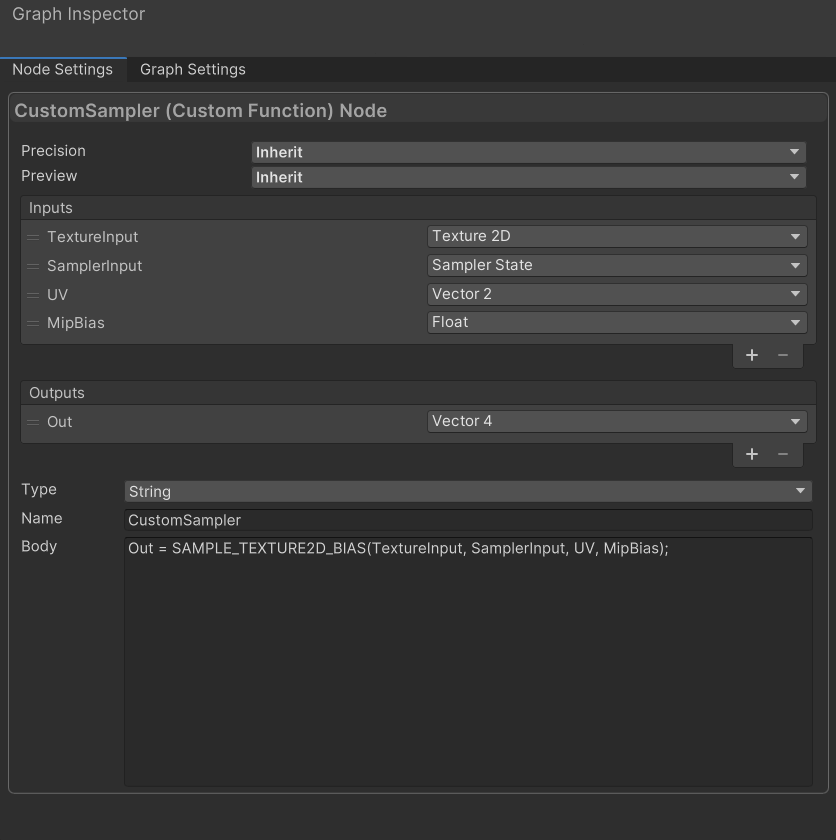
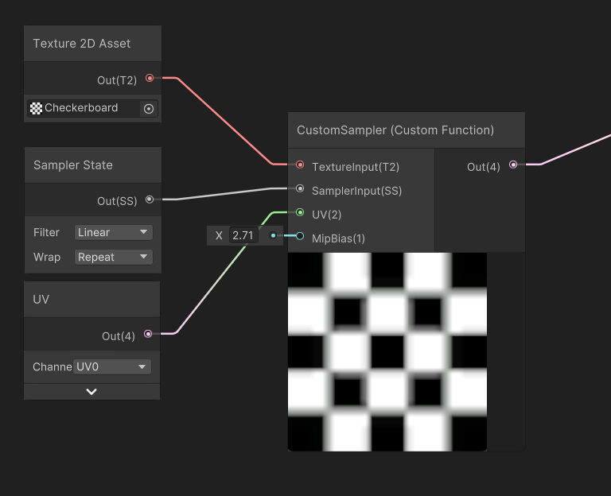

# Deep learning super sampling (DLSS)

NVIDIA Deep Learning Super Sampling (DLSS) is a rendering technology that uses artificial intelligence to increase graphics performance. The High Definition Render Pipeline (HDRP) natively supports DLSS. For more information about DLSS see [Deep learning super sampling](https://docs.unity3d.com/Manual/deep-learning-super-sampling.html).

## Requirements and compatibility

This section includes HDRP-specific requirements and compatibility information for DLSS. For information about the general requirements and compatibility of DLSS, see [Deep learning super sampling](https://docs.unity3d.com/Manual/deep-learning-super-sampling.html).

### Platforms

HDRP supports DLSS on the following platforms:

* DirectX 11 on Windows 64 bit
* DirectX 12 on Windows 64 bit
* Vulkan on Windows 64 bit

**Note**: HDRP doesn't support DLSS for Metal, Linux, Windows using x86 architecture (Win32), or any other platform.

To build your project for Windows, use x86_64 architecture (Win64).

For information about the hardware requirements of DLSS, see [NVIDIA'S DLSS requirements](https://developer.nvidia.com/nvidia-dlss-access-program).

## Using DLSS

To use DLSS in your scene:

1. Add the NVIDIA package. You can either do this automatically or manually.

    * To install the NVIDIA package automatically:

        1. Select an [HDRP Asset](HDRP-Asset.md) and view it in the Inspector.
        2. Go to **Rendering** > **Dynamic Resolution** and click **Install NVIDIA Package**.

    * To install the NVIDIA package manually:

        1. Open the [Package Manager window](https://docs.unity3d.com/Manual/upm-ui.html) (menu: **Window** > **Package Manager**).
        2. Select **Packages**, then select **Built-in**.
        3. In the packages list view, find and select the NVIDIA package.
        4. In the bottom right of the package-specific detail view, select **Enable**.

2. Enable DLSS in your HDRP Asset.

    1. Select the HDRP Asset you want to enable DLSS for and view it in the Inspector.
    2. Go to **Rendering** > **Dynamic Resolution** and select **Enable**.
    3. In the **Dynamic Resolution** section, select the **Enable DLSS** property to expose other properties that you can use to customize DLSS. For information about these properties, see the [HDRP Asset](HDRP-Asset.md) documentation.

3. Enable DLSS for each Camera you want to use it with.

    1. In the Hierarchy or Scene view, select a Camera and view it in the Inspector.
    2. Select **Allow Dynamic Resolution** to expose the DLSS settings. For more information see the [Dynamic Resolution](Dynamic-Resolution.md) guide.
    3. Enable **Allow DLSS** to expose other properties that you can use to customize DLSS for the Camera. For information about these properties, see the [Camera](hdrp-camera-component-reference.md) documentation.

4. Set the DLSS quality mode. You can do this on a project level or a per-Camera level. For information about the available quality modes, see [Quality modes](https://docs.unity3d.com/Manual/deep-learning-super-sampling.html).

    * To change the DLSS quality mode for your whole project:

        1. Select the HDRP Asset that has DLSS enabled and view it in the Inspector.
        2. Go to **Rendering** > **Dynamic Resolution** > **DLSS** and set the **Mode** property to the quality mode you want.

    * To override the DLSS quality mode for a particular Camera:

        1. In the Hierarchy or Scene view, select a Camera and view it in the Inspector.
        2. Select **Use Custom Quality**.
        3. Set the **Mode** property to the quality mode you want.

### DLSS and Dynamic Resolution

The **Use Optimal Settings** checkbox in the [HDRP Assets](HDRP-Asset.md) is enabled by default. This means that DLSS sets the dynamic resolution scale automatically.
If you disable this checkbox DLSS uses the same dynamic resolution scale set by the project. For more information see the [Dynamic Resolution](Dynamic-Resolution.md) guide.

### Mip bias in DLSS

To enable automatic mip bias correction when you enable DLSS, open the [HDRP Asset](HDRP-Asset.md) and enable the **Use Mip Bias** checkbox.

If you need a specific custom mip bias for a Texture, create a custom sampler that samples from TextureInput, SamplerInput, UV, and MipBias. To do this, enter the following script into the Node Settings ' Body field. The images below display this example:

```glsl
Out = SAMPLE_TEXTURE2D_BIAS(TextureInput, SamplerInput, UV, MipBias);
```






## Additional resources

- [Introduction to changing resolution scale](https://docs.unity3d.com/6000.0/Documentation/Manual/resolution-scale-introduction.html)

