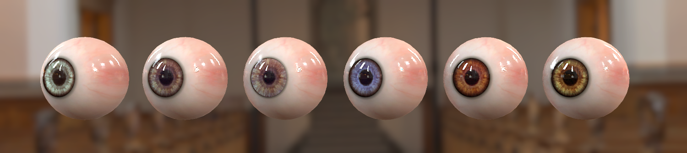
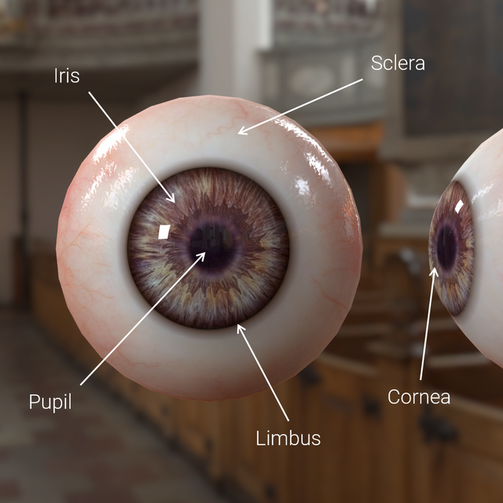
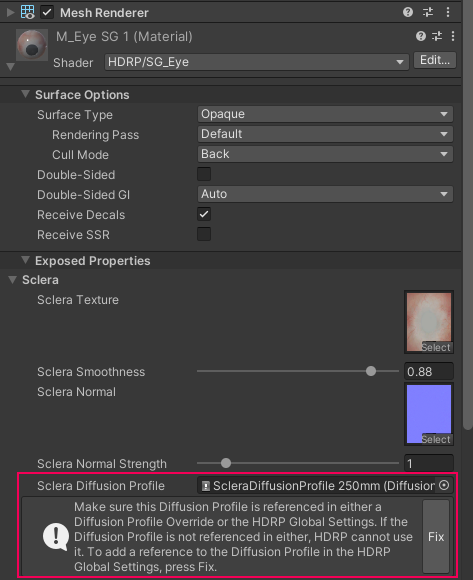

# Eye Shader
The Eye Shader is your starting point for rendering eyes in the High Definition Render Pipeline (HDRP). Use it to exhibit important phenomena like cornea refraction, caustics, pupil dilation, limbal darkening, and subsurface scattering to bring your characters to life.

Under the hood, the Eye shader is a pre-configured Shader Graph. To use the Eye Shader Graph, you need to use the sample [Eye Prefab](#eye-prefab) in your project. To learn more about the Eye shader implementation, or to create your own Eye shader variant, see the Shader Graph documentation about the [Eye Master Stack](master-stack-eye.md).

## Eye anatomy

When rendering eyes, it’s helpful to become familiar with their biological structure to produce a realistic outcome.
* The **Iris** is the flat, colored, ring that surrounds the Pupil. It sits underneath the Cornea.
* The **Cornea** is the transparent lens on top of the Iris. It reflects and focuses light into the Pupil.
* The **Pupil** is the opening in the Iris that allows light to pass into the eye and reach the retina.
* The **Limbus**, or the Limbal Ring, is the darkened bordering region between the Cornea and the Sclera.
* The **Sclera** is the opaque, protective outer layer of the eye.  

## Creating an Eye Material

New Materials in HDRP use the [Lit Shader](Lit-Shader.md) by default. To create an Eye Material:

1. In the Unity Editor, navigate to your Project's Asset window.
2. Right-click the Asset Window and select **Create > Material**. This adds a new Material to your Unity Project’s Asset folder.
3. Click the **Shader** drop-down at the top of the Material Inspector, and select **HDRP > Eye**.

This Eye Material uses the sample Eye Shader Graph. You can only use this Material with the built-in Eye mesh in the [Eye Prefab](#eye-prefab). To create a new Eye Shader graph from scratch, see [Eye Matster Stack](master-stack-eye.md).

## Eye Prefab

To use the sample Eye Shader Graph, you need to use the Eye Prefab from HDRP’s sample Eye scene in your own project. This is because the Eye Shader Graph is dependent on vertex positions in the sample eye mesh which exists in the Eye Prefab. Because of this, HDRP’s Eye Shader Graph isn’t compatible with custom meshes. 

To use the sample Eye Shader Graph:

- [Install the Material Samples project](#material-samples).
- [Open the Eye sample scene](#eye-sample-scene).
- [Import the Eye Prefab into your project](#import-eye-prefab).

You can also create your own custom Textures for the Eye Shader Graph. For more information see [Eye Textures](#eye-textures).

#### Install the Material Samples project

HDRP includes four sample eyes of different sizes in the Eye sample scene. This scene exists in HDRP’s Material Samples. To install the Material Samples:

1. Open the Package Manager window (**Window** > **Package Manager**).
2. Open the **Packages** menu and select the **In Project** context.
3. Select the **High Definition RP** package.
4. Expand the **Samples** dropdown.
5. Next to **Material Samples**, select **Import**.

#### Open the Eye sample scene

To open the Eye sample scene: 

1. In the Project window, go to the **Assets** > **Samples** > **High Definition RP**. Open the folder that matches your current Unity version number, then open **Material Samples.**
2. Right-click the **Eye** scene and select Open.

#### Import the Eye Prefab into your project

To import one of the HDRP sample Eye Prefabs into your scene: 

1. Open your own scene from the Hierarchy window (if you don’t have a scene, go to **Assets** > **Scene** and give it a name in the Project window).
2. In the Project window, go to **Assets** > **Samples** > **High Definition RP.**  Open the folder that matches your current Unity version number, then open **Material Samples > Prefabs.**
3. Click and drag one of the four Eye Variant Prefabs into the Hierarchy window. 

[!TIP]
<When the eye appears in your scene, it might have a green tint. To remove this green tint, fix the Eye Material’s diffusion profiles: 
1. Select the Eye Prefab in the Hierarchy window. 
2. In the Inspector window, find the Material that  begins with M_EyeSG and open the dropdown underneath it.
3. Expand **Exposed Properties** > **Sclera** 
4. In the information box below **Sclera Diffusion Profile**, click **Fix.** 
5. Repeat these steps for the **Iris Diffusion Profile** in the Inspector under **Exposed Properties.** 

Inspector window with the **Sclera Diffusion Profile** fix option highlighted.>

## Eye Textures

You must provide seperate Texture maps for the Iris and Sclera. This is because of the way that properties for subsurface scattering, limbal ring, smoothness, and other surface information blends between the Iris and Sclera. This means you need to create a Sclera map with no Iris information, and an Iris map with no Sclera information:

## Properties

[!include]

### Exposed Properties

#### Sclera

| **Property**                 | **Description**                                              |
| ---------------------------- | ------------------------------------------------------------ |
| **Sclera Texture**           | Assign a Texture that controls color of the Sclera.          |
| **Sclera Smoothness**        | Sets the smoothness of the Sclera.                           |
| **Sclera Normal**            | Assign a Texture that defines the normal map for the Sclera. |
| **Sclera Normal Strength**   | Modulates the Sclera normal intensity between 0 and 8.       |
| **Sclera Diffusion Profile** | Sets a Diffusion Profile, controlling the Subsurface Scattering properties of the Sclera. |

#### Iris

| **Property**                 | **Description**                                              |
| ---------------------------- | ------------------------------------------------------------ |
| **Iris Texture**             | Assign a Texture that controls color of the eye’s Iris.      |
| **Iris Clamp Color**         | Sets the color that will be used if the refraction ray reached the inside of the Cornea |
| **Iris Offset**              | Sets the offset of the Iris placement, useful since real world eyes are never symmetrical and centered. |
| **Iris Normal**              | Assign a Texture that defines the normal map for the eye’s Iris. |
| **Iris Normal Strength**     | Modulates the Iris’ normal intensity between 0 and 8.        |
| **Iris Diffusion Profile**   | Sets a Diffusion Profile, controlling the Subsurface Scattering properties of the Iris. |

#### Pupil

| **Property**                 | **Description**                                              |
| ---------------------------- | ------------------------------------------------------------ |
| **Pupil Radius**             | Sets the radius of the Pupil in the Iris Map as a percentage. |
| **Pupil Debug Mode**         | When enabled, displays a debug mode that allows you to calibrate the desired **Pupil Radius** for your Iris Map. For proper calibration, ensure that the **Iris Offset** is **0**, the **Pupil Aperture** is **0.5** (the neutral position) and then the white circle must be inside the iris pattern. See the following screenshot for an example:  |
| **Pupil Aperture**           | Sets the state of the pupil’s aperture, 0 being the smallest aperture (**Min Pupil Aperture**) and 1 the widest aperture (**Max Pupil Aperture**). |
| **Minimal Pupil Aperture**   | Sets the minimum pupil aperture value.                       |
| **Maximal Pupil Aperture**   | Sets the maximum pupil aperture value.                       |

#### Limbal Ring

| **Property**                 | **Description**                                              |
| ---------------------------- | ------------------------------------------------------------ |
| **Limbal Ring Size Iris**    | Sets the relative size of the Limbal Ring in the Iris.       |
| **Limbal Ring Size Sclera**  | Sets the relative size of the Limbal Ring in the Sclera.     |
| **Limbal Ring Fade**         | Sets the fade out strength of the Limbal Ring.               |
| **Limbal Ring Intensity**    | Sets the darkness of the Limbal Ring.                        |

#### Cornea

| **Property**                 | **Description**                                              |
| ---------------------------- | ------------------------------------------------------------ |
| **Cornea Smoothness**        | Sets the smoothness of the Cornea.                           |

#### Geometry

| **Property**                 | **Description**                                              |
| ---------------------------- | ------------------------------------------------------------ |
| **Mesh Scale**               | The Eye Shader expects a Mesh of size 1 in Object space. If needed, set this parameter to compensate the mesh size. This is independant of the scale on the Transform component. |

[!include]
