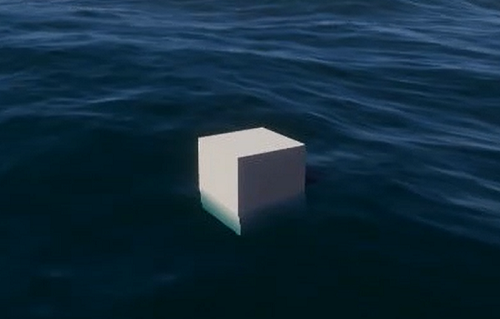
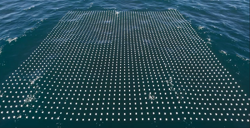

# Float objects on a water surface

You can add buoyancy to the water simulation with a script that queries the height of the water surface.

To do this:

1. Enable [**Script Interactions**](settings-and-properties-related-to-the-water-system.md#scriptinteractions) in the water surface you want to query.

1. Use the [`WaterSearchParameters`](https://docs.unity3d.com/Packages/com.unity.render-pipelines.high-definition@14.0/api/UnityEngine.Rendering.HighDefinition.WaterSearchParameters.html) struct to get the height of the water.

## Example: Float one object



This is an example script to float one object on a water surface.

```
using UnityEngine;
using UnityEngine.Rendering.HighDefinition;

public class FitToWaterSurface : MonoBehaviour
{
    public WaterSurface targetSurface = null;

    // Internal search params
    WaterSearchParameters searchParameters = new WaterSearchParameters();
    WaterSearchResult searchResult = new WaterSearchResult();

    // Update is called once per frame
    void Update()
    {
        if (targetSurface != null)
        {
            // Build the search parameters
            searchParameters.startPositionWS = searchResult.candidateLocationWS;
            searchParameters.targetPositionWS = gameObject.transform.position;
            searchParameters.error = 0.01f;
            searchParameters.maxIterations = 8;

            // Do the search
            if (targetSurface.ProjectPointOnWaterSurface(searchParameters, out searchResult))
            {
                Debug.Log(searchResult.projectedPositionWS);
                gameObject.transform.position = searchResult.projectedPositionWS;
            }
            else Debug.LogError("Can't Find Projected Position");
        }
    }
}
```

<a name="burstversion"></a>
## Example: Float several objects



This is an example script to float an array of objects on a water surface using the [Burst compiler](https://docs.unity3d.com/Packages/com.unity.burst@1.8/manual/index.html).


```
using System.Collections.Generic;
using Unity.Collections;
using Unity.Jobs;
using Unity.Mathematics;
using UnityEngine;
using UnityEngine.Rendering.HighDefinition;

public class FitToWaterSurface_Burst : MonoBehaviour
{
    // Public parameters
    public int resolution = 50;
    public WaterSurface waterSurface = null;

    // List of internal cubes
    List<GameObject> cubes = new List<GameObject>();

    // Input job parameters
    NativeArray<float3> targetPositionBuffer;

    // Output job parameters
    NativeArray<float> errorBuffer;
    NativeArray<float3> candidatePositionBuffer;
    NativeArray<float3> projectedPositionWSBuffer;
    NativeArray<float3> normalWSBuffer;
    NativeArray<float3> directionBuffer;
    NativeArray<int> stepCountBuffer;

    // Start is called before the first frame update
    void Start()
    {
        // Allocate the buffers
        targetPositionBuffer = new NativeArray<float3>(resolution * resolution, Allocator.Persistent);
        errorBuffer = new NativeArray<float>(resolution * resolution, Allocator.Persistent);
        candidatePositionBuffer = new NativeArray<float3>(resolution * resolution, Allocator.Persistent);
        projectedPositionWSBuffer = new NativeArray<float3>(resolution * resolution, Allocator.Persistent);
        normalWSBuffer = new NativeArray<float3>(resolution * resolution, Allocator.Persistent);
        directionBuffer = new NativeArray<float3>(resolution * resolution, Allocator.Persistent);
        stepCountBuffer = new NativeArray<int>(resolution * resolution, Allocator.Persistent);

        for (int y = 0; y < resolution; ++y)
        {
            for (int x = 0; x < resolution; ++x)
            {
                GameObject newCube = GameObject.CreatePrimitive(PrimitiveType.Cube);
                newCube.transform.parent = this.transform;
                newCube.transform.localPosition = new Vector3(x * 5, 0.0f, y * 5);
                cubes.Add(newCube);
            }
        }
    }

    // Update is called once per frame
    void Update()
    {
        if (waterSurface == null)
            return;
        // Try to get the simulation data if available
        WaterSimSearchData simData = new WaterSimSearchData();
        if (!waterSurface.FillWaterSearchData(ref simData))
            return;

        // Fill the input positions
        int numElements = resolution * resolution;
        for (int i = 0; i < numElements; ++i)
            targetPositionBuffer[i] = cubes[i].transform.position;

        // Prepare the first band
        WaterSimulationSearchJob searchJob = new WaterSimulationSearchJob();

        // Assign the simulation data
        searchJob.simSearchData = simData;

        // Fill the input data
        searchJob.targetPositionWSBuffer = targetPositionBuffer;
        searchJob.startPositionWSBuffer = targetPositionBuffer;
        searchJob.maxIterations = 8;
        searchJob.error = 0.01f;
        searchJob.includeDeformation = true;
        searchJob.excludeSimulation = false;

        searchJob.errorBuffer = errorBuffer;
        searchJob.candidateLocationWSBuffer = candidatePositionBuffer;
        searchJob.projectedPositionWSBuffer = projectedPositionWSBuffer;
        searchJob.normalWSBuffer = normalWSBuffer;
        searchJob.directionBuffer = directionBuffer;
        searchJob.stepCountBuffer = stepCountBuffer;

        // Schedule the job with one Execute per index in the results array and only 1 item per processing batch
        JobHandle handle = searchJob.Schedule(numElements, 1);
        handle.Complete();

        // Fill the input positions
        for (int i = 0; i < numElements; ++i)
            cubes[i].transform.position = projectedPositionWSBuffer[i];
    }

    private void OnDestroy()
    {
        targetPositionBuffer.Dispose();
        errorBuffer.Dispose();
        candidatePositionBuffer.Dispose();
        projectedPositionWSBuffer.Dispose();
        normalWSBuffer.Dispose();
        directionBuffer.Dispose();
        stepCountBuffer.Dispose();
    }
}

```
