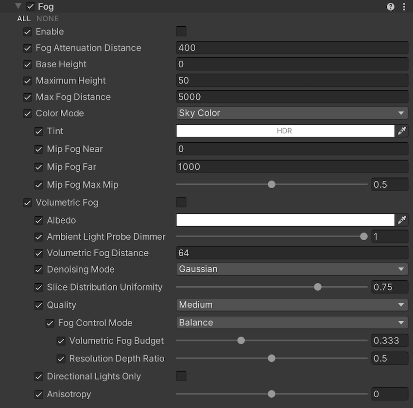

# Fog Volume Override reference

The Fog Volume Override lets you customize a global fog effect.

Refer to [Create a global fog effect](create-a-global-fog-effect.md) for more information.

## Properties

[!include]

[!include]

| Property                 | Function                                                     |
| :----------------------- | :----------------------------------------------------------- |
| **State** | Controls whether the fog is enabled. |
| **Fog Attenuation Distance** | Controls the density at the base of the fog and determines how far you can see through the fog in meters. At this distance, the fog has absorbed and out-scattered 63% of background light. |
| **Base Height**          | The height of the boundary between the constant (homogeneous) fog and the exponential fog. |
| **Maximum Height**   | Controls the rate of falloff for the height fog in meters. Higher values stretch the fog vertically. At this height , the falloff reduces the initial base density by 63%. |
| **Max Fog Distance** | Controls the distance (in meters) when applying fog to the skybox or background. Also determines the range of the Distant Fog. For optimal results, set this to be larger than the Camera’s Far value for its Clipping Plane. Otherwise, a discrepancy occurs between the fog on the Scene’s GameObjects and on the skybox. Note that the Camera’s Far Clipping Plane is flat whereas HDRP applies fog within a sphere surrounding the Camera. |
| **Color Mode** | Use the drop-down to select the mode HDRP uses to calculate the color of the fog. &#8226; **Sky Color**: HDRP shades the fog with a color it samples from the sky cubemap and its mipmaps. &#8226; **Constant Color**: HDRP shades the fog with the color you set manually in the **Constant Color** field that appears when you select this option. |
| **- Tint**    | HDR color multiplied with the sky color. This property only appears when you select **Sky Color** from the **Color Mode** drop-down. |
| **- Mip Fog Near**    | The distance (in meters) from the Camera that HDRP stops sampling the lowest resolution mipmap for the fog color. This property only appears when you select **Sky Color** from the **Color Mode** drop-down. |
| **- Mip Fog Far**     | The distance (in meters) from the Camera that HDRP starts sampling the highest resolution mipmap for the fog color. This property only appears when you select **Sky Color** from the **Color Mode** drop-down. |
| **- Mip Fog Max Mip** | Use the slider to set the maximum mipmap that HDRP uses for the mip fog. This defines the mipmap that HDRP samples for distances greater than **Mip Fog Far**. This property only appears when you select **Sky Color** from the **Color Mode** drop-down. |
| **- Constant Color**  | Use the color picker to select the color of the fog. This property only appears when you select **Constant Color** from the **Color Mode** drop-down. |
| **Volumetric Fog** | Indicates whether HDRP should calculate volumetric fog or not. |
| - **Albedo** | The color of the volumetric fog to. Volumetric fog tints lighting, so the fog scatters light to this color. It only tints lighting emitted by Lights behind or within the fog. This means that it doesn't tint lighting that reflects off GameObjects behind or within the fog - reflected lighting only gets dimmer (fades to black) as fog density increases. For example, if you shine a Light at a white wall through fog with a red **Albedo**, the fog looks red. If you shine a Light at a white wall and view it from the other side of the fog, the fog darkens the light but doesn’t tint it red. |
| - **Ambient Light Probe Dimmer** | The amount to dim the intensity of the global ambient light probe that the sky generates. A value of 0 doesn't dim the light probe and a value of 1 fully dims the light probe. |
| - **Volumetric Fog Distance** | The distance (in meters) from the Camera at which the volumetric fog section of the frustum ends. |
| - **Denoising Mode** | The denoising technique to use for the volumetric fog. The options are: &#8226; **None**: Applies no denoising. &#8226; **Reprojection**: A denoising technique that's effective for static lighting, but can lead to severe ghosting for highly dynamic lighting. &#8226; **Gaussian**: A denoising technique that's better than **Reprojection** for dynamic lighting. &#8226; **Both**: Applies both **Reprojection** and **Gaussian** techniques. Using both techniques can produce high quality results but significantly increases the resource intensity of the effect. |
| - **Slice Distribution Uniformity** | The uniformity of the distribution of slices along the Camera's forward axis. HDRP samples volumetric fog at multiple distances from the Camera. Each of these sample areas is called a slice. A value of 0 makes the distribution of slices exponential (the spacing between the slices increases with the distance from the Camera) which gives greater precision near to the Camera, and lower precision further away. A value of 1 results in a uniform distribution which gives the same level of precision regardless of the distance to the Camera. |
| - **Quality** | Specifies the preset HDRP uses to populate the values of the following nested properties. The options are: &#8226; **Low**: A preset that emphasizes performance over quality. &#8226; **Medium**: A preset that balances performance and quality. &#8226; **High**: A preset that emphasizes quality over performance. &#8226; **Custom**: Allows you to override each property individually. If you select any value other than **Custom**, **Fog Control Mode** switches to **Balance**. |
| - - **Fog Control Mode** | Specifies the method to use to control the performance and quality of the volumetric fog. The options are: &#8226; **Balance**: Uses a performance-oriented approach to define the quality of the volumetric fog. &#8226; **Manual**: Gives you access to the internal set of properties which directly control the effect. |
| - - - **Volumetric Fog Budget** | The performance to quality ratio of the volumetric fog. A value of 0 being the least resource-intensive and a value of 1 being the highest quality. This property only appears if you set **Fog Control Mode** to **Balance**. |
| - - - **Resolution Depth Ratio** | The ratio HDRP uses to share resources between the screen (x-axis and y-axis) and the depth (z-axis) resolutions. This property only appears if you set **Fog Control Mode** to **Balance**. |
| - - - **Screen Resolution Percentage** | The resolution of the volumetric buffer (3D texture) along the x-axis and y-axis relative to the resolution of the screen. This property only appears if you set **Fog Control Mode** to **Manual**. |
| - - - **Volume Slice Count** | The number of slices to use for the volumetric buffer (3D texture) along the camera's focal axis. This property only appears if you set **Fog Control Mode** to **Manual**. |
| - **Directional Lights Only** | Indicates whether HDRP only process volumetric fog for directional [Lights](Light-Component.md) or for all Lights. Including non-directional Lights increases the resource intensity of the effect. |
| - **Anisotropy** | Controls the angular distribution of scattered light. 0 is isotropic, 1 is forward scattering, and -1 is backward scattering. Note that non-zero values have a moderate performance impact. High values may have compatibility issues with the **Enable Reprojection for Volumetrics** Frame Setting. This is an experimental property that HDRP applies to both global and local fog. |
| - **Multiple Scattering Intensity** | Specifies how much light is scattered the further away from the camera.  |

## Light-specific Properties

The [Light component](Light-Component.md) has several properties that are useful for volumetric lighting:

- **Emission Radius** is useful to simulate fill lighting. It acts by virtually "pushing" the light away from the Scene. As a result, it softens the core of [punctual lights](Glossary.md#PunctualLight). Always use a non-zero value to reduce ghosting artifacts resulting from reprojection.
- **Volumetric Multiplier** only affects the fog and replaces the Light Multiplier that HDRP uses for surfaces.
- **Shadow Dimmer** only affects the fog and replaces the Shadow Dimmer that HDRP uses for surfaces.
