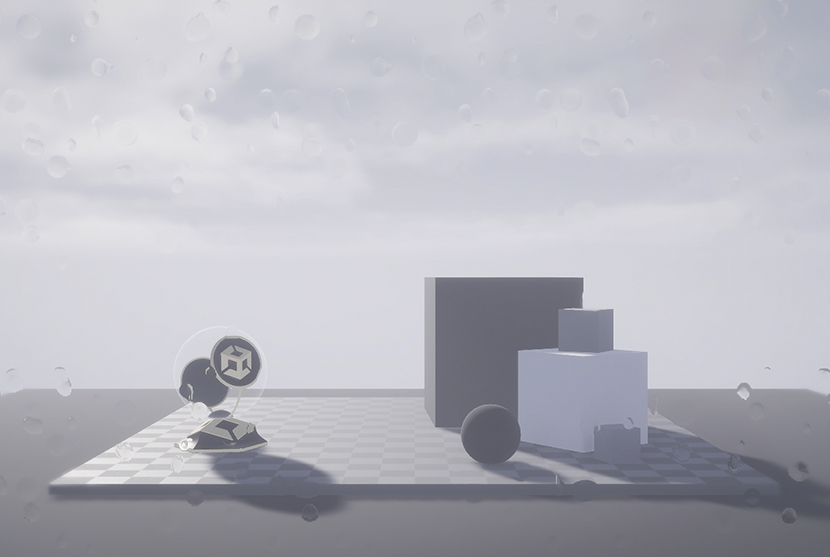

# Fullscreen Master Stack reference

You can modify the properties of a Fullscreen Shader Graph in the Fullscreen Master Stack.

A full-screen shader that applies a raindrop effect to the screen.

# Contexts

A shader graph contains the following contexts: 

- [Vertex context](#vertex-context)
- [Fragment context](#fragment-context)

The Fullscreen Master Stack has its own [Graph Settings](#graph-settings) that determine which blocks you can use in the Shader Graph contexts. For more information about the relationship between Graph Settings and blocks, see [Contexts and blocks](understand-shader-graph-in-hdrp.md).

This section contains information on the blocks that this Master Stack material type uses by default, and which blocks you can use to affect the Graph Settings.

## Vertex context

The Vertex context represents the vertex stage of this shader. Unity executes any block you connect to this context in the vertex function of this shader. For more information, see [Master Stack](https://docs.unity3d.com/Packages/com.unity.shadergraph@14.0/manual/Master-Stack.html).

Vertex blocks are not compatible with the Fullscreen Master Stack.

## Fragment context

The Fragment context represents the fragment (or pixel) stage of this shader. Unity executes any block you connect to this context in the fragment function of this shader. For more information, see [Master Stack](https://docs.unity3d.com/Packages/com.unity.shadergraph@14.0/manual/Master-Stack.html).

### Default

When you create a new Fullscreen Master Stack, the Fragment context contains the following blocks by default.

<table>
<tr>
<th>Property</th>
<th>Description</th>
<th>Setting Dependency</th>
<th>Default Value</th>
</tr>

[!include]
[!include]

</table>

### Relevant

The following blocks are also compatible with the Fullscreen master stack.

<table>
<tr>
<th>Property</th>
<th>Description</th>
<th>Setting Dependency</th>
<th>Default Value</th>
</tr>

[!include]
[!include]
[!include]

</table>

## Graph Settings

The properties in the Graph Settings window control the overall appearance of the Fullscreen shader.

### Surface Options

| **Property**                | **Description**                                              |                                                              |
| --------------------------- | ------------------------------------------------------------ | ------------------------------------------------------------ |
| **Allow Override Material** | Exposes the Graph Settings properties in the Material’s **Surface Options**. **Note:** You can only expose properties that you enable in **Graph Settings.** If you enable one of these properties, you can’t disable it in the Inspector under the Material’s **Surface Options.** |                                                              |
| **Blend Mode**              | Specifies the blend mode to use when Unity renders the full-screen shader. Each option has an equivalent [`BlendMode`](https://docs.unity3d.com/ScriptReference/Rendering.BlendMode.html) operation. **Note**: When you write to a Blit shader, disable this property to avoid undesired effects. |                                                              |
|                             | **Alpha**                                                    | Uses the shader’s alpha value to control its opacity. `BlendMode` operation: `Blend SrcAlpha OneMinusSrcAlpha` |
|                             | **Premultiply**                                              | Multiplies the RGB values of the transparent shader by its alpha value, then applies a similar effect to the shader as **Alpha**.  `BlendMode` operation: `Blend One OneMinusSrcAlpha` |
|                             | **Additive**                                                 | Adds the color values of the full-screen shader and the Camera output together. `BlendMode` operation: `Blend One One` |
|                             | **Multiply**                                                 | Multiplies the color of the full-screen shader with the color of the Camera’s output. `BlendMode` operation: `Blend DstColor Zero` |
|                             | **Custom**                                                   | Set every parameter of the blending equation manually. For more information, see [Custom blend modes](#custom-blend-modes). |
| **Depth Test **                 | Specifies the function this shader uses to perform the depth test. |                                                              |
|                             | **Disabled**                                                 | Does not perform a depth test.                               |
|                             | **Never**                                                    | The depth test never passes.                                 |
|                             | **Less**                                                     | The depth test passes if the pixel's depth value is less than the value stored in the depth buffer. |
|                             | **Equal**                                                    | The depth test passes if the pixel's depth value is equal to the value stored in the depth buffer. |
|                             | **Less Equal**                                               | The depth test passes if the pixel's depth value is less than or equal to the value stored in the depth buffer. This renders the tested pixel in front of other pixels. |
|                             | **Greater**                                                  | The depth test passes if the pixel's depth value is greater than the value stored in the depth buffer. |
|                             | **Not Equal**                                                | The depth test passes if the pixel's depth value is not equal to the value stored in the depth buffer. |
|                             | **Greater Equal**                                            | The depth test passes if the pixel's depth value is greater than or equal to the value stored in the depth buffer. |
|                             | **Always**                                                   | The depth test always passes, and Unity does not compare the pixel's depth value  to the value it has stored in the depth buffer. |
| **Depth Write**                | Indicates whether HDRP writes depth values for GameObjects that use this shader. Enable this property to write the depth value to the depth buffer and use a [depth Fragment](#graph-settings) block. |                                                              |
| **Depth Write Mode**          | Determines the depth value’s input format before Unity passes it to the depth buffer. This property determines which Depth block you can use in the [Fragment context](#fragment-context).This property appears when you enable **Depth Write**. |                                                              |
|                             | **LinearEye**                                                | Converts the depth value into a value scaled to world space. This new value represents the depth (in meters) from the near to the far plane of the Camera. |
|                             | **Linear01**                                                 | Uses a linear depth value range between 0 and 1.             |
|                             | **Raw**                                                      | Does not convert the depth buffer value. Use this setting with a nonlinear depth value or when you directly sample the depth value from the depth buffer. |
| Enable Stencil              | This property gives you control over all stencil fields.  See [Stencil properties](#stencil-properties) for information about the options that become available when you enable this property. |                                                              |
| Custom Editor GUI           | Accepts the full name of a C# class that inherits [`FullscreenShaderGUI`](https://docs.unity3d.com/Packages/com.unity.shadergraph@15.0/api/UnityEditor.Rendering.Fullscreen.ShaderGraph.FullscreenShaderGUI.html). For information on how to use a custom editor, see [ShaderLab: assigning a custom editor](https://docs.unity3d.com/2021.2/Documentation/Manual/SL-CustomEditor.html). |                                                              |

## Custom Blend Mode

Use the **Custom** blend mode to create a blend mode different from those available in [Surface Options](#surface-options). To show these options, set **Blend Mode** to **Custom**. The Custom blend mode properties specify the blending operation to use for this full-screen shader’s alpha and color channels. 

In the blend mode properties, **Src** (source) refers to the full-screen shader itself. **Dst** (destination) refers to the Scene camera’s raw output, which this shader doesn't affect. The blending operation applies the source contents to the destination contents to produce a rendering result.

For more information on the blending equation, see [ShaderLab command: Blend](https://docs.unity3d.com/Manual/SL-Blend.html).

### Color Blend Mode

Determines the blending equation HDRP uses for the red, green, and blue channels (RGB). Each setting defines one part of the equation.

| **Property**        | **Description**                                              |
| ------------------- | ------------------------------------------------------------ |
| **Src Color**       | Sets the blend mode of the source color.                     |
| **Dst Color**       | Sets the blend mode of the destination color.                |
| **Color Operation** | Determines how to combine the source and destination color during the blending process. For information on these options see [ShaderLab command: BlendOp](https://docs.unity3d.com/Manual/SL-BlendOp.html) |

### Alpha Blend Mode

Determines the blending equation HDRP uses for the alpha channel. Each setting defines one part of the equation.

| **Property**          | **Description**                                              |
| --------------------- | ------------------------------------------------------------ |
|**Src**                  | Sets the blend mode of the source alpha. For information on these options, see [Valid parameter values](https://docs.unity3d.com/Manual/SL-Blend.html#valid-parameter-values). |
| **Dst**                  | Sets the blend mode of the destination alpha. For information on these options, see[Valid parameter values](https://docs.unity3d.com/Manual/SL-Blend.html). |
| **Blend Operation Alpha** | Determines how to combine the source and destination alpha during the blending process. For more information on these options, see [ShaderLab command: BlendOp](https://docs.unity3d.com/Manual/SL-BlendOp.html) |

## Stencil properties

These properties affect how this full-screen Shader Graph uses the stencil buffer. For more information on the stencil buffer, see [SL-Stencil](https://docs.unity3d.com/Manual/SL-Stencil.html).

| **Property**        | **Description**                                              |                                                              |
| ------------------- | ------------------------------------------------------------ | ------------------------------------------------------------ |
| **Show Only HDRP Bits** | Determines whether you can set a custom value for the **Reference**, **Read Mask** and **Write Mask** properties. |                                                              |
| **Reference**           | Determines the stencil reference value this shader uses for all stencil operations. When you disable **Show Only HDRP Bits,** you can set a custom value for this property.  **Important:** If you override a bit HDRP has reserved (bits 0, 1, 2, 3, 4, and 5), it can cause rendering artefacts. |                                                              |
|                     | **None**                                                     | Assigns no reference value.                                  |
|                     | **UserBit0**                                                 | Stencil bit number 6.                                        |
|                     | **UserBit1**                                                 | Stencil bit number 7.                                        |
|                     | **AllUserBits**                                              | Stencil bit numbers 6 and 7.                                 |
| **Read Mask**           | Determines which bits this shader can read during the stencil test. When you enable **Show Only HDRP Bits,** you can set a custom value for this property.  **Important**: If you override a bit HDRP has reserved (bits 0,1,2,3,4, and 5), it can cause rendering artefacts. |                                                              |
|                     | **None**                                                     | Assigns no reference value.                                  |
|                     | **UserBit0**                                                 | Stencil bit number 6.                                        |
|                     | **UserBit1**                                                 | Stencil bit number 7.                                        |
|                     | **AllUserBits**                                              | Stencil bit numbers 6 and 7.                                 |
| **Write Mask **         | Determines which bits this shader can write to during the stencil test. When you enable **Show Only HDRP Bits,** you can set a custom value for this property.  **Important**: If you override a bit HDRP has reserved (bits 0,1,2,3,4, and 5), it can cause rendering artefacts. |                                                              |
|                     | **None**                                                     | Assigns no reference value.                                  |
|                     | **UserBit0**                                                 | Stencil bit number 6.                                        |
|                     | **UserBit1**                                                 | Stencil bit number 7.                                        |
|                     | **AllUserBits**                                              | Stencil bit numbers 6 and 7.                                 |
| **Comparison**          | Determines the comparison function this shader uses during the stencil test. |                                                              |
|                     | **Disabled**                                                 | Does not perform a stencil test.                             |
|                     | **Never**                                                    | The stencil test never passes.                               |
|                     | **Less**                                                     | The stencil test passes if the pixel's depth value is less than the value stored in the depth buffer. |
|                     | **Equal**                                                    | The stencil test passes if the pixel's depth value is equal to the value stored in the depth buffer. |
|                     | **Less Equal**                                               | The stencil test passes if the pixel's depth value is less than or equal to than the depth buffer value. This renders the tested pixel in front of other pixels. |
|                     | **Greater**                                                  | The stencil test passes if the pixel's depth value is greater than the value stored in the depth buffer. |
|                     | **Not Equal**                                                | The stencil test passes if the pixel's depth value is not equal to the value stored in the depth buffer. |
|                     | **Greater Equal**                                            | The stencil test passes if the pixel's depth value is greater than or equal to the value stored in the depth buffer. |
|                     | **Always**                                                   | The stencil test always passes,and Unity does not compare the pixel's depth value to the value it has stored in the depth buffer. |
| **Pass**                | Determines the operation this shader executes if the stencil test succeeds.  For more information on this property’s options, see [pass and fail options](#stencil-pass-fail). |                                                              |
| **Fail**                | Determines the operation this shader executes if the stencil test fails.  For more information on this property’s options, see [pass and fail options](#stencil-pass-fail). |                                                              |
| **Depth Fail**          | Determines the operation this shader executes if the depth test fails. This option has no effect if the depth test **Comparison** value is **Never** or **Disabled.**  For more information on this property’s options, see [pass and fail options](#stencil-pass-fail). |                                                              |

### Pass and Fail options

| **Option**            | **Description**                                              |
| --------------------- | ------------------------------------------------------------ |
| **Keep**              | Does not change the current contents of the stencil buffer.  |
| **Zero**              | Writes a value of 0 into the stencil buffer.                 |
| **Replace**           | Writes the **Reference** value into the buffer.              |
| **IncrementSaturate** | Adds a value of 1 to the current value in the buffer.  A value of 255 remains 255. |
| **DecrementSaturate** | Subtracts a value of 1 from the current value in the buffer.  A value of 0 remains 0. |
| **Invert**            | Performs a bitwise NOT operation. This means it negates all the bits of the current value in the buffer. For example, a decimal value of 59 is 0011 1011 in binary. The NOT operation reverses each bit to 1100 0100, which is a decimal value of 196. |
| **IncrementWrap**     | Adds a value of 1 to the current value in the buffer. A value of 255 becomes 0. |
| **DecrementWrap**     | Subtracts a value of 1 from the current value in the buffer.  A value of 0 becomes 255. |
