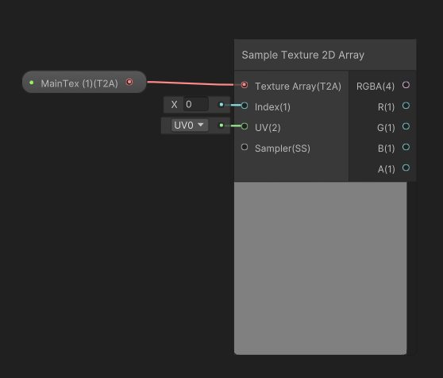
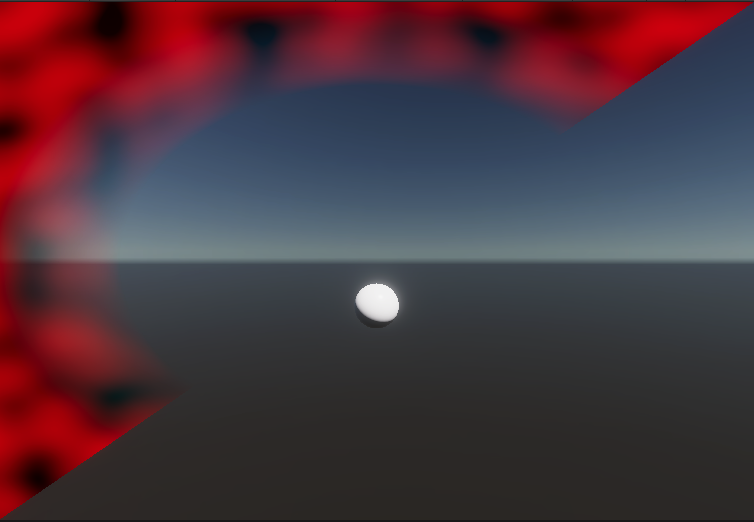

# Fullscreen Shader

Use the Fullscreen shader to create a custom effect that appears over the entire screen view. For example, you could use this shader to make the screen turn red when a character takes damage, or make droplets of water appear on the screen. You can see some example Fullscreen shaders in the [Fullscreen shader samples](#fullscreen-samples).

You can then use the Fullscreen shader in the following ways: 

- To create a [Custom Pass effect](custom-pass-creating.md#material-from-fullscreen-shadergraph).
- To create a [Custom Post Process effect](Custom-Post-Process.md#custom-postprocessing-fullscreen).
- In a C# script with the [`HDUtils.DrawFullscreen`](https://docs.unity3d.com/Packages/com.unity.render-pipelines.high-definition@15.0/api/UnityEngine.Rendering.HighDefinition.HDUtils.html) or `Graphics.Blit()` functions. To use `Graphics.Blit()`see [Make a Fullscreen material Blit compatible](#fullscreen-blit-compatible).


A full-screen shader that applies a raindrop effect to the screen.

<a name="create-fullscreen-shadergraph"></a>

# Create a Fullscreen shader graph

To create a full-screen shader in [Shader Graph](https://docs.unity3d.com/Packages/com.unity.shadergraph@latest/index.html?subfolder=/manual/First-Shader-Graph.html), use one of the following methods: 

- Create a new Fullscreen shader graph:

   - Go to **Assets** > **Create** > **Shader Graph** > **HDRP** > **Fullscreen Shader Graph**.

- Modify an existing shader graph:

1. In the **Project** window, select a shader graph to open it in the Shader Editor.
2. In **Graph Settings**, select the **HDRP** Target. If there isn't one, go to **Active Targets**, click the **Plus** button, and select **HDRP**.
3. In the **Material** drop-down, select **Fullscreen**.

- Open one of the [Fullscreen shader samples](#fullscreen-samples).

This creates a shader graph that contains the [Fullscreen Master Stack](master-stack-fullscreen.md).

<a name="fullscreen-samples"></a>

## Fullscreen shader samples

HDRP includes sample Fullscreen shaders. To use these samples in your project: 

1. Select **Window** > **Package Manager.**
2. Select **High Definition RP.**
3. Open the **Samples** tab.
4. Find **Fullscreen Samples** and select **Import.**

To see the Fullscreen shader graph samples in a scene, open the Fullscreen sample scene: 

1. In the **Project** window, open **Assets** > **Samples** > **High Definition RP** > **Version Number** > **Fullscreen Samples** > **Scenes.**
2. Select the **FullscreenSamplesTestingScene** to open it.
3. Select the Play button and use the arrow keys to switch between Fullscreen shader examples.

<a name="apply-fullscreen-shader"></a>

## Apply a full-screen shader graph

You can apply a full-screen shader graph in a post processing effect or a custom pass:

- [Apply a full-screen shader in a Custom pass](custom-pass-creating.md#material-from-fullscreen-custompass).
- [Apply a full-screen shader in a post processing effect](Custom-Post-Process.md#apply-custom-postprocess).

<a name="fullscreen-blit-compatible"></a>

## Make a full-screen shader graph Blit compatible

To make a full-screen shader graph material compatible with assets or C# scripts that use the `Blit()` command, do the following: 

- [Set a source material](#fullscreen-set-blit-source) for the `Blit()` command in the shader graph.
- [Set the Blit pass in a C# script](#fullscreen-set-blit-script).
- In a [Fullscreen custom pass](Custom-Pass-Creating.md#Full-Screen-Custom-Pass), set the **Pass Name** to **Blit**.

<a name="fullscreen-set-blit-source"></a>

### Set a Blit source material

To set a source material for the `Blit()` command to use in shader graph:

1. Double-click a Fullscreen shader graph to open it in Shader Graph.
2. Create a MainTex node:
   1. In the [Blackboard](https://docs.unity3d.com/Packages/com.unity.shadergraph@15.0/manual/Blackboard.html), select the **Add** (**+**) button.
   2. Select **Texture2DArray**.
   3. Select the Texture2D Array node you just created to open its properties in the Graph Inspector.
   4. In the **Name** property, enter `_MainTex`.
5. In **Node Settings**, enable the **Exposed** toggle so `Blit()`can bind the texture.
4. Drag the **MainTex** node into your shader graph. 
5. Press the Spacebar to open the **Create Node** window
6. In the **Create Node** window, search for the **Texture 2D Array** node and select it to create it in your scene.
7. Connect the **MainTex** node to the **Texture Array** port of the **Sample Texture 2D Array** node.
8. Connect the **RBGA** output port of the **Sample Texture 2D Array** to the **Base Color** block in the **Fragment** context.
9. `Blit()` automatically binds the source texture inside the `_MainTex` property.

**Note**: The type of source material node depends on the platform you use. Windows and some platforms use Texture2DArray and other platforms use Texture2D. To see which texture type to use, refer to the [documentation for the platform you are using](https://docs.unity3d.com/Manual/PlatformSpecific.html).



<a name="fullscreen-set-blit-script"></a>

### Set the Blit pass in a C# script

Shader Graph outputs multiple passes for compatibility reasons. This means you need to manually tell the `Blit()` command to use the correct pass. You can do this in any script that uses a full-screen pass, for example a custom pass or a custom render texture script.

The Blit pass is pass number `0`. Use the following line to reference this pass:

```c#
Graphics.Blit(sourceTexture, destinationTexture, material, pass: 0);
```

# Troubleshooting

This section helps you resolve the most common issues you can have in a full-screen shader.

## Gray screen

Your scene appears gray if you read from and write to the color buffer in the same custom pass. To fix this, see [Write to and read from the custom color buffer](Custom-Pass-Creating.md#readwrite-color-buffer).

## Missing part of full-screen effect 



This error can happen when you use a full-screen shader with a custom pass C# script that uses the `Blit()` function, and you haven’t selected the **Blit** shader pass in the Inspector window or in a script. 

To fix this error:

- In a full-screen custom pass, set the **Pass Name** property to **Blit.**
- In a post processing script, set the Blit pass to 0. For instructions, see [Set the Blit pass in a C# script](#fullscreen-set-blit-script).

### Inverted full-screen effect

In some cases, HDRP flips the full-screen effect upside down. This can happen when you write to the Camera color buffer with [`BuiltinRenderTextureType.CameraTarget`](https://docs.unity3d.com/ScriptReference/Rendering.BuiltinRenderTextureType.CameraTarget.html) or write directly to the display.

To fix this error, flip the material on the Y axis in the script that uses a full-screen shader. To do this, add the following line before the call that applies the full-screen effect:

```C#
material.SetFloat("_FlipY", 1);
```

**Note**: You can also do this with a [`MaterialPropertyBlock`](https://docs.unity3d.com/ScriptReference/MaterialPropertyBlock.html) if you use a [`CommandBuffer`](https://docs.unity3d.com/ScriptReference/Rendering.CommandBuffer.html) to build your effect.
