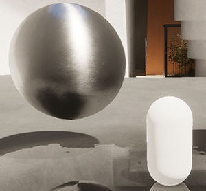
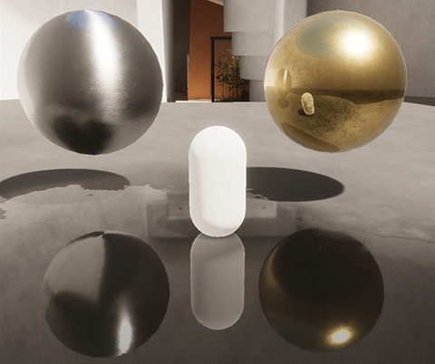

# How HDRP calculates color for reflection and refraction

When HDRP sets the color you see reflected on a reflective object, or through a refractive object, it works down a hierarchy until it finds a color.

## Default hierarchy

1. If the light intersects a position in screen space, HDRP uses the color buffer that contains a 2D texture of the visible scene. For reflection, you must enable the [Screen Space Reflections Override](Override-Screen-Space-Reflection.md) for this to work.
2. If you have a Reflection Probe in your scene and the object is in the probe's Influence Volume, HDRP uses the cubemap texture from the Reflection Probe.
3. If you have a sky, HDRP uses the cubemap texture or color of the sky.
4. HDRP uses black.

The color buffer HDRP uses is the first color pyramid that contains only opaque objects, so refractive objects won't be visible through other refractive objects. See [Depth pyramid and color pyramid generation in HDRP](Custom-Pass-buffers-pyramids.md#depth-pyramid-and-color-pyramid-generation-in-hdrp) for more information.

## Hierarchy if you use ray-traced reflections

If you use [ray-traced reflections](Ray-Traced-Reflections.md), HDRP casts rays from the camera to get information about Materials and lights that are visible in reflections. HDRP then uses the information to calculate the final lighting by combining diffuse color and specular color.

HDRP uses only the [specular color hierarchy](#specular) if the following happens:

- A ray doesn't hit anything (a 'ray miss').
- A ray hits its 'last bounce' - which means it needs to bounce more times than the **Bounce Count** set in the [Screen Space Reflection Override](Override-Screen-Space-Reflection.md).

### Diffuse color

HDRP works down the following hierarchy to find the diffuse color.

1. If you have an Adaptive Probe Volume in your Scene, HDRP uses the lighting data from the Adaptive Probe Volume.
2. If there's a baked lightmap for this position, HDRP uses the lightmap texture.
3. If you have a baked [Light Probe](https://docs.unity3d.com/Manual/LightProbes.html) and the object is in the probe's Influence Volume, HDRP uses the lighting data from the Light Probe.
4. If you set a static sky texture in **Lighting** > **Environment** > **Static Lighting Sky**, HDRP uses the cubemap texture of the sky in the ambient probe.
4. HDRP uses black.

### Specular color

HDRP works down the following hierarchy to find the specular color:

1. If you have a Reflection Probe in your scene and the object is in the probe's Influence Volume, HDRP uses the cubemap texture from the Reflection Probe.
2. If you have a sky, HDRP uses the cubemap texture of the sky.
3. HDRP uses black.

## Control how Materials use each hierarchy

If you use the Screen Space Reflections override, you can use **Minimum Smoothness** in [Screen Space Reflection properties](Override-Screen-Space-Reflection.md) to control when HDRP moves down the hierarchy.

For example, if you use ray-traced reflections and set **Minimum Smoothness** to 0.9, HDRP uses the hierarchies in the following way:

- Areas with a smoothness value larger than or equal to 0.9 will use the [ray-traced reflections hierarchy](#hierarchy-if-you-use-ray-traced-reflections).
- Areas with a smoothness value less than 0.9 will use only the [specular hierarchy](#specular).

 
The sphere has a **Smoothness** value of less than 0.9, so it uses the [specular hierarchy](#specular). This means the sphere falls back to using Reflection Probes, and the capsule doesn't appear in reflections because it's a dynamic object. 

## How reflections inside reflections work

 

In the above Scene:

- [Ray-traced reflections](Ray-Traced-Reflections.md) are enabled with a **Bounce Count** set to 1.
- The **Minimum Smoothness** is set to 0.9.
- The capsule is a dynamic object.
- There are Reflection Probes.

Because the **Bounce Count** is set to 1, rays bounce off a first object then stop when they reach a second object. This means the ray doesn't reach any third objects that appear in reflections on the second object. HDRP moves down the hierarchy to find the color of the second object.

If the object has a high **Smoothness** value, it uses mostly specular color and the [specular color hierarchy](#specular). If the object has a low **Smoothness** value, it uses mostly diffuse color and the [diffuse color hierarchy](#diffuse).

For example:

- In the water puddle, the reflected gold sphere falls back to the specular color hierarchy and a Reflection Probe, because the sphere has a high **Smoothness** value. So the reflected gold sphere does not have a reflection of the capsule inside.
- In the gold sphere, the reflected floor falls back to the diffuse color hierarchy and the floor's lightmap, because the floor has a low **Smoothness** value.
- In the gold sphere, the reflected capsule falls back to the diffuse color hierarchy and the ambient probe, because the capsule has a low **Smoothness** value but no lightmap.
