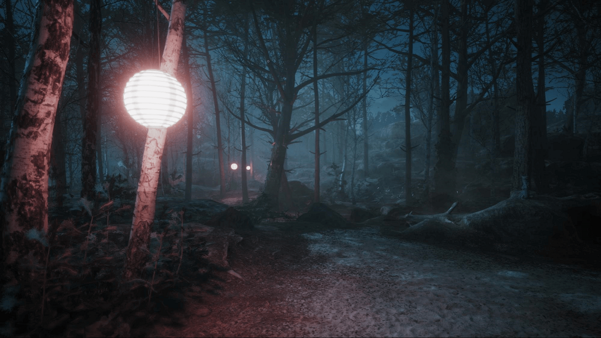

# High Definition Render Pipeline overview

The High Definition Render Pipeline (HDRP) is a high-fidelity Scriptable Render Pipeline built by Unity to target modern (Compute Shader compatible) platforms.

HDRP utilizes Physically-Based Lighting techniques, linear lighting, HDR lighting, and a configurable hybrid Tile/Cluster deferred/Forward lighting architecture. It gives you the tools you need to create applications such as games, technical demos, and animations to a high graphical standard.

NOTE: Projects that you make with HDRP are not compatible with the Universal Render Pipeline (URP). You must decide which render pipeline your Project uses before you start development; HDRP features are not cross-compatible between HDRP and URP.

This documentation contains the information you need to create applications using HDRP; including information on Lighting, Materials and Shaders, Cameras, and debugging.

For information on platform support and system requirements, see [System Requirements](System-Requirements.md).
