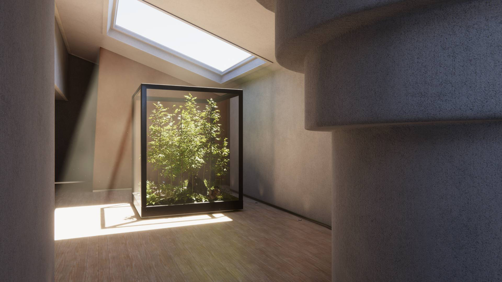

# Install HDRP 

Create a new project

## Create a HDRP Project from the template

To set up and manage your Unity Projects, install the [Unity Hub](https://docs.unity3d.com/hub/manual/index.html).

Unity provides an HDRP Template Project which you can use to get set up with HDRP. To create an HDRP Template Project:

1. Open the Unity Hub,
2. Go to **Projects**, and select **New Project**.
3. Open the **Sample** tab and select **3D Sample Scene (HDRP)**.
4. Enter a **Project name**.
5. Select **Create project**.

Unity creates a Project and automatically installs the HDRP package, and all its dependencies. After Unity opens the Template Project, you can see the main Scene.

This template is a great starting point for projects aiming for high-end graphics. It includes multiple physically based lighting setups to help you realistically illuminate environments with HDRP. It also includes examples for many of HDRP's features such as [Decals](decals.md), [Volumes](understand-volumes.md), and physically accurate Materials.

## Install the High Definition RP package

To install HDRP, add the High Definition RP package to your Unity Project:

1. Open your Unity project.
2. To open the **Package Manager** window, go to **Window** > **Package Manager**.
3. In the **Package Manager** window, in the **Packages:** field, select **Unity Registry** from the menu.
4. Select **High Definition RP** from the list of packages.
5. In the bottom right corner of the Package Manager window, select **Install**.

**Note**: To fix any errors that appear, use the [HDRP Wizard](Render-Pipeline-Wizard.md).

