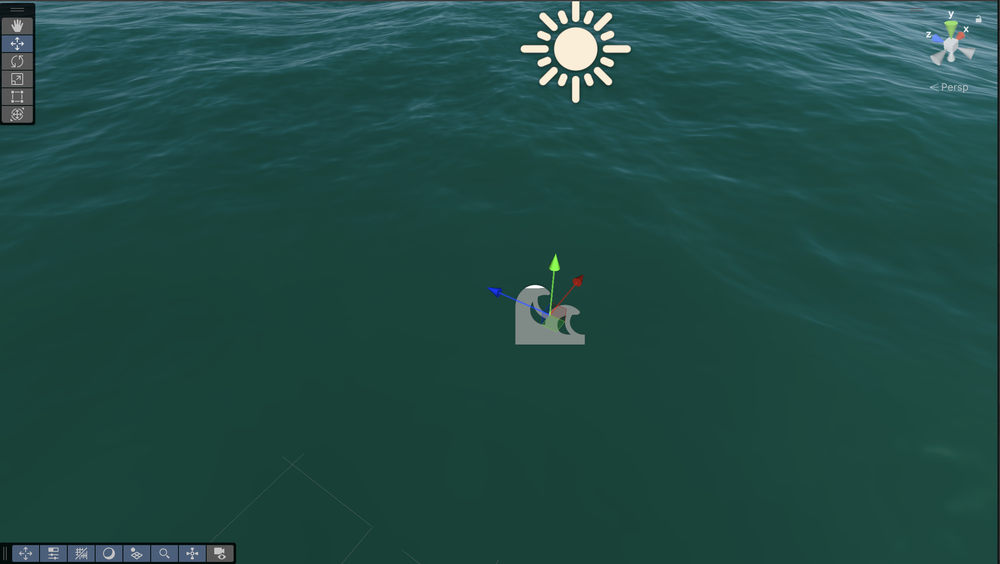

# Introduction to foam

There are two types of foam you may want to create, which you can implement in two different ways:

- To implement wind-driven foam on a whole water surface, use simulation foam. 
- To implement local foam in the wake of a GameObject, such as a sailing boat or an object falling into a pool, use a water decal.

HDRP water sample Island scene

## Wind-driven foam on the whole water surface

When you create a new water ocean, sea, or lake, simulation foam appears at or underneath the whole water surface, depending on the wind speed profile and the amount of foam you set.

Foam does not appear if the foam amount is zero or if the wind profile doesn't generate enough turbulence to create foam.

Foam appears when the foam amount is greater than zero and the wind profile generates enough turbulence to create foam.

### Deep foam and surface foam

The following types of foam can appear at or underneath the water surface:

- Surface foam: Found at or near the water surface. Forms light streaks and patches. Influenced by **Distant Wind Speed** and **Wind Speed Dimmer**.

- Deep foam: Found beneath the water surface. Forms dark streaks and patches. Influenced by **Distant Wind Speed** and **Wind Speed Dimmer**.

## Local foam in the wake of a GameObject

You can create foam behind GameObjects to simulate the trail left by a moving boat. 

You can also create static, circular foam patches to simulate foam appearing in coastal areas or tidal flats, or when an object falls into the water.

