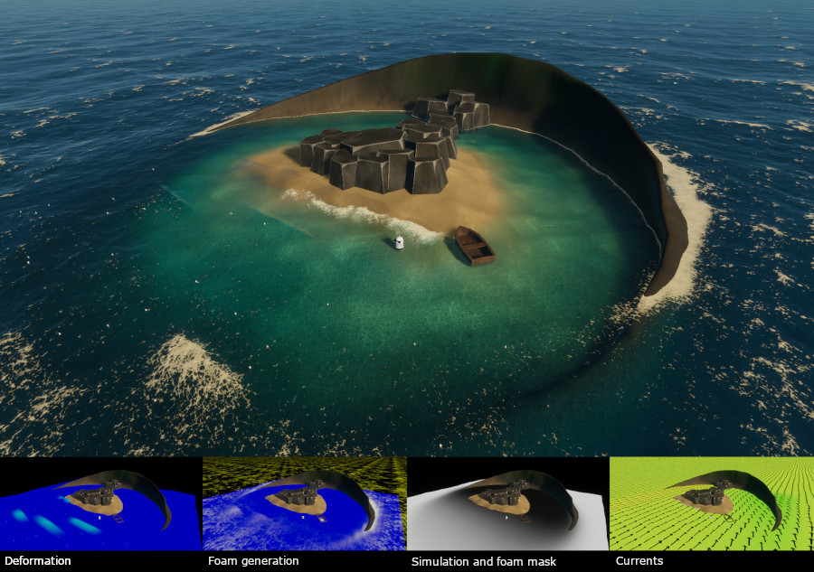

# Introduction to water decals

Duplicate localized water effects such as foam, deformation, and currents without re-authoring textures by tying the water decal region to a game object's transform or, by default, to the camera's transform. This ensures the resolution is focused only where needed.

## Versatile, local water effects

Water decals work similarly to HDRP decals, leveraging a specific Shader Graph master stack node. While effects like water simulation masks, foam masks, and current maps rely on textures applied to the water surface as a whole, water decals offer an alternative method for more precise control and localization.

Water decals are applied in world space, just like any other game object. Instead of using static textures on the entire surface, you can anchor the water decal region to the camera or to game objects for localized adjustments.  This enables you to duplicate setups, such as placing effects around an island, without the need to re-author textures for each instance in your DCC tool of choice.

For example, you can use water decals to add foam, attenuate swell, fine-tune currents, or create shoreline waves around an island. Then, you can replicate this setup by duplicating the decals to apply the same localized effects to another island, without re-authoring textures.

## Additional Resources

- [Decals](decals.md)
- [Enable Mask and Current Water Decals](enable-mask-and-current-water-decals.md)
