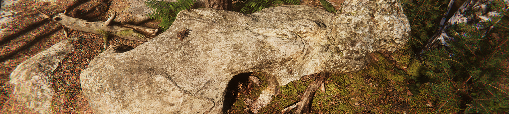

# Layered lit material

The Layered Lit Shader allows you to stack up to four Materials on the same GameObject in the High Definition Render Pipeline (HDRP). The Materials that it uses for each layer are HDRP [Lit Materials](lit-material.md). This makes it easy to create realistic and diverse Materials in HDRP. The **Main Layer** is the undermost layer and can influence upper layers with albedo, normals, and height. HDRP renders **Layer 1**, **Layer 2**, and **Layer 3** in that order on top of the **Main Layer**. For more information about Materials, Shaders, and Textures, see the[ Unity User Manual](https://docs.unity3d.com/Manual/Shaders.html).

The Layered Lit Shader is perfect for photogrammetry. For a tutorial on how to use it in a photogrammetry workflow, see the [Photogrammetry with the Layered Shader Expert Guide](<https://unity3d.com/files/solutions/photogrammetry/Unity-Photogrammetry-Workflow-Layered-Shader_v2.pdf?_ga=2.199967142.94076306.1557740919-264818330.1555079437>).

## Creating a Layered Lit Material

To create a new Layered Lit Material, navigate to your Project's Asset window, right-click in the window and select **Create > Material**. This adds a new Material to your Unity Project's Asset folder. Materials use the [Lit Shader](lit-material.md) by default. To make Materials use the Layered Lit Shader:

1. Click on the Material to view it in the Inspector.
2. In the **Shader** drop-down, select **HDRP > LayeredLit**.

Refer to [Layered Lit Material Inspector reference](layered-lit-material-inspector-reference.md) for more information.
