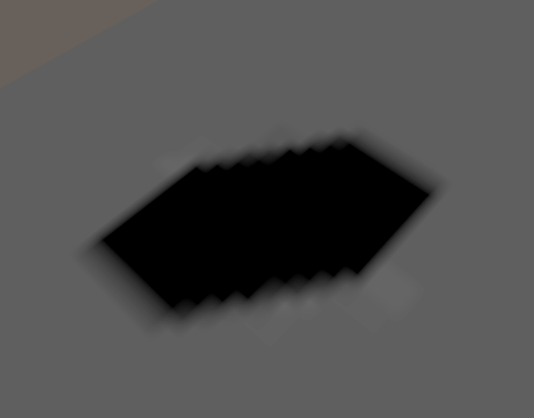
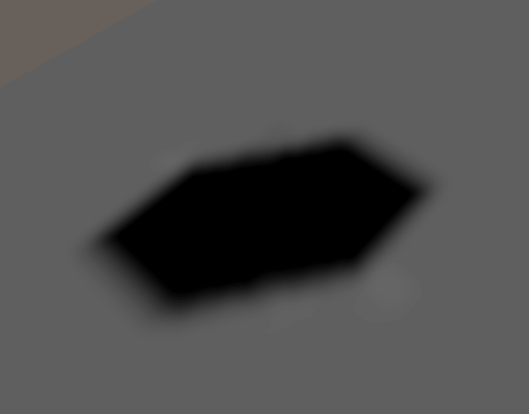

# Improve the visual fidelity of lightmaps

Use bicubic sampling to improve the visual fidelity of lightmaps.

Bicubic sampling smooths sharp or jagged edges in your lightmap to improve its visual fidelity. Bicubic sampling is helpful for low resolution lightmaps and shadows. However, it performs more texture sampling so it introduces additional performance overhead on lower-end platforms. This feature is available only on Unity 6.1.

## Render pipeline compatibility

|**Feature name**|**Universal Render Pipeline (URP)**|**High Definition Render Pipeline (HDRP)**|**Custom SRP**|**Built-in Render Pipeline**|
|:---|:---|:---|:---|:---|
|**Bicubic Lightmap Sampling**|Yes|Yes|No|No|

## Use bicubic sampling

To use bicubic sampling in your project, enable the **Use Bicubic Lightmap Sampling** property in the [HDRP graphics settings window](Default-Settings-Window.md).

## Fix texture bleeding

Bicubic sampling can cause texture bleeding, where Unity samples unintended texels from neighboring regions of a texture, leading to visual artifacts. To prevent texture bleeding, there needs to be enough padding between [lightmap UV charts](https://docs.unity3d.com/Manual/LightingGiUvs-landing.html). To fully remove texture bleeding artifacts, set the number of texels between each UV chart to at least 2 for bilinear filtering and at least 4 for bicubic filtering.

To change the padding in or between charts, refer to [Fix light bleeding in lightmaps](https://docs.unity3d.com/Manual/ProgressiveLightmapper-UVOverlap.html).

## Additional resources

* [Introduction to lightmaps and baking](https://docs.unity3d.com/Manual/Lightmappers.html)
* [Configuring lightmaps and baking](https://docs.unity3d.com/Manual/Lightmapping-configure.html)
* [Optimize baking](https://docs.unity3d.com/Manual/GPUProgressiveLightmapper.html)
* [Introduction to lightmap UVs](https://docs.unity3d.com/Manual/LightingGiUvs.html)