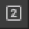
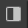
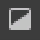
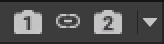

# Look Dev window reference

Look Dev is an image-based lighting tool that contains a viewer to compare assets under different lighting conditions.

To open Look Dev, select **Window** > **Rendering** > **Look Dev**.

For more information on how to use Look Dev, refer to [Compare materials in different lighting conditions with Look Dev](test-and-debug-materials-in-different-lighting-conditions-look-dev.md).

## Toolbar

Use the toolbar in the top-left of the window to change which viewing mode Look Dev uses.

| **Viewport mode** | **Icon** | **Description** |
| :---- | :---- | :---- |
| Single viewport 1 |  | Displays the asset in the first environment.  |
| Single viewport 2 |  | Displays the asset in the second environment. |
| Both viewports split vertically |  | Displays the asset in both environments stacked vertically. |
| Both viewports split horizontally |   | Displays the asset in both environments stacked horizontally. |
| Both viewports split-screen |   | Displays the asset in both environments with a split screen. The red and blue manipulation gizmo separates the two viewports. |
| Viewport cameras |   | Decouples the cameras from one another, allowing you to manipulate them independently. To align or reset the cameras, select the dropdown. The dropdown options are: **Align Camera 1 with Camera 2**, **Align Camera 2 with Camera 1**, and **Reset Cameras**. |

## Environment Settings

| **Property**        | **Description**                                              |
| ------------------- | ------------------------------------------------------------ |
| **Sky with Sun**    | Sets the HDRI texture that Look Dev uses for the sky lighting when using this environment. For information on how to import an HDRI Texture, refer to [Add an environment](test-and-debug-materials-in-different-lighting-conditions-look-dev.md). |
| **Rotation**        | Sets the offset longitude that Look Dev applies for the whole sky and sun position. |
| **Exposure**        | Sets the exposure that Look Dev uses when it renders the environment. |
| **Sun Position**    | Sets the position of the sun when compositing the shadows. The Sun button automatically places the sun on the brightest spot of the **Sky with Sun** HDRI texture. |
| **Shadow Tint**     | Sets the color of the tint that Look Dev uses to color shadows. |
