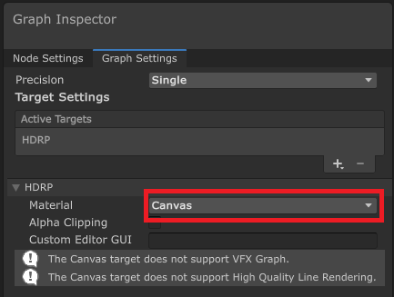

# Canvas

The Canvas Master Stack material type enables you to author Shader Graph shaders that can be applied to [UGUI user interface elements](https://docs.unity3d.com/Packages/com.unity.ugui@1.0/manual/UICanvas.html).

## Create a Canvas Shader Graph

To create a Canvas material in Shader Graph, use one of the following methods:

* Modify an existing Shader Graph:
    1. Open the Shader Graph in the Shader Editor.
    2. In **Graph Settings**, select the **HDRP** Target. If there isn't one, go to **Active Targets** > **Plus**, and select **HDRP**.
    3. In the **Material** drop-down, select **Canvas**.
* Create a new Shader Graph. Go to **Assets** > **Create** > **Shader Graph** > **HDRP**, and select **Canvas Shader Graph**.

## Contexts

[!include]

### Vertex Context

The Vertex context represents the vertex stage of this shader. Unity executes any block you connect to this context in the vertex function of this shader. For more information, refer to [Master Stack](https://docs.unity3d.com/Packages/com.unity.shadergraph@16.0/manual/Master-Stack.html).

Vertex blocks are not compatible with the Canvas Master Stack.

### Fragment Context

The Fragment Context contains the default and relevant Blocks for the Canvas Master Stack target.

#### Default Fragment Context Blocks

When you create a new Canvas Master Stack, the Fragment Context contains the following Blocks by default:

<table>
<tr>
<th>Property</th>
<th>Description</th>
<th>Setting Dependency</th>
<th>Default Value</th>
</tr>
[!include]
[!include]
[!include]
</table>

#### Relevant Fragment Context Blocks

Depending on the [Graph Settings](#graph-settings) you use, Shader Graph might add the following Blocks to the Fragment Context:

<table>
<tr>
<th>Property</th>
<th>Description</th>
<th>Setting Dependency</th>
<th>Default Value</th>
</tr>
[!include]

## Graph Settings

The following table describes the Surface options:

<table>
<tr>
<th>Property</th>
<th>Description</th>
</tr>
[!include]
[!include]

