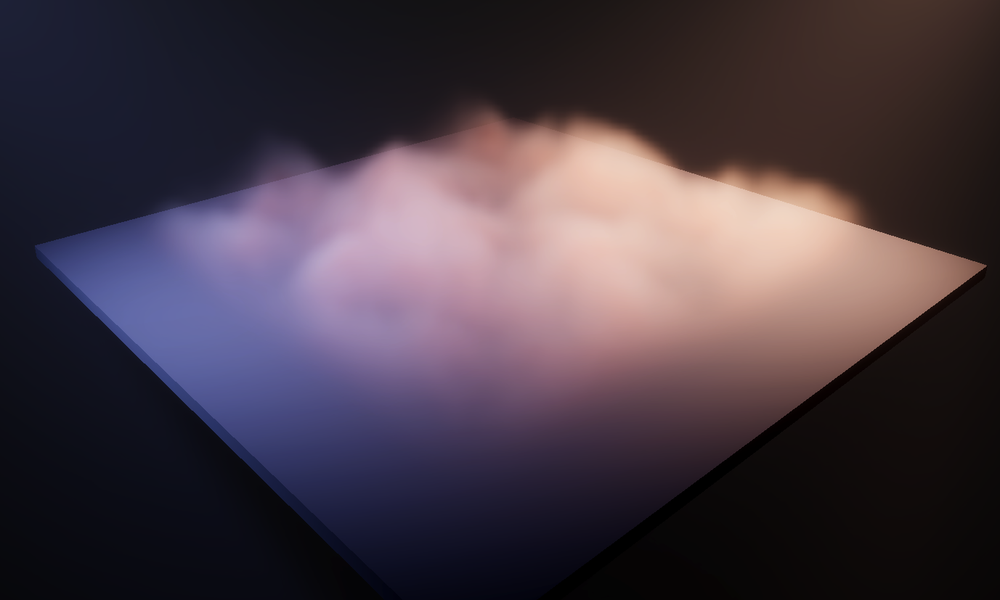

# Fog Volume Master Stack

The Fog Volume master stack refers to the settings and contexts that the Fog Volume shader graph(fog-volume-shader.md) includes by default.

To use this master stack, [set up a Fog Volume in your scene](Local-Volumetric-Fog.md).

An example of a Fog Volume shader graph used to create smoke at ground level. 

# Contexts

A Shader Graph contains the following contexts: 

- [Vertex context](#vertex-context)
- [Fragment context](#fragment-context)

The Fog Volume Master Stack has its own [Graph Settings](#graph-settings) that determine which blocks you can use in the Shader Graph contexts. For more information about the relationship between Graph Settings and blocks, refer to [Contexts and blocks](ss-contexts-and-blocks.md).

This section contains information on the blocks that this master stack material type uses by default, and which blocks you can use to affect the Graph Settings.

## Vertex context

## Fragment context

### Default

<table>
<tr>
<th>Property</th>
<th>Description</th>
<th>Setting Dependency</th>
<th>Default Value</th>
</tr>

[!include]
[!include]

</table>

**Note**: The **Alpha** block controls the density of the fog. HDRP combines the alpha value with the [Local Volumetric Fog’s](Local-Volumetric-Fog.md) **Fog Distance** value to compute the fog.

## Graph Settings

The properties in the Graph Settings window control the appearance of the Fog Volume shader.

### Surface Options

| **Property**          |      | **Description**                                              |
| --------------------- | ---- | ------------------------------------------------------------ |
| **Custom Editor GUI** |      | The class you use to define a custom window for the unity editor or custom material Inspector values or properties. A Custom Editor GUI class might replace default properties. For more information, refer to [Custom material Inspectors](hdrp-custom-material-inspector.md). |

## Material Inspector Settings

These settings appear when you select the Fog’s material in the Asset window.

| **Property**           |                              | **Description**                                              |
| ---------------------- | ---------------------------- | ------------------------------------------------------------ |
| **Fog Volume options** |                              |                                                              |
|                        | **Single Scattering Albedo** | Control the color of each fog particle. The fog’s density doesn’t affect this color. |
|                        | **Fog Distance**             | Control how far you can see through the fog in meters. This controls how far the light passes through fog to affect how opaque it appears. A value of 0 makes the fog appear opaque. |
|                        | **Blend mode**               | Determine how this fog shader blends with existing fog in the scene. This property overwrites the Blend mode you set in the Surface Options: &#8226; **Overwrite:** Replaces existing fog in the volume area with this fog shader. &#8226;**Additive:** Adds the color and density of this fog shader to other fog in the scene. This is the default value.  **Multiply:** Multiplies the color and density of this fog shader with other fog in the scene. You can use this to create effects relative to a specific fog density. &#8226; **Min:** Determines the minimum density value of this fog shader and the scene fog inside its bounding box. For example, a value of 0 appears to remove fog in a certain area. &#8226; **Max:** Determines the maximum density value of this fog shader and the scene fog inside its bounding box. |
