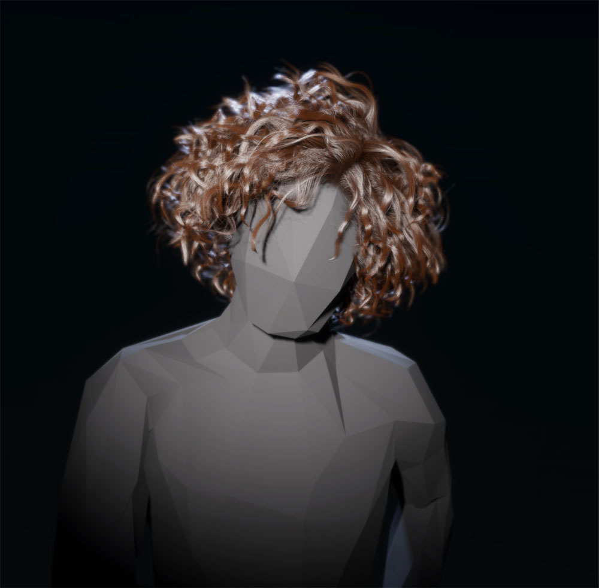
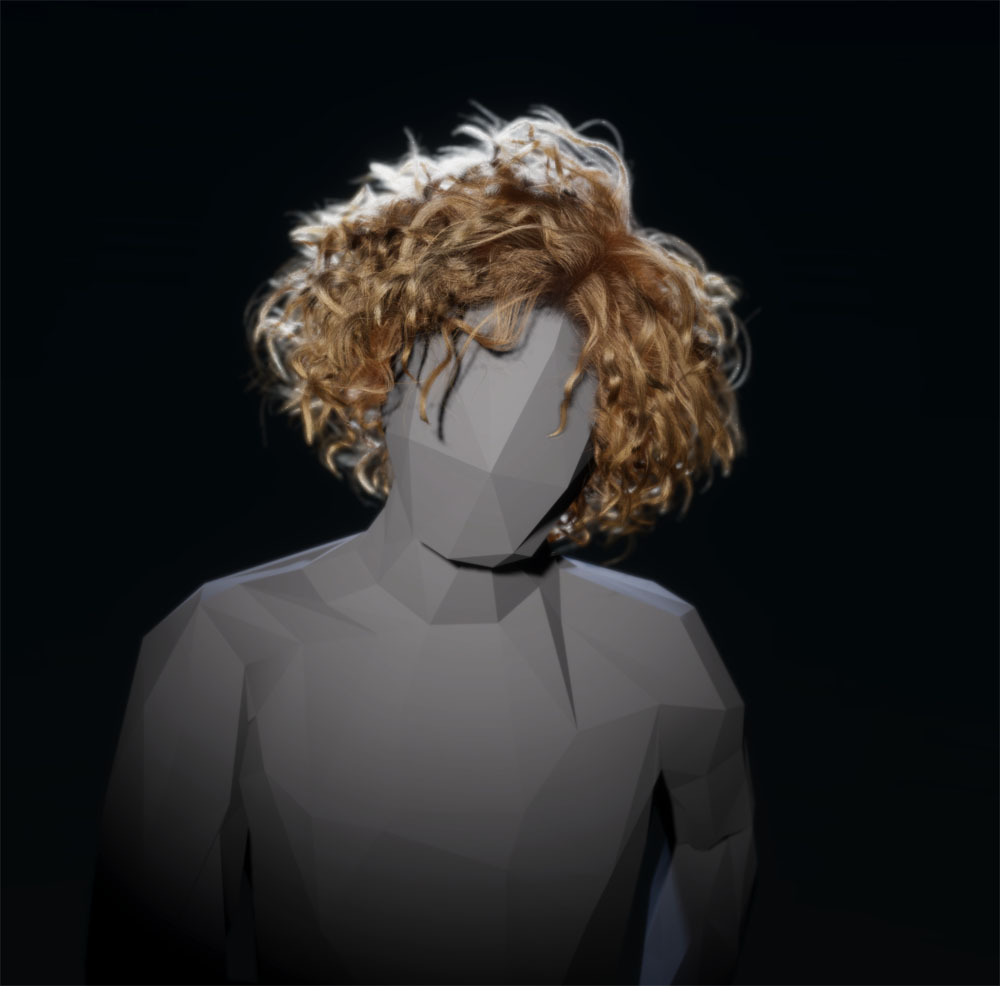

# Hair

The Hair Master Stack enables you to render hair and fur in the High Definition Render Pipeline (HDRP). To create a realistic looking hair effect, it uses layers called hair cards. Each hair card represents a different section of hair. If you use semi-transparent hair cards, you must manually sort them so that they are in back-to-front order from every viewing direction.

## Creating a Hair Shader Graph

To create a Hair material in Shader Graph, you can either:

* Modify an existing Shader Graph.
    1. Open the Shader Graph in the Shader Editor.
    2. In **Graph Settings**, select the **HDRP** Target. If there isn't one, go to **Active Targets,** click the **Plus** button, and select **HDRP**.
    3. In the **Material** drop-down, select **Hair**.

* Create a new Shader Graph.
    1. Go to **Assets > Create >Shader Graph > HDRP** and click **Hair Shader Graph**.

## Hair Material Types

HDRP’s Hair Master Stack has the following **Material Type** options: 

- [Approximate](#hair-approximate): This mode requires you to adjust nodes to suit the lighting in your scene.
- [Physical](#hair-physical) : This mode automatically produces physically correct results.

### Considerations for choosing a Material Type

This table explains the conditions under which you might prefer to choose the Physical or Approximate hair Material Types:

| **Material Type**                | **GPU requirements** | **Geometry compatibility**   | **Compatible with Path tracing**                             | **Hair tones**                                               |
| -------------------------------- | -------------------- | ---------------------------- | ------------------------------------------------------------ | ------------------------------------------------------------ |
| [Approximate](#hair-approximate) | Moderate             | Hair cards.                  | No.  For more information, see [Path tracing](Ray-Tracing-Path-Tracing.md.md#hair). | Works with all hair tones. However, it doesn't give light hair a volumetric appearance. |
| [Physical](#hair-physical)       | High                 | Hair cards and hair strands. | Yes. However, path tracing is not compatible with ribbons.  For more information, see [Path tracing](Ray-Tracing-Path-Tracing.md.md#hair). | Works with all hair tones. Gives lighter hair tones a volumetric appearance when you use [multiple scattering](#hair-scattering) |

### The Approximate hair Material Type

The **Approximate** Material Type mimics the characteristics of human hair. It is based on the [Kajiya-Kay](https://www.cs.drexel.edu/~david/Classes/Papers/p271-kajiya.pdf) hair shading model. HDRP computes this model faster than the [Physical](#hair-physical) Material Type because it is less resource intensive.

The Approximate model doesn’t automatically look realistic in every lighting setup. This means you need to adjust the blocks in the [Fragment context](master-stack-hair.html#fragment-context) to suit the lighting environment in your scene.

The Approximate model is best for darker hair tones. For best results with lighter hair tones, use the Physical model.

### The Physical Material Type

The Physical Material Type automatically creates physically correct results in any light environment. It accurately accounts for the amount of incident light to scatter within a hair fiber (known as an energy-conserving hair model). This means the Physical model works correctly in any lighting environment. 

This model adds the following nodes in the Fragment shader: 

<table>
<tr>
<th>Property</th>
<th>Description</th>
<th>Setting Dependency</th>
<th>Default Value</th>
</tr>
[!include]
[!include]
</table>

Change the [**Base Color** block](master-stack-hair.html#fragment-context) to define the color of the hair.

The Physical Material Type is based on the [Marschner](http://www.graphics.stanford.edu/papers/hair/hair-sg03final.pdf) human hair fiber reflectance model.

### Multiple Scattering 

Multiple scattering creates the appearance of light scattering through thousands of hair strands. This gives lighter hair tones a volumetric appearance. To enable multiple scattering in your scene, select a **Scattering Mode** option. 

To select a **Scattering Mode** option:

1. Open the Graph inspector.
2. Set the **Material Type** to Physical**.**
3. Set the **Geometry mode** to Strands.
4. Open the **Advanced Options** section.
5. Select **Scattering Mode.**

The Scattering Mode options appear when you select the **Physical** material type:

| Property        | Description                                                  |
| --------------- | ------------------------------------------------------------ |
| **Physical**    | Physically simulates light transport through a volume of hair (multiple scattering). This feature is not available for public use yet. |
| **Approximate** | Estimates the appearance of light transport through a volume of hair (multiple scattering). This mode does not take into account how transmittance affects the way light travels and slows through a volume of hair. It also ignores the effect that a hair's roughness has on the spread of light. |

## Geometry Type

You need to select a geometry type in your shader that reflects the geometry you use to represent hair. This allows HDRP to make correct assumptions when it computes the shading model. You can use multiple types of geometry to render hair, but the Hair Master Stack is only compatible with the following geometry types: 

- Cards: Hair cards display high-resolution hair textures on individual pieces of simplified geometry. 
  Card geometry is compatible with the Physical and Approximate Material types.
- Strands: Hair strand geometry represents each individual hair fiber in the shape of tube geometry or ribbons. 
  Strand geometry is compatible with the Physical Material Type.

The hair card method is a simple and efficient way to render hair for games, and doesn’t demand a lot of resources from the GPU. We recommend cards where the user experience will not be negatively impacted by it. For example, for secondary characters, and even as a lower level of detail for main characters. Use strands only for main characters.

### Select a geometry type

To select the geometry type that your shader uses:

1. Open your Hair shader
2. In the Graph inspector, open the **Advanced Options** dropdown

Select a 

Geometry Type

 option.

## Contexts

[!include]

### Vertex Context

#### Default

When you create a new Hair Master Stack, the Vertex Context contains the following Blocks by default:

<table>
<tr>
<th>Property</th>
<th>Description</th>
<th>Setting Dependency</th>
<th>Default Value</th>
</tr>
[!include]
[!include]
[!include]
</table>

#### Relevant
Depending on the [Graph Settings](#graph-settings) you use, Shader Graph can add the following locks to the Vertex Context:

<table>
<tr>
<th>Property</th>
<th>Description</th>
<th>Setting Dependency</th>
<th>Default Value</th>
</tr>
[!include]
[!include]
</table>

This Master Stack material type adds all its Vertex Blocks to the Vertex Context by default and has no extra relevant Blocks.

### Fragment Context

#### Default

When you create a new Hair Master Stack, the Fragment Context contains the following Blocks by default:

<table>
<tr>
<th>Property</th>
<th>Description</th>
<th>Setting Dependency</th>
<th>Default Value</th>
</tr>
[!include]
[!include]
[!include]
[!include]
[!include]
[!include]
[!include]
[!include]
[!include]
[!include]
[!include]
[!include]
[!include]
[!include]
</table>

#### Relevant

Depending on the [Graph Settings](#graph-settings) you use, Shader Graph can add the following blocks to the Fragment Context:

<table>
<tr>
<th>Property</th>
<th>Description</th>
<th>Setting Dependency</th>
<th>Default Value</th>
</tr>
[!include]
[!include]
[!include]
[!include]
[!include]
[!include]
[!include]
[!include]
[!include]
[!include]
[!include]
[!include]
[!include]
[!include]
[!include]
[!include]
</table>

## Graph Settings

### Surface Options
<table>
<tr>
<th>Property</th>
<th>Description</th>
</tr>
[!include]
[!include]
[!include]
[!include]
[!include]
[!include]
[!include]
[!include]
[!include]
[!include]
[!include]
[!include]
[!include]
[!include]
[!include]
[!include]
[!include]
[!include]
[!include]
[!include]
[!include]
[!include]
[!include]
[!include]
[!include]
[!include]
[!include]
</table>

### Advanced Options
<table>
<tr>
<th>Property</th>
<th>Description</th>
</tr>
[!include]
[!include]
[!include]
[!include]
[!include]
[!include]
</table>
