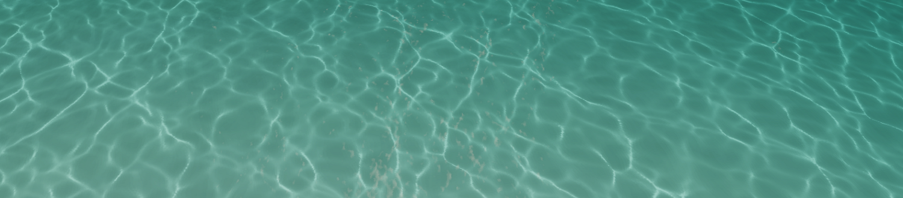

# Water

Use the Water Master Stack to render custom physically based water Material in the High Definition Render Pipeline (HDRP). The Water Master Stack approximately models a volumetric water medium, and includes properties to render effects such as caustics, scattering, and refraction.

## Create a Water shader graph

To create a Water material in Shader Graph, use one of the following methods:

To create a new shader graph, go to **Assets** > **Create** > **Shader Graph** > **HDRP** and select **Water Shader Graph**.

To modify an existing shader graph:

1. Open the shader graph in the Shader Editor.
2. In **Graph Settings**, select the **HDRP** Target. If there isn't an **HDRP** Target, go to **Active Targets** select the **Plus** button, and select **HDRP**.
3. In **Material**, select **Water**.

To duplicate the default shader graph HDRP uses for water surfaces in the **Game Object** > **Water Surface** menu:

1. In the Project window, go to **Packages** > **High Definition RP** > **Runtime** >  **RenderPipelineResources** > **ShaderGraph**.
2. Copy the `Water.shadergraph` asset, then paste the copy into your **Assets** folder.

See [Water Shader Graph nodes](Shader-Graph-Nodes.md) for more information.

## Contexts

[!include]

### Vertex Context

#### Default

When you create a new Water Master Stack, the Vertex Context contains the following Blocks by default. All the Blocks are mandatory. If you remove any of the Blocks, the water shader graph doesn't work.

<table>
<tr>
<th>Property</th>
<th>Description</th>
<th>Setting Dependency</th>
<th>Default Value</th>

[!include]
[!include]

<tr>
<td><b>UV0</b></td>
<td>Water properties packed into a UV coordinate set for the vertex context.</td>
<td></td>
<td></td>
</tr>

<tr>
<td><b>UV1</b></td>
<td>Water properties packed into a UV coordinate set for the vertex context.</td>
<td></td>
<td></td>
</tr>

</table>

### Fragment Context

#### Default

When you create a new Water Master Stack, the Fragment Context contains the following Blocks by default:

<table>
<tr>
<th>Property</th>
<th>Description</th>
<th>Setting Dependency</th>
<th>Default Value</th>
</tr>

[!include]
[!include]
[!include]
[!include]
[!include]
[!include]
[!include]
[!include]

</table>