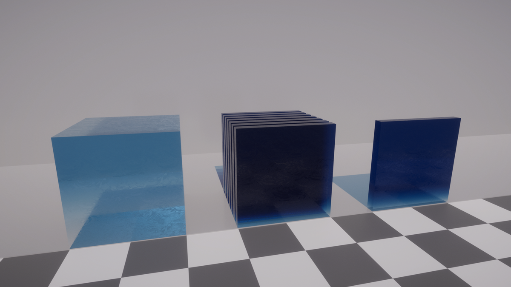
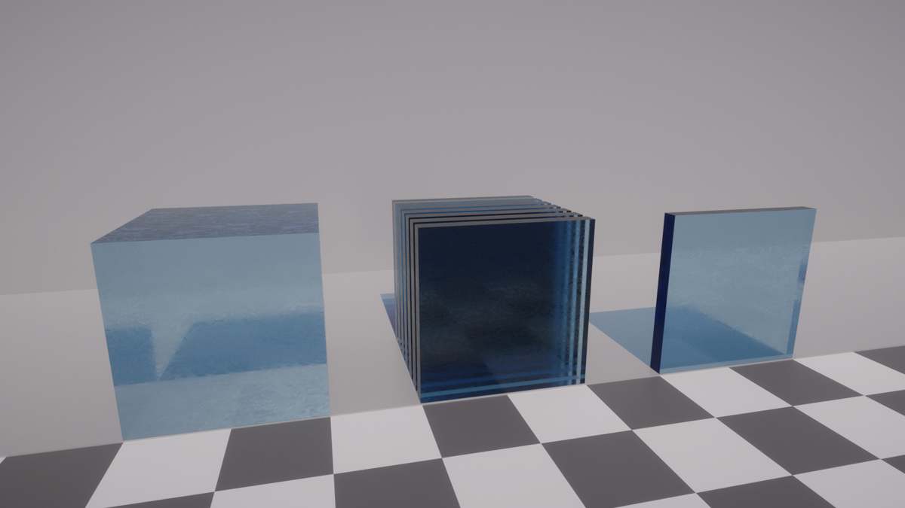
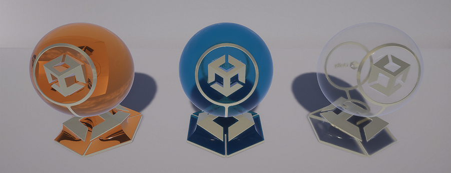
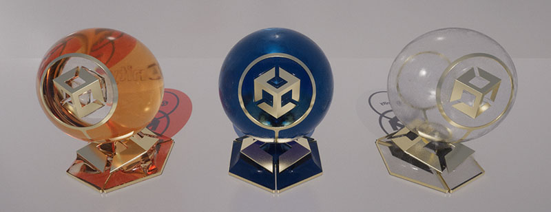
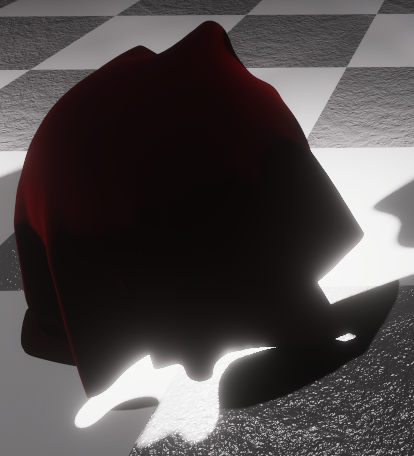

# Understand path tracing

Path tracing is a ray tracing algorithm that sends rays from the Camera and, when a ray hits a reflective or refractive surface, recurses the process until it reaches a light source. The series of rays from the Camera to the Light form a path.

It enables HDRP to compute various effects (such as hard or soft shadows, mirror or glossy reflections and refractions, and indirect illumination) in a single unified process.

A notable downside to path tracing is noise. Noise results from the random nature of the path tracing process; at each surface interaction, a new direction is chosen randomly. Noise vanishes as more paths accumulate and converge toward a clean image. For more information about path tracing limitations in HDRP, see [Unsupported features of path tracing](Ray-Tracing-Getting-Started.md#unsupported-features-of-path-tracing).


Noisy image with **Maximum Samples** set to 1


Clean image with **Maximum Samples** set to 256

The current implementation for path tracing in the High Definition Render Pipeline (HDRP) accumulates paths for every pixel up to a maximum count unless the Camera moves. If the Camera moves, HDRP restarts the path accumulation. Path tracing supports Lit, LayeredLit, Stacklit, AxF, and Unlit materials, and area, point, directional, and environment lights.

To troubleshoot this effect, HDRP provides a Path Tracing [Debug Mode](Ray-Tracing-Debug.md) and a Ray Tracing Acceleration Structure [Debug Mode](Ray-Tracing-Debug.md) in Lighting Full Screen Debug Mode.

## Understand how path tracing affects material properties

Path tracing changes how the following Material properties behave in your scene:

- [How transmissive objects absorb light](#surface-types)
- [How light refracts in transmissive objects](#refraction-models)
- [Subsurface scattering](#path-tracing-and-subsurface-scattering)

This is because path tracing in HDRP implements more precise light transport simulations than rasterization. To do this, path tracing computes all lighting effects and how light interacts with Materials at the same time. This changes the appearance of Materials in path-traced scenes. For example, in the images below, the Material appears darker.

The images below display the difference between transparent, double-sided materials in a rasterized and a path-traced scene:


GameObjects without path tracing (rasterized).


GameObjects with path tracing enabled.

<a name="surface-types"></a>

## Path tracing and double-sided materials

When you use path tracing, the **Double-Sided** property (menu: **Inspector** > **Surface Options** > **Double-Sided**) allows transparent materials to accumulate correctly. If you disable **Double-sided** property, rays which exit the GameObject will not behave correctly.

The following images display the same GameObjects with a single-sided Material and a double-sided material:



GameObjects with a single-sided Material and path tracing enabled



GameObjects with a double-sided Material and path tracing enabled

<a name="refraction-models"></a>

## How path tracing affects refraction models

Path tracing changes the way refraction models on a Lit Material behave.

To change the refraction model a Lit Material uses, in the **Transparency Inputs** section, select a model from the **Refraction model** dropdown, displayed in the following image:


The following table describes how each refraction model behaves when you enable path tracing:

| **Refraction model**   | **Path tracing behavior**                                    | **Compatible Surface sides**                                 |
| ---------------------- | ------------------------------------------------------------ | ------------------------------------------------------------ |
| **Box** and **Sphere** | A surface type that represents thick objects like a paperweight or a crystal ball. When you enable path tracing, the **Box** and **Sphere** models behave in the same way. Rays can intersect the GameObjects in the scene and HDRP doesb't need to approximate transparent surfaces | This refraction model is compatible with a double-sided Material that has its **Normal mode** set to **None**. |
| **Thin**               | A thin surface type with [infinitesimal](<https://en.wikipedia.org/wiki/Infinitesimal>) thickness. Select this for thin, window-like surfaces. When you enable path tracing, the behavior of the **Thin** refraction model behaves the same as in rasterization. | This refraction model is compatible with a double-sided Material that has its **Normal mode** set to  **Flip** or **Mirror**. |
| **None**               | A thin, refractive surface hardcoded to be smooth to simulate alpha blending. When you enable path tracing, the behavior of the **None** refraction model behaves the same as in rasterization. | This refraction model is compatible with a double-sided Material that has its **Normal mode** set to  **Flip** or **Mirror**. |



From left to right, a GameObject with **Sphere**, **Box,** and **Thin** mode without path tracing (rasterized).



From left to right, a GameObject with **Sphere**, **Box,** and **Thin** mode with path tracing enabled.

### Path tracing and subsurface scattering

For [subsurface scattering's](skin-and-diffusive-surfaces-subsurface-scattering.md) **Transmission** property (A) to work correctly with path tracing, you need to do the following:

1. Open the **Surface Options** window.
2. Enable the **Double-Sided** property (B).


The following example images display a sheet of fabric lit from below by a point light. The first image shows a single-sided surface, and the second shows a double-sided surface:



A single-sided surface with Transmission disabled.


A double-sided surface with Transmission enabled.

## Hair

Path tracing gives human hair a volumetric look. To do this, path tracing calculates the multiple scattering events that happen in a full head of hair. It is particularly effective for lighter hair tones.

You can only use path tracing with hair you create with the [Hair Master Stack](hair-master-stack-reference.md). The Hair Master Stack provides two hair Material Types. Path tracing works with the **Physical** Type.

**Tip:** The second Material Type, **Approximate**, does not work with path tracing. You can learn more about it in [The Approximate Material Type](hair-master-stack-reference.md#hair-approximate).

If you create hair using ribbons, it won’t work with path tracing in Unity. For path tracing to work with hair, you must use cards or tube geometry. For more information, see [Geometry type](hair-master-stack-reference.md#hair-geometry).

## Path tracing and automatic histogram exposure

Path tracing creates noise that changes the minimum and maximum values that HDRP uses for automatic, histogram-based [exposure](Override-Exposure.md). You can visualize this when you use the [RGB Histogram](rendering-debugger-window-reference.md#LightingPanel) to debug the exposure in your scene.

This is especially visible in the first few un-converged frames that have the highest level of noise. However, this does not affect the exposure of the final converged frame.

If there is any noise that affects the exposure in the final converged frame, adjust the following properties in the [Automatic Histogram](reference-override-exposure.md) override to set the exposure to your desired range:

- **Limit Min**
- **Limit Max**

## Path tracing and Light sources 

Due to the fundamentally different nature of Path Tracing, light sources are queried differently. To support this, the path tracer needs to build some additional data structures that contain light source information. These data structures limit the maximum number of lights that can be evaluated in local neighborhoods. In the current implementation, there are two such data structures. 

The first one is the [Ray Tracing Light Cluster](Ray-Tracing-Light-Cluster.md). It is used to resolve the lights and Decals (see below) around a specific point. The maximum number of lights per cell in this cluster can be increased if necessary. 

The second one is the Path Tracing light list, an internal data structure used to capture all light sources relevant to a specific path segment. If too many light sources are close to each other, they might not all fit in the light list. This might result in artifacts. To remove these artifacts, you can change the `PathTracingMaxLightCount` setting through the [HDRP Config mechanism](configure-a-project-using-the-hdrp-config-package.md).

## Path tracing and Decals 

In order to efficiently support the path tracing of decals, Decal Projectors are added to the [Ray Tracing Light Cluster](Ray-Tracing-Light-Cluster.md). In the case of many decals in a small volume, it might be necessary to increase the maximum number of lights per cell.

Additionally, the path tracer treats all decals as clustered decals. This might require increasing the "Maximum Lights per Cell (Ray Tracing)" (in the HDRP Quality settings, under lighting) and the size of the decal atlas (in the HDRP Quality settings, under Rendering), as more decals will be added to these data-structures. Emission from decals is currently not supported.

## Path tracing and random numbers

Path tracing uses random numbers to select new directions to trace in. The path tracer needs a seed for every frame to generate these random numbers. The **Seed Mode** property allows you to change how to calculate the seed number.

You can use the Custom mode to script your own behavior for the seed. This mode takes the seed from the **customSeed** parameter on the path tracing override. You must update the seed every frame. Otherwise every frame generates the same random numbers, resulting in no convergence.
<a name="seed-example"></a>
### Custom seed example: accumulating images over multiple recorder runs 

The following script is an example of the Custom Seed mode. It uses the frame count as the seed and adds a user-defined offset. 

You can use the script in the following scenario: rendering a sequence using the path tracer and the [Recorder package](https://docs.unity3d.com/Packages/com.unity.recorder@latest). You render each frame as a separate image with 512 samples. However, the images have not converged yet. Instead of starting from 0, you can re-render the same sequence with a different seed and add the results to the first set of images you rendered. 

```
using System.Collections;
using System.Collections.Generic;
using Unity.VisualScripting;
using UnityEngine;
using UnityEngine.Rendering;
using UnityEngine.Rendering.HighDefinition;
public class exampleBehavior : MonoBehaviour
{
    static int framecounter = 0;
    public Volume pathTracingVolume;
    VolumeProfile pathTracingVolumeProfile;
    PathTracing pathTracing;
    public int seedOffset = 0;
    void Start()
    {
        framecounter = 0;
        pathTracingVolumeProfile = pathTracingVolume.sharedProfile;
        if(!pathTracingVolumeProfile.TryGet<PathTracing>(out pathTracing))
        {
            Debug.Log("Path Tracing not found");
        }
    }
    // Update is called once per frame
    void Update()
    {
        pathTracing.customSeed.overrideState = true;
        pathTracing.customSeed.value = framecounter + seedOffset;
        framecounter++;
    }
}
```

This script allows you to render a first batch of images with 512 samples and a seed offset of zero by setting the Seed mode to custom. A second batch of images is then generated with the Seed offset set to 512 to ensure different random numbers. By doing this, the images are added together and the end result is more converged.
