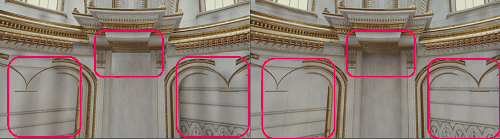
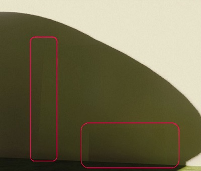

# Fix issues with Probe Volumes

You can adjust settings or use Volume overrides to fix artefacts from Probe Volumes.

## Fix dark blotches or streaks

Dark blotches and streaks are caused by Light Probes inside geometry ('invalid' probes). HDRP marks a Light Probe as invalid when the probe fires sampling rays to capture surrounding light data, but the rays hits the unlit backfaces inside geometry.

You can see which Light Probes are invalid using the [Rendering Debugger](Render-Pipeline-Debug-Window.md#ProbeVolume).

To minimise dark blotches and streaks, HDRP uses the following techniques:

- [Virtual Offset](#virtualoffset), to try to move the capture point of an invalid Light Probe so it's outside any [colliders](https://docs.unity3d.com/Documentation/Manual/CollidersOverview.html).
- [Dilation](#dilation), to detect Light Probes that remain invalid after Virtual Offset, and give them data from valid Light Probes nearby.

 
In the Scene on the left, Virtual Offset isn't active and dark bands are visible. In the Scene on the right, Virtual Offset is active. 

 
In the Scene on the left, Dilation isn't active and some areas are too dark. In the Scene on the right, Dilation is active. 

### Adjust Virtual Offset

You can configure Virtual Offset in [Probe Volume Settings](probevolumes-settings.md#offset). You can adjust the following:

- The length of the sampling ray Unity uses to find a valid capture point.
- How far Unity moves a Light Probe's capture position to avoid geometry. 
- How far Unity moves the start point of rays.
- How many times a probe's sampling ray hits colliders before Unity considers the probe invalid.

You can also disable Virtual Offset in the Probe Volume Settings. Virtual Offset only affects baking time, so disabling Virtual Offset doesn't affect runtime performance.

### Adjust Dilation

You can configure Dilation in [Probe Volume Settings](probevolumes-settings.md#dilationsettings). You can adjust the following:

- The percentage of backfaces a Light Probe can sample before HDRP considers that probe invalid.
- How far away from the invalid probe Unity searches for valid probes to contribute lighting data.
- How many iterations of Dilation HDRP does during the bake.
- How to weight the data from valid probes based on their spatial relationship with the invalid probe.

[How you adjust Light Probe density](probevolumes-showandadjust.md#adjust-light-probe-density) affects the final results, because HDRP uses the settings as a multiplier to calculate the distance between probes.

You can also disable Dilation in the Probe Volume Settings. Dilation only affects baking time, so disabling Dilation doesn't affect runtime performance.

## Fix light leaks

Light leaks are areas that are too light or dark, often in the corners of a wall or ceiling.

 
A light leak.
 

Light leaks are often caused when HDRP gets lighting data from a Light Probe that should be occluded, for example because it's on the other side of the wall. Probe Volumes use regular grids of Light Probes, so Light Probes may not follow walls or be at the boundary between different lighting areas.

To fix light leaks, you can do the following:

- [Create thicker walls](#thickerwalls).
- [Add a Volume to your Scene](#volume).
- [Adjust Probe Volume Settings](#probevolumesettings).
- [Use a Probe Volume Touchup](#probevolumetouchup).

### Create thicker walls

Adjust walls so their width is closer to the distance between probes in the local [brick](probevolumes-concept.md#brick-size-and-light-probe-density).

### Add a Volume to your Scene

You can add a [Volume](Volumes.md) with a **Probe Volume Options** override to adjust which Light Probes object pixels sample at runtime.

1. Add a [Volume](Volumes.md) to your Scene and make sure its area overlaps the camera position.
2. Select **Add Override**, then select **Lighting** > **Probe Volume Options**.
3. Enable **Normal Bias**, then adjust the value to move the position that object pixels use to sample the Light Probes, along the pixel's surface normal.
4. Enable **View Bias**, then adjust the value to move the position that object pixels use to sample the Light Probes, towards the camera.
4. Disable and enable **Leak Reduction Mode** to see if it improves light leaks.

Because HDRP calculates the effects of a Volume based on Camera position, the effect may change as the Camera moves.

See [Probe Volume settings and properties](probevolumes-settings.md#probe-volumes-options-override) for more information on **Probe Volume Options** settings.

### Use Probe Volume Settings

If adding a Volume doesn't work, use **Probe Volume Settings** to adjust Virtual Offset and Dilation settings.

1. In **Dilation Settings**, reduce **Dilation Distance**.
2. In **Virtual Offset Settings**, reduce **Search Distance Multiplier** and **Ray Origin Bias**. 
3. If there are light leaks in multiple locations, adjust **Min Distance Between Probes** and **Max Distance Between Probes** to increase the density of Light Probes.
4. Select **Generate Lighting** to rebake the scene using the new settings.

Note: Don't use very low values for the settings, or Dilation and Virtual Offset might not work.

### Add a Probe Volume Touchup Component

Use a Probe Volume Touchup Component to make Light Probes invalid in a small area. This triggers Dilation during baking, and improves the results of **Leak Reduction Mode** at runtime.

1. In the Probe Volume Inspector, select **Add Component**, then select **Light** > **Probe Volume Touchup**.
2. Set the **Size** so the **Probe Volume Touchup** area overlaps the Light Probes causing light leaks.
3. Enable **Invalidate Probes** to invalidate the Light Probes.
4. If you have a [Volume with a Probe Volume Options override](#volume), enable **Leak Reduction Mode**.
5. If needed, use **Override Dilation Validity** and **Dilation Validity Threshold** to override the values in the **Probe Volume Settings**.
6. In **Probe Volume Settings**, select **Generate Lighting** to rebake the scene using the new settings.

Adding a Probe Volume Touchups solves some light leak issues but usually not all. If you use many Probe Volume Touchup areas in a Scene, your bake will be slower, and your Scene might be harder to understand and maintain.

See [Settings and properties related to Probe Volumes](probevolumes-settings.md#touchup-properties).

## Fix seams

Seams are artefacts that appear when one lighting condition transitions immediately into another. Seams are caused when two adjacent bricks have different Light Probe densities. See [bricks](probevolumes-concept.md#brick-size-and-light-probe-density).

 
Two seams.
 

To fix seams, do the following:

1. Add a [Volume](Volumes.html) to your Scene and make sure its area overlaps the position of the camera.
2. Select **Add Override**, then select **Lighting** > **Probe Volume Options**.
3. Enable **Sampling Bias**, then try adjusting the value to add noise and make the transition more diffuse.

## Additional resources

* [Display and adjust Probe Volumes](probevolumes-showandadjust.md)
* [Settings and properties related to Probe Volumes](probevolumes-settings.md)
