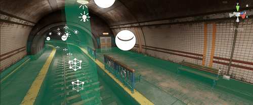

# Optimize loading Adaptive Probe Volume data

To optimize loading Adaptive Probe Volume (APV) data at runtime, do either of the following:

- Stream APV data.
- Load APV data from AssetBundles or Addressables.

You can't use both methods at the same time.

## Stream APV data

You can enable Adaptive Probe Volume streaming to enable Adaptive Probe Volume lighting in very large worlds. Using streaming means you can bake Adaptive Probe Volume data larger than available CPU or GPU memory, and load it at runtime when it's needed. At runtime, as your camera moves, the High Definition Render Pipeline (HDRP) loads only Adaptive Probe Volume data from cells within the camera's view frustum.

Unity uses Streaming Assets to store the lighting data. For more information about where Unity stores the files, refer to [Streaming Assets](https://docs.unity3d.com/6000.0/Documentation/Manual/StreamingAssets.html).

To enable streaming, follow these steps:

1. From the main menu, select **Edit** > **Project Settings** > **Quality** > **HDRP**.
2. Select a Quality Level.
3. Expand **Lighting** > **Light Probe Lighting**.

You can now enable two types of streaming:

- Enable **Enable GPU Streaming** to stream from CPU memory to GPU memory. 
- Enable **Enable Disk Streaming** to stream from disk to CPU memory. You must enable **Enable GPU Streaming** first.

You can configure streaming settings in the same window. Refer to [HDRP Asset](HDRP-Asset.md#Lighting) for more information.

### Debug streaming

The smallest section HDRP loads and uses is a cell, which is the same size as the largest [brick](probevolumes-concept.md) in an Adaptive Probe Volume. You can influence the size of cells in an Adaptive Probe Volume by [adjusting the density of Light Probes](probevolumes-changedensity.md)

To view the cells in an Adaptive Probe Volume, or debug streaming, use the [Rendering Debugger](rendering-debugger-window-reference.md#probe-volume-panel).

 
The Rendering Debugger with **Display Cells** enabled.

## Load APV data from AssetBundles or Addressables

To load only the APV data you need at runtime, add the baked APV data to an [AssetBundle](https://docs.unity3d.com/6000.0/Documentation/Manual/AssetBundlesIntro.html) or [Addressable](https://docs.unity3d.com/Packages/com.unity.addressables@1.22/manual/index.html).

Follow these steps:

1. To store APV data in normal assets instead of Streaming Assets, go to **Project Settings** > **Graphics** > **Pipeline Specific Settings** > **HDRP**, then under **Adaptive Probe Volumes** enable **Probe Volume Disable Streaming Assets**. This automatically disables **Enable Disk Streaming**.
2. Bake your lighting.
3. Add the scene to an AssetBundle. For more information about how to add assets to AssetBundles and load them at runtime, refer to [AssetBundle workflow](https://docs.unity3d.com/6000.0/Documentation/Manual/AssetBundles-Workflow.html).

Enabling **Probe Volume Disable Streaming Assets** may increase the amount of memory APV uses at runtime. Unity has to keep all the lighting data associated with the current Baking Set in memory, regardless of whether all scenes are loaded.

# Additional resources

* [Understanding Adaptive Probe Volumes](probevolumes-concept.md)
* [Frame Settings](frame-settings-reference.md)
