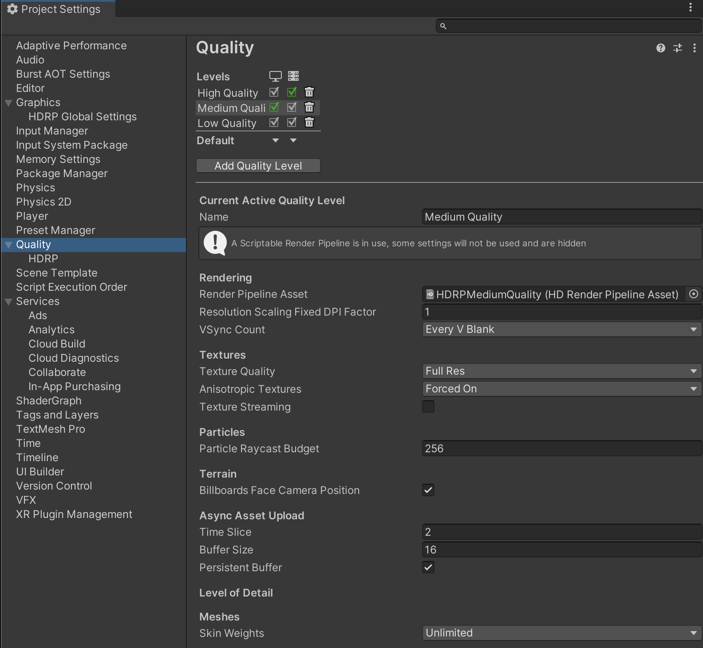
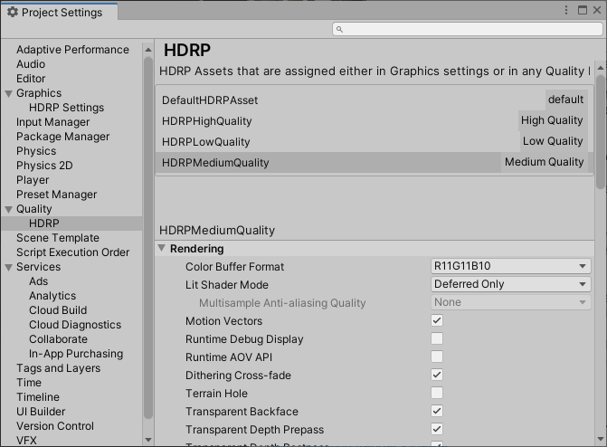

# Quality settings

Different platforms and computers have different GPU performance capabilities and available graphics memory. With this in mind, HDRP allows you to define multiple [HDRP Assets](create-an-hdrp-asset.md) for your Project. 

Each HDRP Asset can target a specific platform or quality tier to maintain a balance between performance and rendering quality. If you enable fewer effects, HDRP uses less memory. If you use a less precise algorithm for an effect, HDRP processes the effect faster.

For example, you can define separate HDRP Assets for:

* Xbox One.
* Xbox One X.
* PlayStation 4.
* PlayStation 4 Pro.
* PC - Low.
* PC - Medium.
* PC - High.

## Using the HDRP Asset and Quality Settings in Unity

### The default HDRP Asset

To use HDRP, you need to create an HDRP Asset and assign it as the **Scriptable Render Pipeline** for your Project. To do this, see [Creating an HDRP Asset](HDRP-Asset.md). When you assign an HDRP Asset as the **Scriptable Render Pipeline**, it acts as the **default** HDRP Asset for your Project and contains all the default HDRP settings.

### Overriding settings for a quality level

To override HDRP settings for different hardware and computer processing ability, create an additional HDRP Asset to contain the overridden values.

To guarantee scalability, define a separate HDRP Asset for each console and an HDRP Asset for a low-end, average, and high-end computer.

A Quality Settings Panel with several quality level with an associated HDRP Asset

After you create an HDRP Asset, create a Quality Level for it. To do this:

1. Go to **Edit** > **Project Settings** > **Quality** and select **Add Quality Level**.
2. Select the new Quality Level and assign the HDRP Asset to its **Render Pipeline Asset** property.

The HDRP Asset that you assign to a Quality Level is the Quality Level's current HDRP Asset.

**Note**: You can use the same HDRP Asset for multiple Quality Levels. If you don't assign an HDRP Asset to a Quality Level, the Quality Level uses the **default** HDRP Asset as its **current** HDRP Asset.

### Editing Quality Levels

To edit the HDRP Asset for a Quality Level, go to **Edit** > **Project Settings** > **Quality** > **HDRP**.

At the top, there is a list of HDRP Assets that contains the default HDRP Asset and every HDRP Asset that you have assigned to a Quality Level.
To edit an HDRP Asset, select it from the list and use the settings that appear below.

The HDRP Quality settings panel allows you to edit values for specific HDRP Assets

## Using the current Quality settings parameters

Unity uses the settings defined in both the default HDRP Asset and in the Quality settings during the rendering.

### Predefined values for different Quality Levels

In a single frame, some elements can require differing resources. For example, a Spot Light closer to the Camera may have a greater shadow resolution than a Light further away.

For this kind of settings, you can either:

* Use a custom value to always use.
* Use a value from those defined in the current HDRP Asset.

For the example above, the shadow resolution of a Light can be either:
- A custom value that you set in the Inspector for the Light.
- One of the predefined values in the current Quality Level's HDRP Asset (either **Low**, **Medium**, **High**, **Ultra**).

### Material Quality Node in Shader Graph

You can use the Material Quality Node in Shader Graphs to decide which code to execute for a specific quality. The current quality level is in the **Material** section of the HDRP Asset.

It's important that, for a given quality level, all Materials have the same Material Quality Level applied. If you need to have a different shader quality in a single rendering (like a Shader LOD system), author a dedicated Shader and use a different Shader with the appropriate complexity for this rendering.

### Ray tracing Quality Keyword in Shader Graph

For Shader Graphs that use ray tracing, you can use the [Raytracing Quality Keyword](SGNode-Raytracing-Quality.md) to provide a fast implementation.

HDRP uses the fast implementation to increase the performance of ray-traced rendering features where accuracy is less important.
