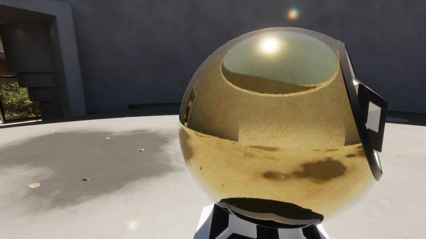
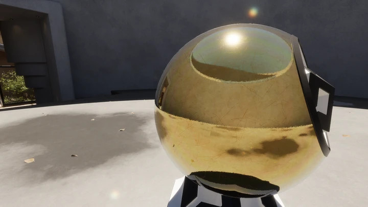
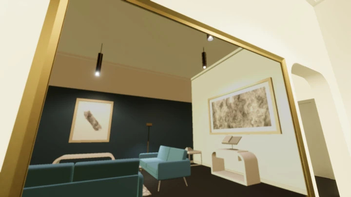
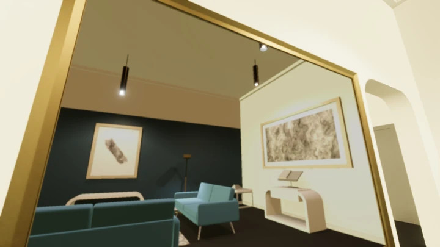
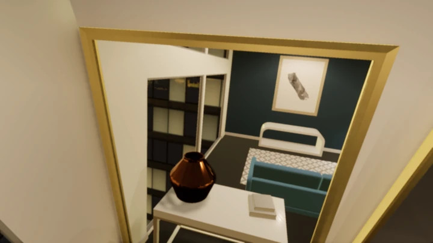
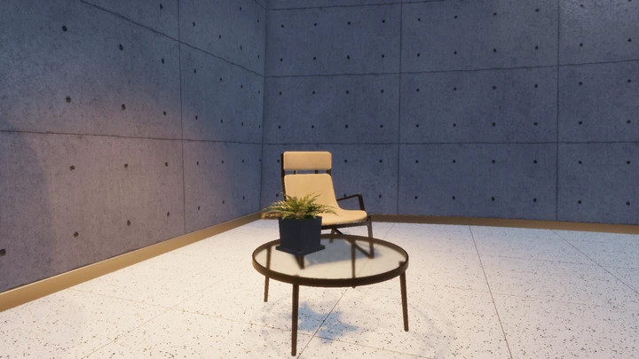
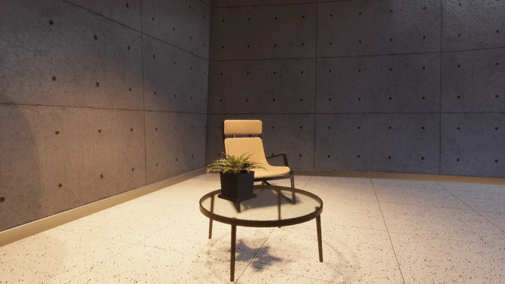
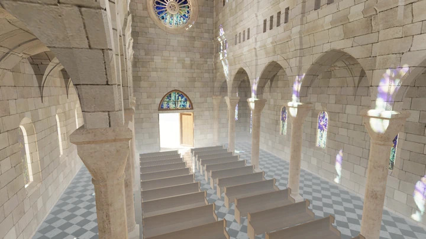
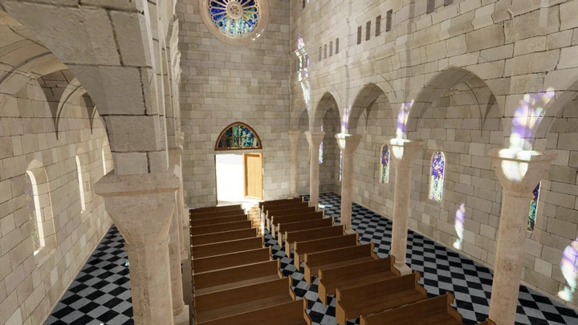

# Troubleshooting HDRP DXR/real-time ray tracing lighting

Incorrect lighting, such as missing shadows or lighting leaks, can occur if the camera's field of view, shadow map configurations, or light clusters don't align properly with the scene's geometry. The causes of these issues can be the following:

- Shadows from directional or punctual lights can be missing if the camera's frustum is misaligned or too narrow, and doesn't cover the shadow map area.

- Lighting leaks and insufficient light contributions can occur in scenes with closed environments, improper probe placement, or incorrect fallback settings.

To resolve lighting issues, you need to check the following light sources, which contribute to the illumination of each rasterized pixel in your scene:

* Directional (global) lights and their shadows
* Direct local lights (point, spot, area) and their shadows
* Indirect specular lighting:
    * Screen Space Reflection (SSR)/Ray Traced Reflection (RTR)
	* Planar reflection
	* Reflection probes
	* Sky cubemap

* Indirect diffuse lighting:
    * Screen Space Global Illumination (SSGI)/Ray-Traced Global Illumination (RTGI)
    * Adaptive Probe Volumes (APV)
    * Light probe groups
    * Lightmaps
    * Ambient probes
* Fog

## Fix missing shadows from directional lights

### Symptoms

You might notice the following symptoms when shadows from directional lights are missing:

- Shadows from directional lights don't appear, even though the light source is visible.

- Certain areas of the scene appear overly bright without proper shading or occlusion.

- The lighting feels flat or unrealistic, especially in large outdoor scenes with sunlight.

<canvas class="image-comparison" role="img" aria-label="Fix missing shadows from directional lights">
    
    
</canvas>

### Cause

Shadows cast by directional light don't render if the camera's field of view (frustum) is narrower than the cascade shadow map's coverage area.

### Resolution

To fix missing shadows from directional lights, adjust the **Directional Shadow Fallback Intensity** in the [Ray Tracing settings](reference-ray-tracing-settings.html). This setting allows HDRP to apply a fallback shadow value to points in the scene geometry where rays from the camera intersect objects but fall outside the coverage area of the shadow map. Depending on your setup, use 0.0 (in shadow) or 1.0 (fully lit) as the fallback shadow value.

## Fix missing shadows from punctual lights

### Symptoms

The following symptoms indicate missing shadows from punctual lights:

- Shadows from point lights or spot lights are missing, causing illuminated objects to look as though they're lit from all directions.

- Scenes appear washed out or lack depth, particularly when using small, concentrated light sources.

- Light leaks occur in areas where shadows are meant to be cast by nearby objects.

<canvas class="image-comparison" role="img" aria-label="Fix missing shadows from punctual lights">
    
    
</canvas>

### Cause

Shadows cast by punctual lights don't render if the camera's field of view (frustum) is narrower than the cascade shadow map's coverage area.

### Resolution

To fix missing shadows from punctual lights, enable **Extend Shadow Culling** in the [Ray Tracing settings](reference-ray-tracing-settings.html).

Extended shadow culling provides the following benefits:

- The [extended frustum culling region](reference-ray-tracing-settings.html#extended-culling) includes more objects in the shadow maps, even if their shadows don't affect pixels inside the frustum.

- Extended frustum culling doesn't increase the size of the cascade shadow map (only for directional lights).

However, extended shadow culling increases memory use and computational load.

## Fix insufficient local light contributions

### Symptoms

If local lights, such as point or area lights, aren't contributing properly to the scene, you might observe the following:

- Local lights seem too dim or fail to light nearby objects properly.

- Certain objects appear unlit or underlit despite being close to a light source.

- Ray-traced global illumination (RTGI) or RTR lighting doesn't seem to take local lights into account.

### Cause

The [light cluster's](Ray-Tracing-Light-Cluster.html) configuration can cause issues with the impact of direct local lights on real-time ray tracing (RTR) and ray-traced global illumination (RTGI).

### Resolution

To fix insufficient local light contributions, diagnose the issue in the [Rendering Debugger window](use-the-rendering-debugger.md).

- If the number of lights in each cell exceeds the default limit, reduce the number of lights in **Edit** > **Project Settings** > **Quality** > **HDRP** > **Lights**.

- If lights outside the camera range aren't contributing as expected, enlarge the camera cluster range in the volume's **Inspector** window under **Override** > **Ray Tracing** > **Light Cluster**.

## Fix indirect specular light leaks

### Symptoms

The following symptoms might occur when an indirect specular light leaks:

- Reflections, especially on glossy or metallic surfaces, are either missing or overly bright, as though they reflect the sky or environment instead of the intended object.

- Unrealistic or random bright spots appear on surfaces with specular highlights, especially in interior scenes.

- Reflections seem disconnected from nearby objects or appear out of place.

<canvas class="image-comparison" role="img" aria-label="Fix indirect specular light leaks">
    
    
</canvas>

### Cause

Common causes for indirect specular light leaks include the absence of reflection probes and incorrect fallback settings in the last bounce of screen-space reflections (SSR) and real-time ray tracing (RTR).

### Resolution

To fix indirect specular light leaks, add reflection probes and configure the **Ray Miss** and **Last Bounce** settings in the volume's Inspector window under **Override** > **Lighting** > **Screen Space Reflection** > **Tracing** > **Ray Tracing**.

## Fix lighting leaks that occur when the sky lights the scene

### Symptoms

You might encounter the following issues when the sky lights the scene:

- Bright light leaks from outside or from the sky into enclosed interiors, particularly in areas with no windows or other direct openings.

- Overexposed or unnaturally bright spots appear on surfaces in closed spaces, even when no visible light sources are present.

- Lighting feels uneven, with areas illuminated by the sky despite being fully enclosed.

### Cause

When the camera is in a closed environment, and no data is sampled from reflection probes at a ray intersection, the sky becomes the only light source.

### Resolution

To fix lighting leaks that occur when the sky lights the scene, create, place, and bake reflection probes, or use real-time reflection probes. 

- In the **Last Bounce** dropdown menu, select **Reflection Probes** or **None**.

- Even in **Quality** mode and with more than the default number of bounces, you must specify a valid source of indirect specular light for the last bounce.

## Fix indirect diffuse light leaks

### Symptoms

The following symptoms can indicate indirect diffuse light leaks:

- Diffuse lighting appears to seep through walls or barriers, creating bright patches in areas meant to be shaded.

- Areas in closed environments are lit by ambient or external light sources, producing an unrealistic lighting effect.

- Objects near walls or other occlusions might appear brighter than intended, disrupting the desired lighting mood.

<canvas class="image-comparison" role="img" aria-label="Fix indirect diffuse light leaks">
    
    
</canvas>

### Cause

Common causes of indirect diffuse light leaks include improper use of ambient probes, deprecated light probes, and lightmaps in real-time ray tracing (RTR).

### Resolution

To fix indirect diffuse light leaks, follow one or both of these steps:

- Adjust the **Ambient Probe Dimmer** in the Inspector window under **Override** > **Lighting** > **Screen Space Global Illumination** > **Tracing** > **Ray Tracing**.

- Bake probes via adaptive probe volumes.

## Fix fog light leaks

### Symptoms

Fog light leaks have the following symptoms:

- Interior scenes have a tinted or colored fog effect that seems unnatural or overly bright, especially in areas with no visible sky.

- The color of the fog in enclosed spaces appears inconsistent with the intended lighting setup, creating a disjointed visual effect.

- Fog might seem to have a glowing or leaking effect, as though it's illuminated by a non-existent light source from outside.

<canvas class="image-comparison" role="img" aria-label="Fix fog light leaks">
    
    
</canvas>

### Cause

Setting the fog color mode to **Sky Color** can cause unintended tinting in closed interiors.

### Resolution

To fix fog light leaks, set the fog's color to a constant black in closed environments. In the Sky and Fog Global Volume's Inspector window, select **Color mode** > **Constant color**, check the **Color box**, and select black in the color wheel. Bake probes via adaptive probe volumes.

## Additional resources

- [Unity ray tracing guide](Ray-Tracing-Getting-Started.html)

- [Ray tracing settings](Ray-Tracing-Settings.html)

- [Ray-traced global illumination](Ray-Traced-Global-Illumination.html)

- [Ray-traced reflections](Ray-Traced-Reflections.html)

- [Understand reflection in HDRP](reflection-understand.html)
