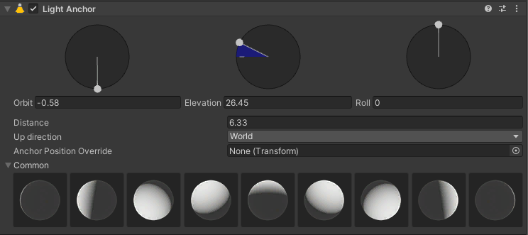

# Light Anchor reference

## Properties

| **Property**                 | **Description**                                              |
| ---------------------------- | ------------------------------------------------------------ |
| **Orbit**                    | Use the left icon to control the Orbit of the light. This tool becomes green when you move the icon. |
| **Elevation**                | Use the middle icon to control the Elevation of the light. This tool becomes blue when you move the icon. |
| **Roll**                     | Use the right icon to control the Roll of the light. This tool becomes gray when you move the icon. This is useful if the light has an IES or a Cookie. |
| **Distance**                 | Controls the distance between the light and its anchor in world space. |
| **Up Direction**             | Defines the space of the up direction of the anchor. When you set this value to Local, the Up Direction is relative to the Camera. |
| **Anchor Position Override** | Allows you to use a GameObject's [Transform](https://docs.unity3d.com/ScriptReference/Transform.html) as anchor position instead of the LightAnchor's Transform. When the Transform of the GameObject you assigned to this property changes, the Light Anchor's Transform also changes. |
| **Common**                   | Assigns a preset to the light component based on the behavior of studio lights. |