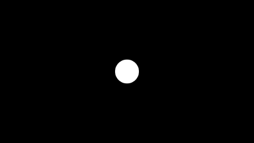

# Exposure volume override reference

[!include]

| **Property** | **Description**                                              |
| ------------ | ------------------------------------------------------------ |
| **Mode**     | Use the drop-down to select the method that HDRP uses to process exposure:  &#8226;  [**Fixed**](#FixedProperties): Allows you to manually sets the Scene exposure. &#8226;  [**Automatic**](#AutomaticProperties): Automatically sets the exposure depending on what's on screen. &#8226;  [**Automatic Histogram**](#AutomaticHistogram): Extends Automatic exposure with histogram control. &#8226;  [**Curve Mapping**](#CurveMappingProperties): Maps the current Scene exposure to a custom curve. &#8226;  [**Use Physical Camera**](#UsePhysicalCameraProperties): Uses the current physical Camera settings to set the Scene exposure. |

### Fixed

This is the simplest, and least flexible, method for calculating exposure but it's useful when you have a Scene with a relatively uniform exposure or when you want to take images of static areas. You can also use local [Volumes](understand-volumes.md) to blend between various fixed exposure values in your Scenes.

#### Properties

| **Property**       | **Description**                                         |
| ------------------ | ------------------------------------------------------- |
| **Fixed Exposure** | Set the exposure value for Cameras this Volume affects. |

### Automatic

The human eye can function in both dark and bright areas. However, at any single moment, the eye can only sense a contrast ratio of about one millionth of the total range. The eye functions well in multiple light levels by adapting and redefining what's black.

**Automatic Mode** dynamically adjusts the exposure according to the range of brightness levels on the screen. The adjustment takes place gradually, which means that the user can be dazzled by bright outdoor light when they emerge from a dark area. Equally, when moving from a bright area to a dark one, the Camera takes a moment to adjust.

#### Properties

| **Property**            | **Description**                                              |
| ----------------------- | ------------------------------------------------------------ |
| **Metering Mode**       | Use the drop-down to select the metering method that HDRP uses to filter the luminance source. For information on the **Metering Mode**s available, see the [Using Automatic section](#UsingAutomatic). |
| **Luminance Source**    | Use the drop-down to set the luminance source that HDRP uses to calculate the current Scene exposure. HDRP doesn't currently support the **Lighting Buffer** option. |
| **Compensation**        | Set the value that the Camera uses to compensate the automatically calculated exposure value. This is useful if you want to over or under expose the Scene. |
| **Limit Min**           | Set the minimum value that the Scene exposure can be.        |
| **Limit Max**           | Set the maximum value that the Scene exposure can be.        |
| **Mode**                | Use the drop-down to select the method that HDRP uses to change the exposure when the Camera moves from dark to light and vice versa: &#8226; **Progressive**: The exposure changes over the period of time defined by the **Speed Dark to Light** and **Speed Light to Dark** property fields. &#8226; **Fixed**: The exposure changes instantly. Note: The Scene view uses **Fixed**. |
| **Speed Dark to Light** | Set the speed at which the exposure changes when the Camera moves from a dark area to a bright area. This property only appears when you set the **Mode** to **Progressive**. |
| **Speed Light to Dark** | Set the speed at which the exposure changes when the Camera moves from a bright area to a dark area. This property only appears when you set the **Mode** to **Progressive**. |
| **Target Mid Gray**     | Sets the desired Mid gray level used by the auto exposure (for example, to what grey value the auto exposure system maps the average scene luminance). Note that the lens model used in HDRP isn't of a perfect lens, so it won't map precisely to the selected value. |

### Automatic Histogram

The automatic histogram is an extension of the [**Automatic**](#AutomaticProperties) mode. In order to achieve a more stable exposure result, this mode calculates a histogram of the image which makes it possible exclude parts of the image from the exposure calculation. This is useful to discard very bright or very dark areas of the screen.

To control this process, in addition to the properties for **Automatic** mode, this mode includes the following properties:

#### Properties

| **Property**              | **Description**                                              |
| ------------------------- | ------------------------------------------------------------ |
| **Histogram Percentages** | Use this field to select the range of the histogram to consider for auto exposure calculations. The values for this field are percentiles. This means that, for example, if you set the low percentile to *X*, if a pixel has a lower intensity than (100-*X*)% of all the pixels on screen, HDRP discards it from the exposure calculation. Similarly, if you set the higher percentile to *Y*, it means that if a pixel has a higher intensity than *Y*%, HDRP discards it from the exposure calculation. This allows the exposure calculation to discard unwanted outlying values in the shadows and highlight regions. |
| **Use Curve Remapping**   | Specifies whether to apply curve mapping on top of this exposure mode or not. For information on curve mapping properties, see the [Curve Mapping section](#Curve Mapping). |

#### Using Automatic

To configure **Automatic Mode**:

1. Set the **Metering Mode**. This tells the Camera how to measure the current Scene exposure. You can set the **Metering Mode** to:

- **Average**: The Camera uses the entire luminance buffer to measure exposure.
- **Spot**: The Camera only uses the center of the buffer to measure exposure. This is useful if you want to only expose light against what's in the center of your screen.

- **Center Weighted**: The Camera applies a weight to every pixel in the buffer and then uses them to measure the exposure. Pixels in the center have the maximum weight, pixels at the screen borders have the minimum weight, and pixels between have a progressively lower weight the closer they're to the screen borders.

- **Mask Weighted**: The Camera applies a weight to every pixel in the buffer then uses the weights to measure the exposure. To specify the weighting, this technique uses the Texture set in the **Weight Texture Mask** field. Note that, if you don't provide a Texture, this metering mode is equivalent to **Average**.
- **Procedural Mask**: The Camera applies a weight to every pixel in the buffer then uses the weights to measure the exposure. The weights are generated using a mask that's procedurally generated with the following parameters:

| **Property**                      | **Description**                                              |
| --------------------------------- | ------------------------------------------------------------ |
| **Center Around Exposure target** | Whether the procedural mask is centered around the GameObject set as Exposure Target in the [Camera](hdrp-camera-component-reference.md). |
| **Center**                        | Sets the center of the procedural metering mask ([0,0] being bottom left of the screen and [1,1] top right of the screen). Available only when **Center Around Exposure target** is disabled. |
| **Offset**                        | Sets an offset to where mask is centered . Available only when you enable **Center Around Exposure target**. |
| **Radius**                        | Sets the radiuses (horizontal and vertical) of the procedural mask, in terms of fraction of half the screen (for example, 0.5 means a mask that stretch half of the screen in both directions). |
| **Softness**                      | Sets the softness of the mask, the higher the value the less influence is given to pixels at the edge of the mask. |
| **Mask Min Intensity**            | All pixels below this threshold (in EV100 units) are assigned a weight of 0 in the metering mask. |
| **Mask Max Intensity**            | All pixels above this threshold (in EV100 units) are assigned a weight of 0 in the metering mask. |

2. Set the **Limit Min** and **Limit Max** to define the minimum and maximum exposure values respectively. Move between light and dark areas of your Scene and alter each property until you find the perfect values for your Scene.
3. Use the **Compensation** property to over or under-expose the Scene. This works in a similar way to how exposure compensation works on most cameras.
4. Tweak the adaptation speed. This controls how fast the exposure adapts to exposure changes. The human eye adapts slower to darkness than to lightness, so use a lower value for **Speed Light to Dark** than for **Speed Dark to Light**.

### Curve Mapping

The **Curve Mapping Mode** is a variant of [**Automatic**](#AutomaticProperties) **Mode**. Instead of setting limits, you manipulate a curve, where the x-axis represents the current Scene exposure and the y-axis represents the exposure you want. This lets you set the exposure in a more precise and controlled way for all lighting conditions at once.

#### Properties

| **Property**  | **Description**                                              |
| ------------- | ------------------------------------------------------------ |
| **Curve Map** | Use the curve to remap the Scene exposure (x-axis) to the exposure you want (y-axis). |

### Use Physical Camera

This mode mainly relies on the [Camera’s](https://docs.unity3d.com/Manual/class-Camera.html) **Physical Settings**. The only property this **Mode** exposes allows you to over or under expose the Scene.

#### Properties

| **Property**     | **Description**                                              |
| ---------------- | ------------------------------------------------------------ |
| **Compensation** | Set the value that the Camera uses to compensate the automatically computed exposure value. This is useful if you want to over or under expose the Scene. This works similarly to how exposure compensation works on most cameras. |