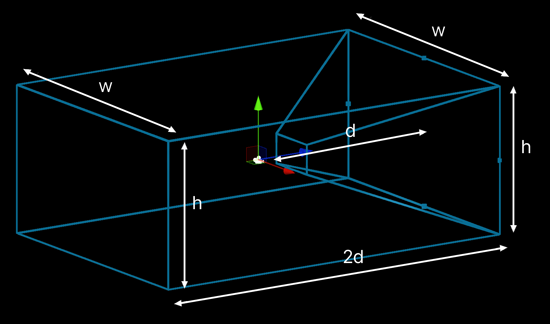

# Ray Tracing Settings reference

In the High Definition Render Pipeline (HDRP), various ray-traced effects share common properties. Most of them are constants, but you may find it useful to control some of them. Use this [Volume Override](volume-component.md) to change these values.

## Properties

| **Property**                              | **Description**                                              |
| ----------------------------------------- | ------------------------------------------------------------ |
| **Ray Bias**                              | Specifies the bias value HDRP applies when casting rays for all effects. This value should remain unchained unless your scene scale is significantly smaller or larger than average. |
| **Distant Ray Bias**                      | Specifies the Ray Bias value used when the distance between the pixel and the camera is close to the far plane. Between the near and far plane the Ray Bias and Distant Ray Bias are interpolated linearly. This does not affect Path Tracing or Recursive Rendering. This value can be increased to mitigate Ray Tracing z-fighting issues at a distance. |
| **Extend Shadow Culling**                 | Extends the region that HDRP includes in shadow maps, to create more accurate shadows in ray traced effects. See [Extended frustum culling](#extended-culling) for more information. For Directional lights, cascades are not extended, but additional objects may appear in the cascades. |
| **Extend Camera Culling**                 | Extends the region that HDRP includes in rendering. This is a way to force skinned mesh animations for GameObjects that aren't in the frustum. See [Extended frustum culling](#extended-culling) for more information. |
| **Directional Shadow Ray Length**         | Controls the maximal ray length for ray traced directional shadows. |
| **Directional Shadow Fallback Intensity** | The shadow intensity value HDRP applies to a point when there is a [Directional Light](Light-Component.md) in the Scene and the point is outside the Light's shadow cascade coverage. This property helps to remove light leaking in certain environments, such as an interior room with a Directional Light outside. |
| **Acceleration Structure Build Mode**     | Specifies if HDRP handles automatically the building of the ray tracing acceleration structure internally or if it's provided by the user through the camera. When set to Manual, the RTAS build mode expects a ray tracing acceleration structure to be set on the camera. If not, all ray traced effects will be disabled. This option does not affect the scene view. |
| **Culling Mode**                          | Specifies which technique HDRP uses to cull geometry out of the ray tracing acceleration structure. When set to Extended Frustum, HDRP automatically generates a camera oriented bounding box that extends the camera's frustum. When set to Sphere, a bounding sphere is used for the culling step. Solid Angle culling allows ignoring small geometries or geometries that are far away from the camera position depending on their projected solid angle.|
| **Culling Distance**                      | Specifies the radius of the sphere used to cull objects out of the ray tracing acceleration structure when the culling mode is set to Sphere. |

### Extended frustum culling

If you enable **Extend Shadow Culling** or **Extend Camera Culling**, HDRP sets the culling region to the width and height of the frustum at the far clipping plane, and sets the depth to twice the distance from the camera to the far clipping plane.