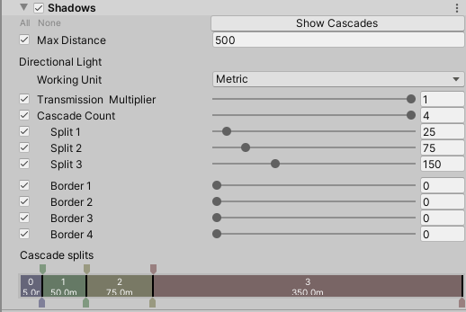

# Shadows volume override reference

## Properties

[!include]

| **Property**                | **Description**                                              |
| --------------------------- | ------------------------------------------------------------ |
| **Working Unit**            | Use the drop-down to select the unit that you want to use to define the cascade splits. &#8226; **Metric**: Defines cascade splits and borders in meters. &#8226; **Percent**: Defines cascade splits and borders as a percentage of **Max Distance**. |
| **Max Distance**            | Set the maximum distance (in meters) at which HDRP renders shadows. HDRP uses this for punctual Lights and as the last boundary for the final cascade. |
| **Transmission Multiplier** | Sets the multiplier that HDRP applies to light transmitted by Directional Lights on thick objects. |
| **Cascade Count**           | Use the slider to set the number of cascades to use for Directional Lights that can cast shadows. Cascades work as levels of detail (LOD) for shadows. Each cascade has its own shadow map, and the cascade area gets progressively larger as they get further from the Camera. HDRP spreads the same resolution shadow map over each cascade area, so cascades closer to the Camera have higher quality shadows than those further from the Camera. |
| **Split 1**                 | Set the distance of the split between the first and second cascades. The **Working Unit** defines the unit this property uses. |
| **Split 2**                 | Set the distance of the split between the second and third cascades. The **Working Unit** defines the unit this property uses. |
| **Split 3**                 | Set the distance of the split between the third and final cascades. The **Working Unit** defines the unit this property uses. |
| **Border 1**                | Set the size of the border between the first and second cascade split. HDRP fades the shadow cascades between these two sections over this border. The **Working Unit** defines the unit this property uses. |
| **Border 2**                | Set the size of the border between the second and third cascade split. HDRP fades the shadow cascades between these two sections over this border. The **Working Unit** defines the unit this property uses. |
| **Border 3**                | Set the size of the border between the third and final cascade split. HDRP fades the shadow cascades between these two sections over this border. The **Working Unit** defines the unit this property uses. |
| **Border 4**                | Set the size of the border at the end of the last cascade split. HDRP fades the final shadow cascade out over this distance. The **Working Unit** defines the unit this property uses. |