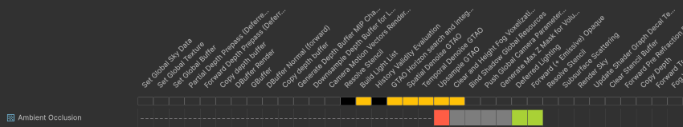

# Analyze the render graph in HDRP

To analyze the render graph in HDRP, use the **Render Graph Viewer** window. 

The render graph is the optimized sequence of render passes the High Definition Render Pipeline (HDRP) steps through each frame. The Render Graph Viewer displays both built-in render passes and any [custom passes](Custom-Pass.md) you create.

For more information about the **Render Graph Viewer** window, refer to [Render Graph Viewer window reference](render-graph-viewer-reference.md).

## Open the Render Graph Viewer window

Go to **Window** > **Analysis** > **Render Graph Viewer**.

The **Render Graph Viewer** window displays the render graph for the active camera by default. To select another camera, use the dropdown in the toolbar.

## View the render graph for a build

To connect the Render Graph Viewer window to a build, enable **Development Build** in the **Build Profiles** window when you build the project. If you build for WebGL or Universal Windows Platform (UWP), enable both **Development Build** and **Autoconnect Profiler**.

After you build your project, follow these steps:

1. Run your built project.
2. In the **Render Graph Viewer** window, select the **Target Selection** dropdown. The dropdown is set to **Editor** by default.
3. In the **Local** section, select your build.

Your build appears in the **Local** section only if the build is running.

## Example: Check how HDRP uses a resource

You can use the resource access blocks next to a resource name to check how the render passes use the resource.

In this example, the **Ambient Occlusion** texture goes through the following stages:

1. During the first 19 render passes between **Set Global Sky Texture** and **Temporal Denoise GTAO**, the texture doesn't exist. The resource assess blocks are dotted lines.

2. The **Upsample GTAO** render pass creates the texture, and has write-only access to it. The resource access block is red.
    
3. The next four render passes don't have access to the texture. The resource access blocks are gray.

4. The **Deferred Lighting** render pass has read-only access to the texture. The resource access block is green.

6. The **Forward (+ Emissive) Opaque** render pass has read-only access to the texture. The resource access block is green.

7. Unity destroys the texture, because it's no longer needed. The resource access blocks are blank.

## Check how HDRP optimized a render pass

To check the details of a render pass, for example to find out why it's not a native render pass or a merged pass, do either of the following:

- Select the render pass name to display the details in the Pass List.
- Below the render pass name, hover your cursor over the gray, blue, or flashing blue resource access overview block.

For more information about displaying details of a render pass, refer to [Render Graph Viewer window reference](render-graph-viewer-reference.md).

## Additional resources

- [Optimizing draw calls](reduce-draw-calls-landing-hdrp.md)
- [Reduce rendering work on the CPU](reduce-rendering-work-on-cpu.md)
