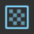
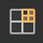

# Render Graph Viewer window reference for HDRP

The **Render Graph Viewer** window displays the [render graph](render-graph-introduction.md) for the current scene in the High Definition Render Pipeline (HDRP). 

For more information about the **Render Graph Viewer** window, refer to [Analyze a render graph](render-graph-view.md).

## Toolbar

|**Control**|**Description**|
|-|-|
|**Refresh**|Selects whether to update the window automatically. The options are: <ul><li>**Auto Update**: Updates the window automatically.</li><li>**Pause**: Doesn't update the window automatically.</li></ul>|
|**Target Selection**|Selects which project the window connects to. For more information, refer to [View the render graph for a built project](render-graph-view.md#built-project). The options are:<ul><li>**Editor**: Connects to the project in the Unity Editor.</li><li>**Local**: Connects to a built project on the same device. </li><li>**Remote**: Connects to a built project on a different device.<li></li>**Direct Connection**: Connects to an application through an IP address.</li></ul>|
|**Camera**|Selects the camera to display the rendering loop for.|
|**Pass Filter**|Selects which render passes to display. For more information, refer to [Pass Filter dropdown](#pass-filter-property).|
|**Resource Filter**|Selects which resources to display. For more information, refer to [Resource Filter dropdown](#resource-filter-property).|
|**View Options**|Selects whether to display how the render pass stores and loads the resource in the main window.|

### Pass Filter dropdown

|**Control**|**Description**|
|-|-|
|**Culled Passes**|Displays render passes that HDRP hasn't included in the render graph because they have no effect on the final image.|
|**Raster Passes**|Displays only raster render passes created using `renderGraph.AddRasterRenderPass`.|
|**Unsafe Passes**|Displays only render passes that use the `AddUnsafePass` API to use `CommandBuffer` interface APIs such as `SetRenderTarget`.|
|**Compute Passes**|Displays only compute render passes created using `renderGraph.AddComputePass`.|

### Resource Filter dropdown

|**Control**|**Description**|
|-|-|
|**Imported Resources**|Displays only resources imported into the render graph using `ImportTexure`.|
|**Textures**|Displays only textures.|
|**Buffers**|Displays only buffers.|
|**Acceleration Structures**|Displays only acceleration structures used in compute render passes.|

## Main window

The main window is a timeline graph that displays the render passes in the render graph. It displays the following:

- On the left, the list of resources the render passes use, in the order HDRP creates them.
- At the top, the list of render passes, in the order HDRP executes them.

At the point where a render pass and a texture meet on the graph, a resource access block displays how the render pass uses the resource. The access block uses the following icons and colors:

|**Access block icon or color**|**Description**|
|-|-|
|Dotted lines|The resource hasn't been created yet.|
|Green|The render pass has read-only access to the resource. The render pass can read the resource.|
|Red|The render pass has write-only access to the resource. The render pass can write to the resource.|
|Green and red|The render pass has read-write access to the resource. The render pass can read from or write to the resource.|
|Gray|The render pass can't access the resource.|
|Globe icon|The render pass sets the texture as a global resource. If the globe icon has a gray background, the resource was imported into the render graph as a `TextureHandle` object, and the pass uses the `SetGlobalTextureAfterPass` API.|
|**F**|The render pass can read the resource from on-chip GPU memory.|
|Blank|The resource has been deallocated in memory, so it no longer exists.|

If you enable **View Options** > **Load Store Actions**, the access block displays triangles that represent how the render pass loads the resource (top-left) and stores the resource (bottom-right). The triangles use the following colors:

|**Triangle color**|**Load or store action**|
|-|-|
|Blue|Clear|
|Green|Load|
|Red|Store|
|Gray|Don't Care|

Select an access block to display the resource in the Resource List and the render pass in the Pass Inspector List.

### Render passes

|**Control**|**Description**|
|-|-|
|Render pass name|The name of the render pass. This name is set in the `AddRasterRenderPass` or `AddComputePass` method.|
|Merge bar|If HDRP merged this pass with other passes, the Render Graph Viewer displays a blue bar below the merged passes.|
|Resource access overview bar|When you select a render pass name, the resource access overview bar displays information about the pass you selected and related passes. Hover your cursor over an overview block for more information. Select an overview block to open the C# file for the render pass.  Overview blocks use the following colors:<ul><li>White: The selected pass.</li><li>Gray: The pass isn't related to the selected pass.</li><li>Blue: The pass reads from or writes to a resource the selected pass uses.</li><li>Flashing blue: The pass reads from or writes to a resource the selected pass uses, and can be merged with the current pass.</li></ul>|

### Resources

|**Property**|**Description**|
|-|-|
|Resource type|The type of the resource. Refer to the following screenshot.|
|Resource name|The resource name.|
|Imported resource|Displays a left-facing arrow if the resource is imported.|

### Render graph viewer icons

|**Icon**|**Description**|
|-|-|
||A texture.|
||An acceleration structure.|
||A buffer.|

## Resource List

Select a resource in the Resource List to expand or collapse information about the resource.

You can also use the Search bar to find a resource by name.

|**Property**|**Description**|
|-|-|
|Resource name|The resource name.|
|Imported resource|Displays a left-facing arrow if the resource is imported.|
|**Size**|The resource size in pixels.|
|**Format**|The texture format. For more information about texture formats, refer to [GraphicsFormat](https://docs.unity3d.com/Documentation/ScriptReference/Experimental.Rendering.GraphicsFormat.html).|
|**Clear**|Displays **True** if HDRP clears the texture.|
|**BindMS**|Whether the texture is bound as a multisampled texture. For more information about multisampled textures, refer to [RenderTextureDescriptor.BindMS](https://docs.unity3d.com/ScriptReference/RenderTextureDescriptor-bindMS.html).|
|**Samples**|How many times Multisample Anti-aliasing (MSAA) samples the texture. Refer to [Anti-aliasing](anti-aliasing.md).|
|**Memoryless**|Displays **True** if the resource is stored in tile memory on mobile platforms that use tile-based deferred rendering (TBDR). For more information about TBDR, refer to [Render graph system introduction](render-graph-introduction.md).|

## Pass List

Select a render pass in the main window to display information about the render pass in the Pass List.

You can also use the Search bar to find a render pass by name.

|**Property**|**Description**|
|-|-|
|Pass name|The render pass name. If HDRP merged multiple passes, this property displays the names of all the merged passes.|
|**Native Render Pass Info**|Displays information about whether HDRP created a native render pass for this render pass by merging multiple render passes. For more information about native render passes, refer to [Introduction to the render graph system](render-graph-introduction.md).|
|**Pass break reasoning**|Displays the reasons why HDRP could not merge this render pass with the next render pass. |

### Render Graph Pass Info

The **Render Graph Pass Info** section displays information about the render pass, and each of the resources it uses.

If HDRP merged multiple passes into this pass, the section displays information for each merged pass.

|**Property**|**Description**|
|-|-|
|**Name**|The render pass name.|
|**Attachment dimensions**|The size of a resource the render pass uses, in pixels. Displays **0x0x0** if the render pass doesn't use a resource.|
|**Has depth attachment**|Whether the resource has a depth texture.|
|**MSAA samples**|How many times Multisample Anti-aliasing (MSAA) samples the texture. Refer to [Anti-aliasing](anti-aliasing.md). |
|**Async compute**|Whether the render pass accesses the resource using a compute shader.|

### Attachments Load/Store Actions

The **Attachments Load/Store Actions** section displays the resources the render pass uses. The section displays **No attachments** if the render pass doesn't use any resources.

|**Property**|**Description**|
|-|-|
|**Name**|The resource name.|
|**Load Action**|The load action for the resource. Refer to [`RenderBufferLoadAction`](https://docs.unity3d.com/ScriptReference/Rendering.RenderBufferLoadAction.html).|
|**Store Action**|The store action for the resource, and how HDRP uses the resource later in another render pass or outside the graph. Refer to [`RenderBufferStoreAction`](https://docs.unity3d.com/ScriptReference/Rendering.RenderBufferStoreAction.html).|

## Additional resources

- [Frame Debugger](https://docs.unity3d.com/Manual/frame-debugger-window.html)
- [Optimization](Optimization.md)
