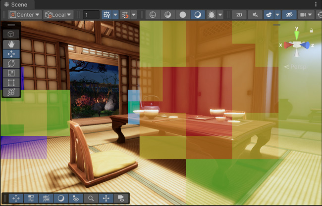
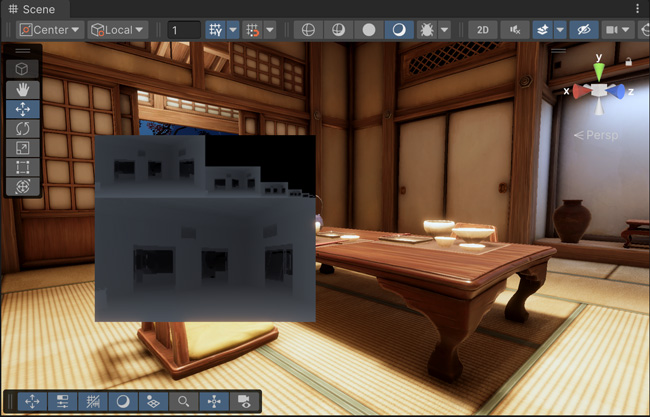

# Rendering Debugger window reference

The Rendering Debugger separates debug items into the following sections:

* [Decals](#DecalsPanel)
* [Display Stats](#StatsPanel)
* [Material](#MaterialPanel)
* [Lighting](#LightingPanel)
* [Volume](#VolumePanel)
* [Rendering](#RenderingPanel)
* [Probe Volume](#ProbeVolume)
* [Camera](#CameraPanel)
* [Virtual Texturing](#VirtualTexturingPanel)
* [GPU Resident Drawer](#GPUResidentDrawer)

Refer to [Use the Rendering debugger](use-the-rendering-debugger.md) for more information.

## Decals panel

The **Decals** panel has tools that you can use to debug [decals](decal-material-inspector-reference.md) affecting transparent objects in your project.

| **Property** | **Description** |
| ----------------- | ------------------------------------------------------------ |
| **Display Atlas** | Enable the checkbox to display the decal atlas for a Camera in the top left of that Camera's view. |
| **Mip Level** | Use the slider to select the mip level for the decal atlas. The higher the mip level, the blurrier the decal atlas. |

## Display Stats panel

The **display stats** panel is only visible in play mode. You can use it to debug performance issues in your project.

Use the [runtime shortcuts](#Navigation at runtime) to open the Display stats window in the scene view at runtime.
<table>

### Frame Stats

The Frame Stats section displays the average, minimum, and maximum value of each property. HDRP calculates each Frame Stat value over the 30 most recent frames.

| **Property** | | **Description** |
| ---------------------------- | ----------------------- | ------------------------------------------------------------ |
| **Frame Rate** | | The frame rate (in frames per second) for the current camera view. |
| **Frame Time** | | The total frame time for the current camera view. |
| **CPU Main Thread Frame** | | The total time (in milliseconds) between the start of the frame and the time when the Main Thread finished the job. |
| **CPU Render Thread Frame** | | The time (in milliseconds) between the start of the work on the Render Thread and the time Unity waits to render the present frame ([Gfx.PresentFrame](https://docs.unity3d.com/2022.1/Documentation/Manual/profiler-markers.html)). |
| **CPU Present Wait** | | The time (in milliseconds) that the CPU spent waiting for Unity to render the present frame ([Gfx.PresentFrame](https://docs.unity3d.com/2022.1/Documentation/Manual/profiler-markers.html)) during the last frame. |
| **GPU Frame** | | The amount of time (in milliseconds) the GPU takes to render a given frame. |
| **RT Mode** | | When you [enable ray tracing](Ray-Tracing-Getting-Started.md), this property shows the ray tracing quality mode that HDRP uses during rendering. HDRP updates this value once every frame based on the previous frame. |
| **Count Rays** | | Count the number of traced rays for each effect (in MRays / frame). This property only appears when you enable ray tracing. |
| | **Ambient Occlusion** | The number of rays that HDRP traced for [Ambient Occlusion (AO)](Ambient-Occlusion.md) computations, when you enable realtime ambient occlusion (RT AO). |
| | **Shadows Directional** | The number of rays that HDRP traced for [directional lights](Light-Component.md) when you enable ray-traced shadows. |
| | **Shadows Area** | The number of rays that HDRP traced towards area lights when you enable [ray-traced shadows](Ray-Traced-Shadows.md). |
| | **Shadows Point/Spot** | The number of rays that HDRP traced towards point and spot lights when you enable ray-traced shadows. |
| | **Reflection Forward** | The number of rays that HDRP traced for reflection computations that use [forward shading](Forward-And-Deferred-Rendering.md). |
| | **Reflection Deferred** | The number of rays that HDRP traced for reflection computations that use [deferred shading](Forward-And-Deferred-Rendering.md). |
| | **Diffuse GI Forward** | The number of rays that HDRP traced for diffuse [Global Illumination (GI)](Ray-Traced-Global-Illumination.md) computations that use forward shading. |
| | **Diffuse GI Deferred** | The number of rays that HDRP traced for diffuse Global Illumination (GI) computations that use deferred shading. |
| | **Recursive** | The number of rays that HDRP traced for diffuse Global Illumination (GI) computations when you enable recursive ray tracing. |
| | **Total** | The total number of rays that HDRP traced. |
| **Debug XR Layout** | | Display debug information for XR passes.  This mode is only available in editor and development builds. |

### Bottlenecks

A bottleneck is a condition that occurs when one process performs significantly slower than other components, and other components depend on it. 

The **Bottlenecks** section describes the distribution of the last 60 frames across the CPU and GPU. You can only see the Bottleneck information when you build your player on a device. 

**Note**: Vsync limits the **Frame Rate** based on the refresh rate of your device’s screen. This means when you enable Vsync, the **Present Limited** category is 100% in most cases. To turn Vsync off, go to **Edit** > **Project settings** > **Quality** > **Current Active Quality Level** and set the **Vsync Count** set to **Don't Sync**.

#### Bottleneck categories

| **Category** | **Description** |
| ------------------- | ------------------------------------------------------------ |
| **CPU** | The percentage of the last 60 frames in which the CPU limited the frame time. |
| **GPU** | The percentage of the last 60 frames in which the GPU limited the frame time. |
| **Present limited** | The percentage of the last 60 frames in which the frame time was limited by the following presentation constraints: &bull; Vertical Sync (Vsync): Vsync synchronizes rendering to the refresh rate of your display. &bull;[Target framerate]([Application.targetFrameRate](https://docs.unity3d.com/ScriptReference/Application-targetFrameRate.html)): A function that you can use to manually limit the frame rate of an application. If a frame is ready before the time you specify in targetFrameRate, Unity waits before presenting the frame. |
| **Balanced** | This percentage of the last 60 frames in which the frame time was not limited by any of the above categories. A frame that is 100% balanced indicates the processing time for both CPU and GPU is approximately equal. |

#### Bottleneck example

If Vsync limited 20 of the 60 most recent frames, the Bottleneck section might appear as follows: 

- **CPU** 0.0%: This indicates that HDRP did not render any of the last 60 frames on the CPU.
- **GPU** 66.6%: This indicates that the GPU limited 66.6% of the 60 most recent frames rendered by HDRP.
- **Present Limited** 33.3%: This indicates that presentation constraints (Vsync or the [target framerate](https://docs.unity3d.com/ScriptReference/Application-targetFrameRate.html)) limited 33.3% of the last 60 frames.
- **Balanced** 0.0%: This indicates that in the last 60 frames, there were 0 frames where the CPU processing time and GPU processing time were the same.

In this example, the bottleneck is the GPU.

### Detailed Stats

The Detailed Stats section displays the amount of time in milliseconds that each rendering step takes on the CPU and GPU. HDRP updates these values once every frame based on the previous frame. 

| **Property** | **Description** |
| -------------------------------- | ------------------------------------------------------------ |
| Update every second with average | Calculate average values over one second and update every second. |
| Hide empty scopes | Hide profiling scopes that use 0.00ms of processing time on the CPU and GPU. |
| Count Rays | Count the number of traced rays for each effect (in MRays / frame). This mode only appears when you enable ray tracing. |
| Debug XR Layout | Enable to display debug information for [XR](https://docs.unity3d.com/Manual/XR.html) passes. This mode only appears in the editor and development builds. |

## Material panel

The **Material** panel has tools that you can use to visualize different Material properties.

<table>
 <thead>
 <tr>
 <th colspan="1"><strong>Property</strong></th>
 <th colspan="2"><strong>Description</strong></th>
 </tr>
 </thead>
 <tbody>
 <tr>
 <td rowspan="1"><strong>Common Material Property</strong></td>
 <td colspan="2">Use the drop-down to select a Material property to visualize on every GameObject on screen. All HDRP Materials share the properties available.</td>
 </tr>
 <tr>
 <td rowspan="1"><strong>Material</strong></td>
 <td colspan="2">Use the drop-down to select a Material property to visualize on every GameObject on screen using a specific Shader. The properties available depend on the HDRP Material type you select in the drop-down.</td>
 </tr>
 <tr>
 <td rowspan="5"><strong>Rendering Layer Mask</strong></td>
 <td colspan="2">These parameters only appear when you set the Material Debug Option to Rendering Layers.</td>
 </tr>
 <tr>
 <td><strong>Filter Light Layers by Light</strong></td>
 <td>Enable the checkbox to visualize GameObjects that the selected light affects.</td>
 </tr>
 <tr>
 <td><strong>Use Light&#39;s Shadow Layer Mask</strong></td>
 <td>Enable the checkbox to visualize GameObjects that cast shadows for the selected light.</td>
 </tr>
 <tr>
 <td><strong>Filter Layers</strong></td>
 <td>Use the drop-down to filter layers that you want to display. GameObjects that have a matching layer appear in a specific color. Use **Layers Color** to define this color.</td>
 </tr>
 <tr>
 <td><strong>Layers Color</strong></td>
 <td>Use the color pickers to select the display color of each rendering layer.</td>
 </tr>
 <tr>
 <td rowspan="1"><strong>Engine</strong></td>
 <td colspan="2">Use the drop-down to select a Material property to visualize on every GameObject on a screen that uses a specific Shader. The properties available are the same as <Strong>Material</Strong> but are in the form that the lighting engine uses them (for example, <Strong>Smoothness</Strong> is <Strong>Perceptual Roughness</Strong>).</td>
 </tr>
 <tr>
 <td rowspan="1"><strong>Attributes</strong></td>
 <td colspan="2">Use the drop-down to select a 3D GameObject attribute, like Texture Coordinates or Vertex Color, to visualize on screen.</td>
 </tr>
 </tr>
 <tr>
 <td rowspan="1"><strong>Properties</strong></td>
 <td colspan="2">Use the drop-down to select a property that the debugger uses to highlight GameObjects on screen. The debugger highlights GameObjects that use a Material with the property that you select.</td>
 </tr>
 </tr>
 <tr>
 <td rowspan="1"><strong>GBuffer</strong></td>
 <td colspan="2">Use the drop-down to select a property to visualize from the GBuffer for deferred Materials.</td>
 </tr>
 <tr>
 <td rowspan="5"><strong>Material Validator</strong></td>
 <td colspan="2">Use the drop-down to select properties to display validation colors for: <ul> <li><strong>Diffuse Color</strong>: Select this option to check if the diffuse colors in your Scene adheres to an acceptable <a href="https://docs.unity3d.com/Packages/com.unity.render-pipelines.high-definition@latest/index.html?subfolder=/manual/Glossary.html#PhysicallyBasedRendering">PBR</a> range. If the Material color is out of this range, the debugger displays it in the <strong>Too High Color</strong> color if it's above the range, or in the <strong>Too Low Color</strong> if it's below the range.</li>
 <li><strong>Metal or SpecularColor</strong>: Select this option to check if a pixel contains a metallic or specular color that adheres to an acceptable PBR range. If it doesn't, the debugger highlights it in the <strong>Not A Pure Metal Color</strong>. For information about the acceptable PBR ranges in Unity, see the <a href="https://docs.unity3d.com/Manual/StandardShaderMaterialCharts.html">Material Charts documentation</a>.</li></ul></td>
 </tr>
 <tr>
 <td><strong>Too High Color</strong></td>
 <td>Use the color picker to select the color that the debugger displays when a Material's diffuse color is above the acceptable PBR range. This property only appears when you select <strong>Diffuse Color</strong> or <strong>Metal or SpecularColor</strong> from the <strong>Material Validator</strong> drop-down.</td>
 </tr>
 <tr>
 <td><strong>Too Low Color</strong></td>
 <td>Use the color picker to select the color that the debugger displays when a Material's diffuse color is below the acceptable PBR range. This property only appears when you select <strong>Diffuse Color</strong> or <strong>Metal or SpecularColor</strong> from the <strong>Material Validator</strong> drop-down.</td>
 </tr>
 <tr>
 <td><strong>Not A Pure Metal Color</strong></td>
 <td>Use the color picker to select the color that the debugger displays if a pixel defined as metallic has a non-zero albedo value. The debugger only highlights these pixels if you enable the <strong>True Metals</strong> checkbox. This property only appears when you select <strong>Diffuse Color</strong> or <strong>Metal or SpecularColor</strong> from the <strong>Material Validator</strong> drop-down.</td>
 <tr>
 <td><strong>Pure Metals</strong></td>
 <td>Enable the checkbox to make the debugger highlight any pixels which Unity defines as metallic, but which have a non-zero albedo value. The debugger uses the <strong>Not A Pure Metal Color</strong> to highlight these pixels. This property only appears when you select <strong>Diffuse Color</strong> or <strong>Metal or SpecularColor</strong> from the <strong>Material Validator</strong> drop-down.</td>
 </tr>
 <tr>
 <td rowspan="1"><strong>Override Global Material Texture Mip Bias</strong></td>
 <td colspan="2">Enable the checkbox to override the mipmap level bias of texture samplers in material shaders. Use the <strong>Debug Global Material Texture Mip Bias Value</strong> to control the mipmap level bias override. When using this feature, be aware of the following:
 <ul>
 <li>It only affects gbuffer, forward opaque, transparency and decal passes.</li>
 <li>It doesn't affect virtual texturing sampling.</li>
 <li>It doesn't affect custom passes.</li>
 </ul></td>
 </tr>
 <tr>
 <td rowspan="1"><strong>Debug Global Material Texture Mip Bias Value</strong></td>
 <td colspan="2">Use the slider to control the amount of mip bias of texture samplers in material shaders.</td>
 </tr>
 </tbody>
</table>

If the geometry or the shading normal is denormalized, the view renders the target pixel red.

## Lighting panel

The **Lighting** panel has tools that you can use to visualize various components of the lighting system in your Scene, like, shadowing and direct/indirect lighting.

<table>
 <thead>
 <tr>
 <th colspan="1"><strong>Shadow Debug Option</strong></th>
 <th colspan="2"><strong>Description</strong></th>
 </tr>
 </thead>
 <tbody>
 <tr>
 <td rowspan="3"><strong>Debug Mode</strong></td>
 <td colspan="2">Use the drop-down to select which shadow debug information to overlay on the screen: 
 <ul>
 <li><strong>None</strong>: Select this mode to remove the shadow debug information from the screen.</li>
 <li><strong>VisualizePunctualLightAtlas</strong>: Select this mode to overlay the shadow atlas for <a href="https://docs.unity3d.com/Packages/com.unity.render-pipelines.high-definition@latest/index.html?subfolder=/manual/Glossary.html#PunctualLight">Punctual Lights</a> in your Scene.</li>
 <li><strong>VisualizeDirectionalLightAtlas</strong>: Select this mode to overlay the shadow atlas for Directional Lights in your Scene.</li>
 <li><strong>VisualizeAreaLightAtlas</strong>: Select this mode to overlay the shadow atlas for area Lights in your Scene.</li>
 <li><strong>VisualizeShadowMap</strong>: Select this mode to overlay a single shadow map for a Light in your Scene.</li>
 <li><strong>SingleShadow</strong>: Select this mode to replace the Scene's lighting with a single Light. To select which Light to isolate, see <strong>Use Selection</strong> or <strong>Shadow Map Index</strong>.</li>
 </ul></td>
 </tr>
 <tr>
 <td><strong>Use Selection</strong></td>
 <td>Enable the checkbox to display the shadow map for the Light you select in the Scene. This property only appears when you select <Strong>VisualizeShadowMap</Strong> or <Strong>SingleShadow</Strong> from the <Strong>Shadow Debug Mode</Strong> drop-down.</td>
 </tr>
 <tr>
 <td><strong>Shadow Map Index</strong></td>
 <td>Use the slider to select the index of the shadow map to view. To use this property correctly, you must have at least one <a href="https://docs.unity3d.com/Packages/com.unity.render-pipelines.high-definition@latest/index.html?subfolder=/manual/Light-Component.html">Light</a> in your Scene that uses shadow maps.</td>
 </tr>
 <tr>
 <td rowspan="1"><strong>Global Scale Factor</strong></td>
 <td colspan="2">Use the slider to set the global scale that HDRP applies to the shadow rendering resolution.</td>
 </tr>
 <tr>
 <td rowspan="1"><strong>Clear Shadow Atlas</strong></td>
 <td colspan="2">Enable the checkbox to clear the shadow atlas every frame.</td>
 </tr>
 <tr>
 <td rowspan="1"><strong>Range Minimum Value</strong></td>
 <td colspan="2">Set the minimum shadow value to display in the various shadow debug overlays.</td>
 </tr>
 <tr>
 <td rowspan="1"><strong>Range Maximum Value</strong></td>
 <td colspan="2">Set the maximum shadow value to display in the various shadow debug overlays.</td>
 </tr>
 <tr>
 <td rowspan="1"><strong>Log Cached Shadow Atlas Status</strong></td>
 <td colspan="2">Set the maximum shadow value to display in the various shadow debug overlays.</td>
 </tr>
 </tbody>
</table>

<table>
<thead>
<tr>
<th colspan="1"><strong>Lighting Debug Option</strong></th>
<th colspan="2"><strong>Description</strong></th>
</tr>
</thead>
<tbody><tr>
<td rowspan="5"><strong>Show Lights By Type</strong></td>
<td colspan="2">Allows the user to enable or disable lights in the scene based on their type.</td>
</tr>
<tr>
<td><strong>Directional Lights</strong></td>
<td>Enable the checkbox to see Directional Lights in your Scene. Disable this checkbox to remove Directional Lights from your Scene&#39;s lighting.</td>
</tr>
<tr>
<td><strong>Punctual Lights</strong></td>
<td>Enable the checkbox to see <a href="https://docs.unity3d.com/Packages/com.unity.render-pipelines.high-definition@latest/index.html?subfolder=/manual/Glossary.html#PunctualLight">Punctual Lights</a> in your Scene. Disable this checkbox to remove Punctual Lights from your Scene&#39;s lighting.</td>
</tr>
<tr>
<td><strong>Area Lights</strong></td>
<td>Enable the checkbox to see Area Lights in your Scene. Disable this checkbox to remove Aera Lights from your Scene&#39;s lighting.</td>
</tr>
<tr>
<td><strong>Reflection Probes</strong></td>
<td>Enable the checkbox to see Reflection Probes in your Scene. Disable this checkbox to remove Reflection Probes from your Scene&#39;s lighting.</td>
</tr>
<tr>
<td rowspan="7"><strong>Exposure</strong></td>
<td colspan="2">Allows you to select an <a href="https://docs.unity3d.com/Packages/com.unity.render-pipelines.high-definition@latest/index.html?subfolder=/manual/Override-Exposure.html">Exposure</a> debug mode to use.</td>
</tr>
<tr>
<td><strong>Debug Mode</strong></td>
<td>Use the drop-down to select a debug mode. See <a href="https://docs.unity3d.com/Packages/com.unity.render-pipelines.high-definition@latest/index.html?subfolder=/manual/Override-Exposure.html#exposure-debug-modes">Exposure</a> documentation for more information.</td>
</tr>
<tr>
<td><strong>Show Tonemap curve</strong></td>
<td>Enable the checkbox to overlay the tonemap curve to the histogram debug view. This property only appears when you select <strong>HistogramView</strong> from <strong>Debug Mode</strong>.</td>
</tr>
<tr>
<td><strong>Center Around Exposure</strong></td>
<td>Enable the checkbox to center the histogram around the current exposure value. This property only appears when you select <strong>HistogramView</strong> from <strong>Debug Mode</strong>.</td>
</tr>
<tr>
<td><strong>Display RGB Histogram</strong></td>
<td>Enable the checkbox to display the Final Image Histogram as an RGB histogram instead of just luminance. This property only appears when you select <strong>FinalImageHistogramView</strong> from <strong>Debug Mode</strong>.</td>
</tr>
<tr>
<td><strong>Display Mask Only</strong></td>
<td>Enable the checkbox to display only the metering mask in the picture-in-picture. When disabled, the mask displays after weighting the scene color instead.  This property only appears when you select <strong>MeteringWeighted</strong> from <strong>Debug Mode</strong>.</td>
</tr>
<tr>
<td><strong>Debug Exposure Compensation</strong></td>
<td>Set an additional exposure compensation for debug purposes.</td>
</tr>
<tr>
<td><strong>Debug Mode</strong></td>
<td colspan="2">Use the drop-down to select a lighting mode to debug. For example, you can visualize diffuse lighting, specular lighting, direct diffuse lighting, direct specular lighting, indirect diffuse lighting, indirect specular lighting, emissive lighting and Directional Light shadow cascades.</td>
</tr>
<tr>
<td><strong>Hierarchy Debug Mode</strong></td>
<td colspan="2">Use the drop-down to select a light type to display the direct lighting for or a Reflection Probe type to display the indirect lighting for.</td>
</tr>
</tbody></table>

<table>
<thead>
<tr>
<th colspan="1"><strong>Material Overrides</strong></th>
<th colspan="2"><strong>Description</strong></th>
</tr>
</thead>
<tbody>
<tr>
<td rowspan="2"><strong>Override Smoothness</strong></td>
<td colspan="2">Enable the checkbox to override the smoothness for the entire Scene.</td>
</tr>
<tr>
<td><strong>Smoothness</strong></td>
<td>Use the slider to set the smoothness override value that HDRP uses for the entire Scene.</td>
</tr>
<tr>
<td rowspan="2"><strong>Override Albedo</strong></td>
<td colspan="2">Enable the checkbox to override the albedo for the entire Scene.</td>
</tr>
<tr>
<td><strong>Albedo</strong></td>
<td>Use the color picker to set the albedo color that HDRP uses for the entire Scene.</td>
</tr>
<tr>
<td><strong>Override Normal</strong></td>
<td colspan="2">Enable the checkbox to override the normals for the entire Scene with object normals for lighting debug.</td>
</tr>
<tr>
<td rowspan="2"><strong>Override Specular Color</strong></td>
<td colspan="2">Enable the checkbox to override the specular color for the entire Scene.</td>
</tr>
<tr>
<td><strong>Specular Color</strong></td>
<td>Use the color picker to set the specular color that HDRP uses for the entire Scene.</td>
</tr>
<tr>
<td rowspan="2"><strong>Override Ambient Occlusion</strong></td>
<td colspan="2">Enable the checkbox to override the ambient occlusion for the entire Scene.</td>
</tr>
<tr>
<td><strong>Ambient Occlusion</strong></td>
<td>Use the slider to set the Ambient Occlusion override value that HDRP uses for the entire Scene.</td>
</tr>
<tr>
<td rowspan="2"><strong>Override Emissive Color</strong></td>
<td colspan="2">Enable the checkbox to override the emissive color for the entire Scene.</td>
</tr>
<tr>
<td><strong>Emissive Color</strong></td>
<td>Use the color picker to set the emissive color that HDRP uses for the entire Scene.</td>
</tr>
</tbody>
</table>

<table>
<thead>
<tr>
<th colspan="1"><strong>Property</strong></th>
<th colspan="2"><strong>Description</strong></th>
</tr>
</thead>
<tbody>
<tr>
<td><strong>Fullscreen Debug Mode</strong></td>
<td colspan="2">Use the drop-down to select a fullscreen lighting effect to debug. For example, you can visualize <a href="https://docs.unity3d.com/Packages/com.unity.render-pipelines.high-definition@latest/index.html?subfolder=/manual/Override-Contact-Shadows.html">Contact Shadows</a>, the depth pyramid, and indirect diffuse lighting. You can also use some of those Lighting Fullscreen Debug Modes to debug <a href="https://docs.unity3d.com/Packages/com.unity.render-pipelines.high-definition@latest/index.html?subfolder=/manual/Ray-Tracing-Debug.html">Ray-Traced effects</a>.</td>
</tr>
<tr>
<td rowspan="4"><strong>Tile/Cluster Debug</strong></td>
<td colspan="2">Use the drop-down to select an internal HDRP lighting structure to visualize on screen.
<ul>
<li><strong>None</strong>: Select this option to disable this debug feature.</li>
<li><strong>Tile</strong>: Select this option to display an overlay of each lighting tile, and the number of lights in them.</li>
<li><strong>Cluster</strong>: Select this option to display an overlay of each lighting cluster that intersects opaque geometry, and the number of lights in them.</li>
<li><strong>Material Feature Variants</strong>: Select this option to display the index of the lighting Shader variant that HDRP uses for a tile. You can find variant descriptions in the lit.hlsl file.</li>
</ul></td>
</tr>
<tr>
<td><strong>Tile/Cluster Debug By Category</strong></td>
<td>Use the drop-down to select the Light type that you want to display the Tile/Cluster debug information for. The options include <a href="https://docs.unity3d.com/Packages/com.unity.render-pipelines.high-definition@latest/index.html?subfolder=/manual/Light-Component.html">Light Types</a>, <a href="https://docs.unity3d.com/Packages/com.unity.render-pipelines.high-definition@latest/index.html?subfolder=/manual/Decal-Projector.html">Decals</a>, and <a href="https://docs.unity3d.com/Packages/com.unity.render-pipelines.high-definition@latest/index.html?subfolder=/manual/Local-Volumetric-Fog.html">Local Volumetric Fog</a>. This property only appears when you select <strong>Tile</strong> or <strong>Cluster</strong> from the <strong>Tile/Cluster Debug</strong> drop-down.</td>
</tr>
<tr>
<td><strong>Cluster Debug Mode</strong></td>
<td>Use the drop-down to select the visualization mode for the cluster. The options are:  <strong>VisualizeOpaque</strong>: displays cluster information on opaque geometry.  <strong>VisualizeSlice</strong>: Displays cluster information at a set distance from the camera. This property only appears when you select <strong>Cluster</strong> from the <strong>Tile/Cluster Debug</strong> drop-down..</td>
</tr>
<tr>
<td><strong>Cluster Distance</strong></td>
<td>Use this slider to set the distance from the camera at which to display the cluster slice. This property only appears when you select <strong>VisualizeSlice</strong> from the <strong>Cluster Debug Mode</strong> drop-down.</td>
</tr>
<tr>
<td rowspan="2"><strong>Display Sky Reflection</strong></td>
<td colspan="2">Enable the checkbox to display an overlay of the cube map that the current sky generates and HDRP uses for lighting.</td>
</tr>
<tr>
<td><strong>Sky Reflection Mipmap</strong></td>
<td>Use the slider to set the mipmap level of the sky reflection cubemap. Use this to view the sky reflection cubemap's different mipmap levels. This property only appears when you enable the <strong>Display Sky Reflection</strong> checkbox.</td>
</tr>
<tr>
<td rowspan="3"><strong>Display Light Volumes</strong></td>
<td colspan="2">Enable the checkbox to display an overlay of all light bounding volumes.</td>
</tr>
<tr>
<td><strong>Light Volume Debug Type</strong></td>
<td>Use the drop-down to select the method HDRP uses to display the light volumes.
<ul>
<li><strong>Gradient</strong>: Select this option to display the light volumes as a gradient.</li>
<li><strong>ColorAndEdge</strong>: Select this option to display the light volumes as a plain color (a different color for each Light Type) with a red border for readability. This property only appears when you enable the <strong>Display Light Volumes</strong> checkbox.
</ul></td>
</tr>
<tr>
<td><strong>Max Debug Light Count</strong></td>
<td>Use the slider to rescale the gradient. Lower this value to make the screen turn red faster. Use this property to change the maximum acceptable number of lights for your application and still see areas in red. This property only appears when you set the <strong>Display Light Volumes</strong> mode to <strong>Gradient</strong>.</td>
</tr>
<tr>
<td rowspan="3"><strong>Display Cookie Atlas</strong></td>
<td colspan="2">Enable the checkbox to display an overlay of the cookie atlas.</td>
</tr>
<tr>
<td><strong>Mip Level</strong></td>
<td>Use the slider to set the mipmap level of the cookie atlas. This property only appears when you enable the <strong>Display Cookie Atlas</strong> checkbox.</td>
</tr>
<tr>
<td><strong>Clear Cookie Atlas</strong></td>
<td>Enable the checkbox to clear the cookie atlas at each frame. This property only appears when you enable the <strong>Display Cookie Atlas</strong> checkbox.</td>
</tr>
<tr>
<td rowspan="3"><strong>Display Planar Reflection Atlas</strong></td>
<td colspan="2">Enable the checkbox to display an overlay of the planar reflection atlas.</td>
</tr>
<tr>
<td><strong>Mip Level</strong></td>
<td>Use the slider to set the mipmap level of the planar reflection atlas. This property only appears when you enable the <strong>Display Planar Reflection Atlas</strong> checkbox.</td>
</tr>
<tr>
<td><strong>Clear Planar Atlas</strong></td>
<td>Enable the checkbox to clear the planar reflection atlas at each frame. This property only appears when you enable the <strong>Display Planar Reflection Atlas</strong> checkbox.</td>
</tr>
<tr>
<td><strong>Debug Overlay Screen Ratio</strong></td>
<td colspan="2">Set the size of the debug overlay textures with a ratio of the screen size. The default value is 0.33 which is 33% of the screen size.</td>
</tr>
</tbody>
</table>

## Volume panel

The **Volume** panel has tools that you can use to visualize the Volume Components affecting a camera.

| **Property** | **Description** |
| ---------------------- | ---------------------------------------------------- |
| **Component** | Use the drop-down to select which volume component to visualize. |
| **Camera** | Use the drop-down to select which camera to use as volume anchor. |
| **Parameter** | List of parameters for the selected component. |
| **Interpolated Value** | Current value affecting the choosen camera for each parameter. |
| **Other columns** | Each one of the remaining columns display the parameter values of a volume affecting the selected **Camera**. They're sorted from left to right by decreasing influence. |

## Probe Volume panel

These settings make it possible for you to visualize [Adaptive Probe Volumes](probevolumes.md) in your Scene, and configure the visualization.

### Subdivision Visualization

| **Property** | **Sub-property** | **Description** |
|-|-|-|
| **Display Cells** || Display cells. Refer to [Understanding Adaptive Probe Volumes](probevolumes-concept.md) for more information. |
| **Display Bricks** || Display bricks. Refer to [Understanding Adaptive Probe Volumes](probevolumes-concept.md) for more information. |
| **Live Subdivision Preview** || Enable a preview of Adaptive Probe Volume data in the scene without baking. This might make the Editor slower. This setting appears only if you select **Display Cells** or **Display Bricks**. |
|| **Cell Updates Per Frame** | Set the number of cells, bricks, and probe positions to update per frame. Higher values might make the Editor slower.  The default value is 4. This property appears only if you enable **Live Subdivision Preview**. |
|| **Update Frequency** | Set how frequently Unity updates cell, bricks, and probe positions, in seconds. The default value is 1. This property appears only if you enable **Live Subdivision Preview**. |
| **Debug Draw Distance** || Set how far from the scene camera Unity draws debug visuals for cells and bricks, in meters. The default value is 500. |

### Probe Visualization

| **Property** | **Sub-property** | **Description** |
|-|-|-|
| **Display Probes** || Display probes. |
|| **Probe Shading Mode** | Set what the Rendering Debugger displays. The options are:<ul><li><strong>SH</strong>: Display the [spherical harmonics (SH) lighting data](https://docs.unity3d.com/Manual/LightProbes-TechnicalInformation.html) for the final color calculation. The number of bands depends on the **SH Bands** setting in the active [HDRP Asset](HDRP-Asset.md).</li><li><strong>SHL0</strong>: Display the spherical harmonics (SH) lighting data with only the first band.</li><li><strong>SHL0L1</strong>: Display the spherical Harmonics (SH) lighting data with the first two bands.</li><li><strong>Validity</strong>: Display whether probes are valid, based on the number of backfaces the probe samples. Refer to [Fix issues with Adaptive Probe Volumes](probevolumes-fixissues.md) for more information about probe validity.</li><li><strong>Probe Validity Over Dilation Threshold</strong>: Display red if a probe samples too many backfaces, based on the **Validity Threshold** set in the [Adaptive Probe Volumes panel](probevolumes-lighting-panel-reference.md). This means the probe can't be baked or sampled.</li><li><strong>Invalidated By Touchup Volumes</strong>: Display probes that a [Probe Adjustment Volume component](probevolumes-adjustment-volume-component-reference.md) has made invalid.</li><li><strong>Size</strong>: Display a different color for each size of [brick](probevolumes-concept.md).</li><li><strong>Sky Occlusion SH</strong>: If you enable [sky occlusion](probevolumes-skyocclusion.md), this setting displays the amount of indirect light the probe receives from the sky that bounced off static GameObjects. The value is a scalar, so it displays as a shade of gray.</li><li><strong>Sky Direction</strong>: Display a green circle that represents the direction from the probe to the sky. This setting displays a red circle if Unity can't calculate the direction, or **Sky Direction** in the [Adaptive Probe Volumes panel](probevolumes-lighting-panel-reference.md) is disabled.</li></ul>|
|| **Debug Size** | Set the size of the displayed probes. The default is 0.3. |
|| **Exposure Compensation** | Set the brightness of the displayed probes. Decrease the value to increase brightness. The default is 0. This property appears only if you set **Probe Shading Mode** to **SH**, **SHL0**, or **SHL0L1**. |
|| **Max Subdivisions Displayed** | Set the lowest probe density to display. For example, set this to 0 to display only the highest probe density. |
|| **Min Subdivisions Displayed** | Set the highest probe density to display. |
| **Debug Probe Sampling** || Display how probes are sampled for a pixel. In the Scene view, in the **Adaptive Probe Volumes** overlay, select **Select Pixel** to change the pixel. |
|| **Debug Size** | Set the size of the **Debug Probe Sampling** display. |
|| **Debug With Sampling Noise** | Enable sampling noise for this debug view. Enabling this gives more accurate information, but makes the information more difficult to read. |
| **Virtual Offset Debug** || Display the offsets Unity applies to Light Probe capture positions. |
|| **Debug Size** | Set the size of the arrows that represent Virtual Offset values. |
| **Debug Draw Distance** || Set how far from the scene camera Unity draws debug visuals for cells and bricks, in meters. The default is 200. |
| **Auto Display Probes** || Display probes in the Scene view, if you select a volume with a Probe Adjustment Volume component in the Hierarchy window. |
| **Isolate Affected** || Display only probes affected by a volume with a Probe Adjustment Volume component, if you select the volume in the Hierarchy window. |

### Streaming

Use the following properties to control how HDRP streams Adaptive Probe Volumes. Refer to [Streaming Adaptive Probe Volumes](probevolumes-streaming.md) for more information.

| **Property** | **Description** |
| ------------ | --------------- |
| **Freeze Streaming** | Stop Unity from streaming probe data. |
| **Display Streaming Score** | If you enable **Display Cells**, this setting darkens cells that have a lower priority for streaming. Cells closer to the camera usually have the highest priority. |
| **Maximum cell streaming** | Stream as many cells as possible every frame. |
| **Display Index Fragmentation** | Open an overlay that displays how fragmented the streaming memory is. A green square is an area of used memory. The more spaces between the green squares, the more fragmented the memory. |
| **Index Fragmentation Rate** | Displays the amount of fragmentation as a numerical value, where 0 is no fragmentation. |
| **Verbose Log** | Log information about streaming. |

### Scenario Blending

Use the following properties to control how HDRP blends Lighting Scenarios. Refer to [Bake different lighting setups with Lighting Scenarios](probevolumes-bakedifferentlightingsetups.md) for more information.

| **Property** | **Description** |
| - | - |
| **Number of Cells Blended Per Frame** | Determines the maximum number of cells Unity blends per frame. The default is 10,000. |
| **Turnover Rate** | Set the blending priority of cells close to the camera. The range is 0 to 1, where 0 sets the cells close to the camera with high priority, and 1 sets all cells with equal priority. Increase **Turnover Rate** to avoid cells close to the camera blending too frequently. |
| **Scenario To Blend With** | Select a Lighting Scenario to blend with the active Lighting Scenario. |
| **Scenario Blending Factor** | Set how far to blend from the active Lighting Scenario to the **Scenario To Blend With**. The range is 0 to 1, where 0 is fully the active Lighting Scenario, and 1 is fully the **Scenario To Blend With**. |

## Rendering panel

The **Rendering** panel has tools that you can use to visualize various HDRP rendering features.

### Fullscreen Debug Mode

Use the drop-down to select a rendering mode to display as an overlay on the screen.

| Property | Description |
|-|-|
| **Motion Vectors** | Select this option to display motion vectors. Note that object motion vectors aren't visible in the Scene view. |
| **World Space Position** | Select this option to display world space positions. |
| **NaN Tracker** | Select this option to display an overlay that highlights [NaN](https://en.wikipedia.org/wiki/NaN) values. |
| **ColorLog** | Select this option to display how the raw, log-encoded buffer looks before color grading takes place. |
| **DepthOfFieldCoc** | Select this option to display the circle of confusion for the depth of field effect. The circle of confusion displays how much the depth of field effect blurs a given pixel/area. |
| **Quad Overdraw** | Select this option to display an overlay that highlights gpu quads running multiple fragment shaders. This is mainly caused by small or thin triangles. Use LODs to reduce the amount of overdraw when objects are far away. (This mode is currently not supported on Metal and PS4). |
| **Vertex Density** | Select this option to display an overlay that highlights pixels running multiple vertex shaders. A vertex can be run multiple times when part of different triangles. This helps finding models that need LODs. (This mode is currently not supported on Metal). |
| **TransparencyOverdraw** | Select this option to view the number of transparent pixels that draw over one another. This represents the amount of on-screen overlapping of transparent pixel. This is useful to see the amount of pixel overdraw for transparent GameObjects from different points of view in the Scene. This debug option displays each pixel as a heat map going from black (which represents no transparent pixels) through blue to red (at which there are **Max Pixel Cost** number of transparent pixels). |
| **RequestedVirtualTextureTiles** | Select this option to display what texture tile each pixel uses. Pixels that this debug view renders with the same color request the same texture tile to be streamed into video memory by the streaming virtual texturing system. This debug view is useful to see which areas of the screen use textures that the virtual texturing system steams into video memory. It can help to identify issues with the virtual texture streaming system. |
| **LensFlareScreenSpace** | Display the lens flares that the [Screen Space Lens Flare](shared/lens-flare/Override-Screen-Space-Lens-Flare.html) override generates. |
| **Compute Thickness** | Select this option to display thickness for each layer selected in the current HDRP Asset and configure the following properties:  &#8226; **Layer Mask**: Set the layer number to visualize in the debug view.  &#8226; **Show Overlap Count**: Highlight the triangles that intersect for each pixel.  &#8226; **Thickness Scale**: Set the range (in meters) of the ComputeThickness debug view. When you enable Show Overlap Count, this setting affects the Overlap Count debug view.  For more information on how to debug compute thickness, refer to [Sample and use material thickness](Compute-Thickness.md). |
| **Max Pixel Cost** | The scale of the transparency overdraw heat map. For example, a value of 10 displays a red pixel if 10 transparent pixels overlap. Any number of overdraw above this value also displays as red. This property only appears if you set **Fullscreen Debug Mode** to **TransparencyOverdraw**. |
| **High Quality Lines** | Select this option to view underlying data used by tile-based software rasterizer for the [High Quality Line Rendering](Override-High-Quality-Lines.md) feature.<ul><li> **Segments per Tile** displays a heatmap representing the number of segments in each tile. </li><li>**Tile Processor UV** displays the uv coordinate for each tile.</li><li>**Cluster Depth** displays segments based on their depth in the cluster structure that's used for transparent sorting.</li></ul> |

### Mipmap Streaming

| **Property** | **Description** |
|-|-|
| **Disable Mip Caching** | If you enable **Disable Mip Caching**, Unity doesn't cache mipmap levels in GPU memory, and constantly discards mipmap levels from GPU memory when they're no longer needed. This means the mipmap streaming debug views more accurately display which mipmap levels Unity uses at the current time. Enabling this setting increases the amount of data Unity transfers from disk to the CPU and the GPU. |
| **Debug View** | Set a mipmap streaming debug view. Options:<ul><li>**None**: Display the normal view.</li><li>**Mip Streaming Performance**: Use color to indicate which textures use mipmap streaming, and whether mipmap streaming limits the number of mipmap levels Unity loads.</li><li>**Mip Streaming Status**: Use color on materials to indicate whether their textures use mipmap streaming. Diagonal stripes mean some of the textures use a [`requestedMipmapLevel`](https://docs.unity3d.com/6000.0/Documentation/ScriptReference/Texture2D-requestedMipmapLevel.html) that overrides mipmap streaming. Yellow means Unity can't stream the texture, or the texture is assigned to terrain.</li><li>**Mip Streaming Activity**: Use color to indicate whether Unity recently streamed the textures.</li><li>**Mip Streaming Priority**: Use color to indicate the streaming priority of the textures. Set streaming priority for a texture in the [**Texture Import Settings** window](https://docs.unity3d.com/6000.0/Documentation/Manual/class-TextureImporter.html).</li><li>**Mip Count**: Display the number of mipmap levels Unity loads for the textures.</li><li>**Mip Ratio**: Use color to indicate the pixel density of the highest-resolution mipmap levels Unity uploads for the textures.</li></ul> |
| **Debug Opacity** | Set the opacity of the **Debug View** you select. 0 means not visible and 1 means fully visible. This property is visible only if **Debug View** is not set to **None**. |
| **Combined Per Material** | Set the **Debug View** to display debug information of all the textures on a material, not individual texture slots. This property is only visible if **Debug View** is set to **Mip Streaming Status** or **Mip Streaming Activity**. |
| **Material Texture Slot** | Set which texture Unity uses from each material to display debug information. For example, set **Material Texture Slot** to **Slot 3** to display debug information for the fourth texture. If a material has fewer textures than the **Material Texture Slot** value, Unity uses no texture. This property is visible only if **Combined Per Material** is disabled, and **Debug View** is not set to **None**. |
| **Display Status Codes** | Display more detailed statuses for textures that display as **Not streaming** or **Warning** in the **Mip Streaming Status** debug view. This property is visible only if **Debug View** is set to **Mip Streaming Status**. |
| **Activity Timespan** | Set how long a texture displays as **Just streamed**, in seconds. This property is visible only if **Debug View** is set to **Mip Streaming Activity**. |
| **Terrain Texture** | Set which terrain texture Unity displays. You can select either **Control** for the control texture, or one of the diffuse textures. This property is visible only if **Debug View** is not set to **None**. |

### Color Picker

The **Color Picker** works with whichever debug mode HDRP displays at the time. This means that you can see the values of various components of the rendering like Albedo or Diffuse Lighting. By default, this displays the value of the main High Dynamic Range (HDR) color buffer.

| **Property** | **Description** |
| --------------------- | ------------------------------------------------------------ |
| **Debug Mode** | Use the drop-down to select the format of the color picker display. |
| **Font Color** | Use the color picker to select a color for the font that the Color Picker uses for its display. |

### False Color Mode and Freeze Camera For Culling

<table>
<thead>
<tr>
<th colspan="1"><strong>Property</strong></th>
<th colspan="2"><strong>Description</strong></th>
</tr>
</thead>
<tbody>
<tr>
<td rowspan="5"><strong>False Color Mode</strong></td>
<td colspan="2">Enable the checkbox to define intensity ranges that the debugger uses to display a color temperature gradient for the current frame. The color temperature gradient goes from blue, to green, to yellow, to red.</td>
</tr>
<tr>
<td><strong>Range Threshold 0</strong></td>
<td>Set the first split for the intensity range. This property only appears when you enable the <strong>False Color Mode</strong> checkbox.</td>
</tr>
<tr>
<td><strong>Range Threshold 1</strong></td>
<td>Set the second split for the intensity range. This property only appears when you enable the <strong>False Color Mode</strong> checkbox.</td>
</tr>
<tr>
<td><strong>Range Threshold 2</strong></td>
<td>Set the third split for the intensity range. This property only appears when you enable the <strong>False Color Mode</strong> checkbox.</td>
</tr>
<tr>
<td><strong>Range Threshold 3</strong></td>
<td>Set the final split for the intensity range. This property only appears when you enable the <strong>False Color Mode</strong> checkbox.</td>
</tr>
<tr>
<td><strong>MSAA Samples</strong></td>
<td colspan="2">Use the drop-down to select the number of samples the debugger uses for <a href="Anti-Aliasing.md#MSAA">MSAA</a>.</td>
</tr>
<tr>
<td><strong>Freeze Camera for Culling</strong></td>
<td colspan="2">Use the drop-down to select a Camera to freeze to check its culling. To check if the Camera's culling works correctly, freeze the Camera and move occluders around it.</td>
</tr>
</tbody>
</table>

### Color Monitors

The **Color monitors** are a set of industry-standard monitors to help artists control the overall look and exposure of a scene.

| **Property** | **Description**    |
|------------------|-----------------------------------------------------------------------------------------------------------------------------------------------------------------------------------------------------------------------------------------------------------------------------------------------------------------------------------------------------------------------------------------------------------------------------------------------------------------------------------------------------------------------------------------------------------------------------------------------------------------------------------------------------------------------------------------------------------------------------------------------------------------------------------------------------------------|
| **Waveform** | Displays the full range of luma (brightness) information in the Camera’s output. The horizontal axis of the graph corresponds to the render (from left to right) and the vertical axis indicates the brightness value.   |
| **Exposure** | Determines the exposure multiplier HDRP applies to the waveform values.  This property only appears when you enable the **Waveform** checkbox.   |
| **Parade mode** | Splits the image into red, green and blue separately. You can use this to visualise the RGB balance of the Camera's image. This helps you to see large offsets in one particular channel, or to determine if GameObjects are true black or true white. A true black, white, or grey GameObject has equal values across all channels.  This property only appears when you enable the **Waveform** checkbox.  |
| **Vectorscope** | The Vectorscope monitor measures the overall range of hue and saturation within the Camera’s image in real-time. To display the data, it uses a scatter graph relative to the center of the Vectorscope.  The Vectorscope measures hue values between yellow, red, magenta, blue, cyan and green. The center of the Vectorscope represents absolute zero saturation and the edges represent the highest level of saturation. To determine the hues in your scene and their saturation, look at the distribution of the Vectorscope’s scatter graph. To identify whether there is a color imbalance in the image, look at how close the middle of the Vectorscope graph is to the absolute center. If the Vectorscope graph is off-center, this indicates that there is a color cast (tint) in the image. |
| **Exposure** | Determines the exposure multiplier HDRP applies to the vectorscope values.  This property only appears when you enable the **Vectorscope** checkbox.   |
| **Size** | The size ratio of the color monitors.   |

| **Property** | **Description** |
| --- | --- |
| **Clear Render Targets At Creation**  | Clears render textures the first time the render graph system uses them. |
| **Clear Render Targets When Freed**  | Clears render textures when they're no longer used by render graph. |
| **Disable Pass Culling** | Disables HDRP culling render passes that have no impact on the final render. |
| **Disable Pass Merging** | Disables HDRP merging render passes. |
| **Immediate Mode** | Enables the render graph system evaluating passes immediately after it creates them. |
| **Enable Logging** | Enables logging to the **Console** window. |
| **Log Frame Information** | Logs how HDRP uses the resources during the frame, in the **Console** window. |
| **Log Resources** | Logs the resources HDRP uses during the frame, in the **Console** window. |

The **NVIDIA device debug view** is a panel that displays a list of the current feature states of NVIDIA Deep Learning Super Sampling (DLSS). Each row represents an active screen in which DLSS is running.

| **Information** | **Description** |
| ------------------------ | ------------------ |
| **NVUnityPlugin Version**| Displays the current internal version id of the NVIDIA Unity Plugin that interacts with DLSS. |
| **NGX API Version** | Displays the actual version which DLSS operates on. |
| **Device Status** | Displays the current status of the NVIDIA driver. If an internal error occurred when initializing the driver, Unity displays the error here. |
| **DLSS Supported** | Displays **True** if your project supports DLSS at runtime. Otherwise, displays **False**. |
| **DLSS Slot ID** | Displays an internal ID for the particular DLSS view being displayed. |
| **Status** | Displays whether the view is **valid** or **invalid**. A view is invalid if there is an internal error, or if the Scriptable Render Pipeline passes incorrect parameters. |
| **Input resolution** | Displays the current input resolution. Unity calculates this from the screen percentage specified for dynamic resolution scaling. |
| **Output resolution** | Displays the target resolution for this particular DLSS view. |
| **Quality** | Displays the quality selected for this particular DLSS view. |

The **History Buffers view** lets you display various render pipeline full screen buffers that persist across multiple frames.

| **Property**   | **Description**                                              |
| ------------------ | ------------------------------------------------------------ |
| **Buffer**         | Choose the history buffer to visualize as a full screen output. |
| **Frame Index**    | Choose what frame version of the history buffer to visualize. Certain buffers only have a limited number of versions. |
| **Apply Exposure** | Enable exposure correction of the buffer. It is only available for certain history buffers. |

## Camera panels

In the **Rendering Debugger**, each active Camera in the Scene has its own debug window. Use the Camera's debug window to temporarily change that Camera's [Frame Settings](Frame-Settings.md) without altering the Camera data in the Scene. The Camera window helps you to understand why a specific feature doesn't work correctly. You can access all the information that HDRP uses the render the Camera you select.

**Note**: The Camera debug window is only available for Cameras, not Reflection Probes.

The following columns are available for each Frame Setting:

| **Column** | **Description** |
| -------------- | ------------------------------------------------------------ |
| **Debug** | Displays Frame Setting values you can modify for the selected Camera. You can use these to temporarily alter the Camera’s Frame Settings for debugging purposes. You can't enable Frame Setting features that your HDRP Asset doesn't support. |
| **Sanitized** | Displays the Frame Setting values that the selected Camera uses after Unity checks to see if your HDRP Asset supports them. |
| **Overridden** | Displays the Frame Setting values that the selected Camera overrides. If you don't check the **Custom Frame Settings** checkbox, check it and don't override any settings, this column is identical to the **Default** column. |
| **Default** | Displays the default Frame Setting values in your current [HDRP Asset](HDRP-Asset.md). |

Unity processes **Sanitized**, **Overridden**, and **Default** in a specific order:

1. It checks the **Default** Frame Settings
2. It checks the selected Camera’s **Overridden** Frame Settings.
3. It checks whether the HDRP Asset supports the selected Camera’s Frame Settings
4. It displays that result in the **Sanitized** column.

### Interpreting the Camera window

- In the image above, **Ray Tracing** is disabled at the **Sanitized** step, but enabled at the **Default** and **Overridden** steps. This means that, although **Ray Tracing** is enabled in the Frame Settings this Camera uses, it's not enabled in the HDRP Asset’s **Render Pipeline Supported Features**.
- Also in the image above, **Decals** is disabled at the **Overridden** step, but enabled at the **Default** step. This means that **Decals** is enabled in the default Camera Frame Settings but disabled for that specific Camera’s **Custom Frame Settings**.

## Virtual Texturing panel

You can use the **Virtual Texturing** panel to visualize [Streaming Virtual Texturing](https://docs.unity3d.com/Manual/svt-streaming-virtual-texturing.html).

| **Property** | **Description** |
| ------------------------------------ | ------------------------------------------------------------- |
| **Debug disable Feedback Streaming** | Deactivate Streaming Virtual Texturing to quickly assess its cost in performance and memory at runtime. |
| **Textures with Preloaded Mips** | Display the total number of virtual textures Unity has loaded into the scene. Unity tries to preload the least detailed mipmap level (least being 128x128) into GPU memory. This number increases every time a material is loaded. |

## GPU Resident Drawer

The properties in this section let you visualize settings that [reduce rendering work on the CPU](reduce-rendering-work-on-cpu.md).

### Occlusion Culling

|**Property**|**Sub-property**|**Description**|
|-|-|-|
| **Occlusion Test Overlay** || Display a heatmap of culled instances. The heatmap displays blue if there are few culled instances, through to red if there are many culled instances. If you enable this setting, culling might be slower. |
| **Occlusion Test Overlay Count Visible** || Display a heatmap of instances that Unity doesn't cull. The heatmap displays blue if there are many culled instances, through to red if there are few culled instances. This setting only has an effect if you enable **Occlusion Test Overlay**. |
| **Override Occlusion Test To Always Pass** || Set occluded objects as unoccluded. This setting affects both the Rendering Debugger and the scene. |
| **Occluder Context Stats** || Display the [**Occlusion Context Stats**](#occlusion-context-stats) section. |
| **Occluder Debug View** || Display an overlay with the occlusion textures and mipmaps Unity generates. |
|| **Occluder Debug View Index** | Set the occlusion texture to display. |
|| **Occluder Debug View Range Min** | Set the brightness of the minimum depth value. Increase this value to brighten objects that are far away from the view. |
|| **Occluder Debug View Range Max** | Set the brightness of the maximum depth value. Decrease this value to darken objects that are close to the view. |

 
The Rendering Debugger with **Occlusion Test Overlay** enabled. The red areas are where Unity culls many objects. The blue area is where Unity culls few objects.

 
The Rendering Debugger with **Occluder Debug View** enabled. The overlay displays each mipmap level of the occlusion texture.

### Occlusion Context Stats

The **Occlusion Context Stats** section lists the occlusion textures Unity generates.

|**Property**|**Description**|
|-|-|
| **Active Occlusion Contexts** | The number of occlusion textures. |
| **View Instance ID** | The instance ID of the camera Unity renders the view from, to create the occlusion texture. |
| **Subview Count** | The number of subviews. The value might be 2 or more if you use XR. |
| **Size Per Subview** | The size of the subview texture in bytes. |

### GPU Resident Drawer Settings

|**Section**|**Property**|**Sub-property**|**Description**|
|-|-|-|-|
|**Display Culling Stats**|||Display information about the cameras Unity uses to create occlusion textures.|
|**Instance Culler Stats**||||
||**View Count**|| The number of views Unity uses for GPU culling. Unity uses one view per shadow cascade or shadow map. For example, Unity uses three views for a Directional Light that generates three shadow cascades. |
||**Per View Stats**|||
|||**View Type**| The object or shadow split Unity renders the view from. |
|||**View Instance ID**| The instance ID of the camera or light Unity renders the view from. |
|||**Split Index**| The shadow split index value. This value is 0 if the object doesn't have shadow splits. |
|||**Visible Instances**| How many objects are visible in this split. |
|||**Draw Commands**| How many draw commands Unity uses for this split. |
|**Occlusion Culling Events**||||
||**View Instance ID**|| The instance ID of the camera Unity renders the view from. |
||**Event type**|| The type of render pass. <ul><li>**OccluderUpdate**</li>The GPU samples the depth buffer and creates a new occlusion texture and its mipmap.<li>**OcclusionTest**</li>The GPU tests all the instances against the occlusion texture.</ul> |
||**Occluder Version**|| How many times Unity updates the occlusion texture in this frame. |
||**Subview Mask**|| A bitmask that represents which subviews are affected in this frame.  |
||**Occlusion Test**|| Which test the GPU runs against the occlusion texture. <ul><li>**TestNone**</li>Unity found no occluders, so all instances are visible.<li>**TestAll**: Unity tests all instances against the occlusion texture.</li><li>**TestCulled**: Unity tests only instances that the previous **TestAll** test culled.</li></ul> |
||**Visible Instances**|| The number of visible instances after occlusion culling. |
||**Culled Instances**|| The number of culled instances after occlusion culling. |

