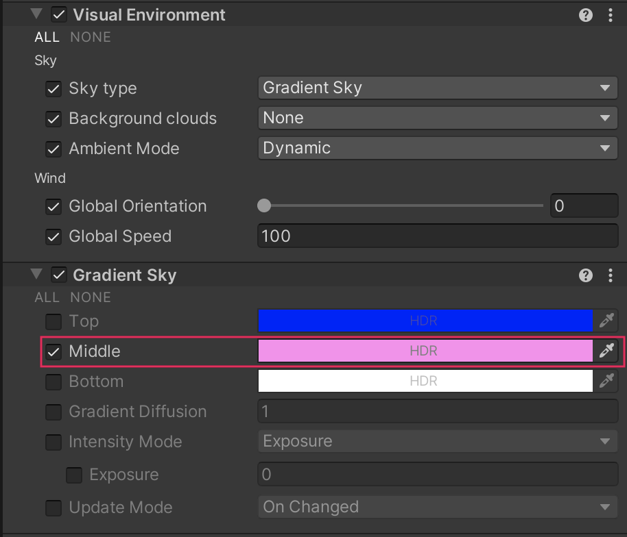

# Set the type of sky

The Visual Environment Volume component override specifies the **Sky Type** that HDRP renders in the Volume.

## Using the Visual Environment

The **Visual Environment** uses the [Volume](understand-volumes.md) framework, so to enable and modify **Visual Environment** properties, you must add a **Visual Environment** override to a [Volume](understand-volumes.md) in your Scene.

The **Visual Environment** override comes as default when you create a **Scene Settings** GameObject (Menu: **GameObject** > **Volumes** > **Sky and Fog Global Volume**). You can also manually add a **Visual Environment** override to any [Volume](understand-volumes.md). To manually add **Visual Environment** to a Volume:

1. In the Scene or Hierarchy view, select a GameObject that contains a Volume component to view it in the Inspector.
2. In the Inspector, go to **Add Override** and select **Visual Environment**.

You can use the **Visual Environment** override to control the sky and fog for this Volume.

[!include]

## Changing sky settings

After you have set your **Sky Type**, if you want to override the default settings, you need to create an override for them in a Volume. For example, if you set the **Sky Type** to **Gradient Sky**, select **Add Override** on your Volume and add a **Gradient Sky** override. Then you can disable, or remove, the **Procedural Sky** override because the Visual Environment ignores it and uses the **Gradient Sky** instead.

* To disable the override, disable the checkbox to the left of the **Procedural Sky** title .
* To remove the override, click the drop-down menu to the right of the title and select **Remove** .

On the [Gradient Sky](gradient-sky-volume-override-reference.md) override itself, you can enable the checkboxes next to each property to override the property with your own values. For example, enable the checkbox next to the **Middle** property and use the color picker to change the color to pink.

Refer to the [Visual Environment Volume Override reference](visual-environment-volume-override-reference.md) for more information.