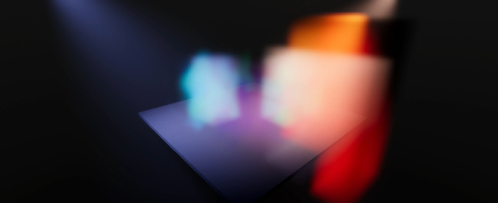
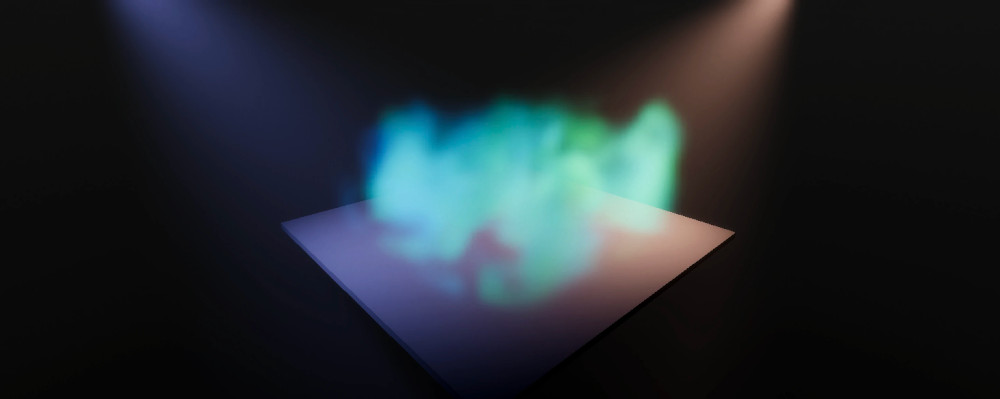
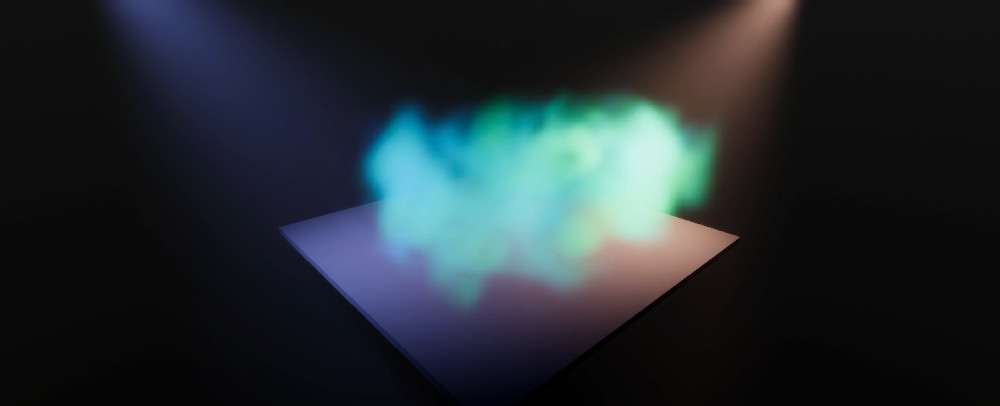
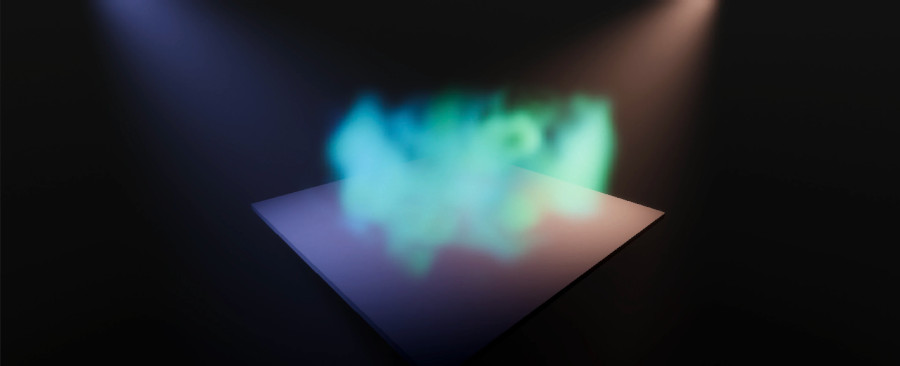
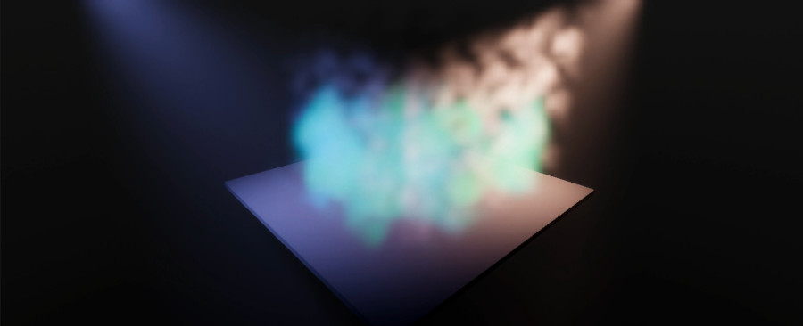
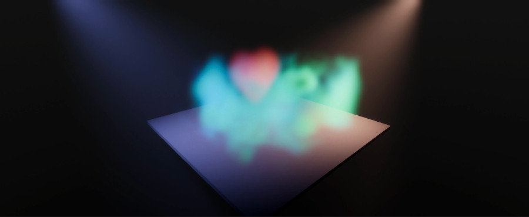

# Set up a volumetric sample scene

1. Select **Window** > **Package manager**.

1. In the **Package manager** window, select **High Definition RP**.

1. In the **Samples** tab, import the **Volumetric Samples**.

1. In the **Project** window, go to **Assets** > **Samples** > **High Definition RP** > HDRP version number > **Volumetric samples** > **Scenes.**

1. Select the **Volumetric Samples scene.**

1. Go to **Assets** > **Samples** > **High Definition RP** > HDRP version number > **Volumetric sample**s > **Prefabs**.

1. Drag one of the following sample prefabs in your scene:

**3D Texture Mask Sample**

**About Blending Modes**

**Cloudy Sample**

**Foggy Orb and Light Sample**

**Fumes Sample**

**Ground Smoke Prefab Sample**

**Procedural Noise Fog Sample**

**Volumetric Heart Sample**
