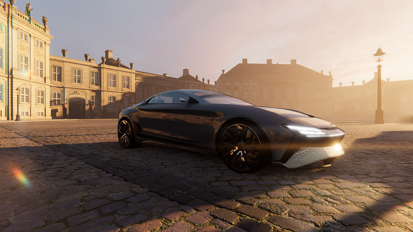

# Add screen space lens flares

The **Screen Space Lens Flare** override adds lens flares to your scene.

To calculate lens flares, the High-Definition Render Pipeline (HDRP) fetches bright areas of the current image, such as emissive lights and bright specular reflections. HDRP then draws the same areas back to the screen in different locations and using different effects such as stretch, blur, and chromatic aberration.

The **Screen Space Lens Flare** creates lens flares from the following:

- Emissive surfaces.
- Bright spots in your scene that appear depending on the camera view, for example a bright specular reflection on a shiny metal object, or a bright outside area viewed from a dark indoor area.
- All onscreen lights.

You can use the [Lens Flare (SRP)](lens-flare-component.md) component instead to create a flare for a light that has a specific position in the scene. You can also use both the **Lens Flare (SRP)** component and the **Screen Space Lens Flare** override in the same scene.

## How screen space lens flares work

The bright areas HDRP uses to calculate screen space lens flares are the same areas the [Bloom override](../../Post-Processing-Bloom.md) brightens.

HDRP uses the same buffer as the Bloom override to fetch the bright areas and render the lens flares. The settings in the Bloom override affect the appearance of screen space lens flares. 

You can create the following types of lens flare:

- Regular flares, which are a brightened distorted version of the bright areas of the screen.
- Reversed flares, which are regular flares flipped upside-down and reversed.
- Warped flares, which are regular flares transformed using polar coordinates, to mimic a circular camera lens.
- Streaks, which are flares stretched in one direction, to mimic an anamorphic camera lens. 

You can control which types of flares appear and how many there are. You can also control the chromatic aberration effect HDRP adds to the flares.

 
The left image shows an emissive cube with bloom but no lens flares. The right image shows the same cube and a regular flare (top-left), a reversed flare (bottom-right), a warped flare (top-right) and streaks (to the left and right of the cube). 

## Enable screen space lens flares

[!include]

To enable screen space lens flares, follow these steps:

1. Go to **Edit** > **Project Settings** > **Graphics** > **HDRP Global Settings** > **Frame Settings (Default Values)** > **Rendering**.
2. Enable **Lens Flare Screen Space**.

## Use screen space lens flares

1. Add a [Volume](../../understand-volumes.md) to your scene and select it.
2. In the Inspector, select **Add Override** > **Post-processing** > **Screen Space Lens Flare**.
3. Set **Intensity** to a value higher than 0.
4. If you have a [Bloom override](../../Post-Processing-Bloom.md) in the volume, set **Intensity** in the Bloom override to a value higher than 0 or lens flares won't appear.

If lens flares don't appear, check the settings of the **Bloom** override in the default volume in **Edit** > **Project Settings** > **Graphics** > **HDRP Global Settings** > **Frame Settings (Default Values)** > **Default Volume Profile Asset** > **Bloom**.

For information about screen space lens flare properties, refer to [Screen Space Lens Flare reference](reference-screen-space-lens-flare.md).

[!include]

## Debug screen space lens flares

You can use the [Rendering Debugger](../../use-the-rendering-debugger.md) to display the lens flares HDRP generates.

1. Select **Window** > **Analysis** > **Rendering Debugger**.
2. Select **Rendering**.
3. Set **Debug Mode** to **LensFlareScreenSpace**.
