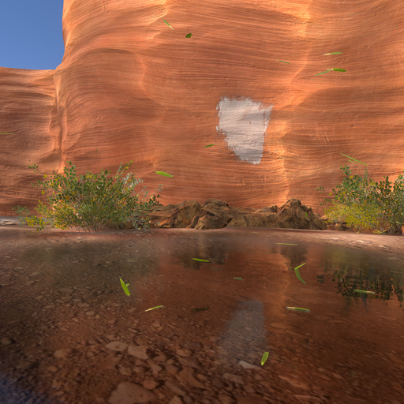
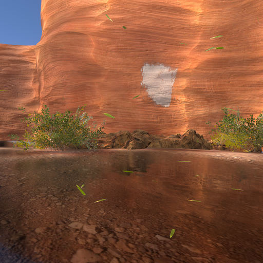
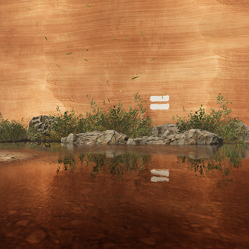

## Tracing modes

The properties visible in the Inspector change depending on the option you select from the **Tracing** drop-down:

- To use a screen-space, ray-marched solution, select **Ray Marching** and see [Screen-space](#screen-space) for the list of properties.
- To use ray tracing, select **Ray Tracing** and see [Ray-traced](#ray-traced) for the list of properties.
- To use a combination of ray tracing and ray marching, select **Mixed** and see [Ray-traced](#ray-traced) for the list of properties. For more information about mixed tracing mode, see [mixed tracing](#mixed-tracing)

### Mixed tracing

This option uses ray marching to intersect on-screen geometry and uses ray tracing to intersect off-screen geometry. This enables HDRP to include on-screen opaque particles, vertex animations, and decals when it processes the effect. This option only works in [Performance mode](../Ray-Tracing-Getting-Started.md#ray-tracing-mode) and with Lit Shader Mode setup to Deferred.

In Mixed tracing mode, HDRP processes screen-space ray marching in the GBuffer. This means that it can only use GameObjects rendered using the [deferred](../Forward-And-Deferred-Rendering.md) rendering path. For example, HDRP renders transparent GameObjects in the forward rendering path which means they don't appear in the GBuffer or in effects that use mixed tracing.

In Mixed tracing mode, HDRP still uses ray tracing for any geometry inside the ray tracing acceleration structure, regardless of whether vertex animation or decals modify the geometry's surface. This means if HDRP fails to intersect the on-screen deformed geometry, it intersects the original mesh inside in the ray tracing acceleration structure. This may cause visual discrepancies between what you see and what you expect. For example, the following Scene contains a cliff that uses mesh deformation.

In this Scene, Mixed mode can include reflections for the opaque leaf particles, the white decal, and GameObjects that aren't visible in the cliff face's non-deformed geometry.

Reflection rays intersect with the original, non-deformed cliff face geometry. This means the rays can still be affected by the bush behind the rock. To view the Scene from the perspective of the ray tracing mode, refer to the following image.

This image shows the elements of the Scene that ray tracing takes into account. The non-deformed cliff face geometry reveals the bushes behind the rocks.

### Tracing Modes Limitation

#### Ray Marching

* Transparent Emissive Material are only taken into account when you set Rendering Pass to **Before Refraction**.

#### Ray Tracing

* Transparent Emissive Material aren't taken into account.
* No [decals](decals.md) are supported including Emissive Decals.

#### Mixed Tracing

* The Mixed tracing mode is only useful if you set the Lit shader mode to **Deferred** and have the same limitation than Ray Tracing mode.
