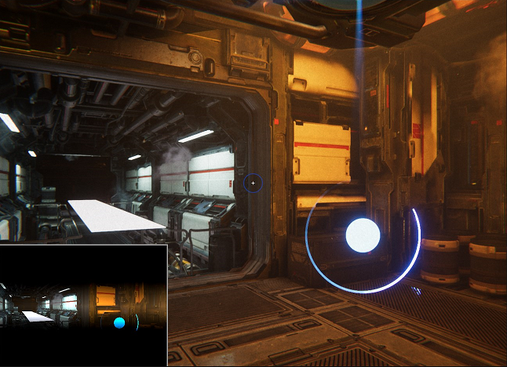
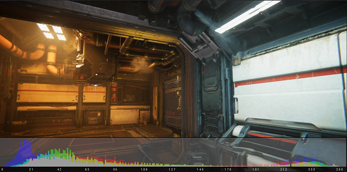

# Debug exposure

The High Definition Render Pipeline (HDRP) includes options to debug [exposure](Override-Exposure.md) in the [Debug window](use-the-rendering-debugger.md).

## Scene EV100 Values

This debug mode shows a heat map of the scene luminance converted to [EV100](Physical-Light-Units.md#EV) units across the screen. This is useful to determine the distribution of intensity across the screen which can help you to identify whether you have set the right exposure limits. It's also an informative view on how the brightness is distributed in your scene.

Furthermore, this debug view shows the numerical value of the pixel at the center of the screen. It also displays this value in the heatmap indicator at the bottom of the screen to show where it's relative to the full range.

## Histogram View

In **Automatic Histogram** mode, if may be difficult to set the upper and lower brightness percentages without a references. To help with this, HDRP includes the Histogram debug view which shows an overview of what the scene brightness distribution looks like.

There are two places this debug mode displays information:

- On the screen
- On a histogram at the bottom of the screen.

Both of these methods display whether the exposure algorithm accepts or excludes a particular brightness value. To do this on the screen, the debug mode overlays excluded pixels with a particular color. The histogram draws bars that use the same colors to display the range of brightness values and their validity. The colors correspond to:

- **Blue**: The brightness value is below the lower percentile and is excluded.
- **Red**: The brightness value is above the higher percentile and is excluded.
- **White**: The brightness value is between the upper and lower percentiles and is accepted.

At the bottom of the histogram, a yellow arrow points to the target exposure, while a grey arrow points at the current exposure.

If you enable the **Show Tonemap Curve** option, the debug view overlays the curve used to tonemap to the histogram view.

By default, the values on the x-axis are fixed, however, you can also make the histogram fix around the current exposure. To do this, enable the **Center Around Exposure** option. This can be useful to fix the tonemap curve overlay and have a clearer view on how the scene distributes under that curve.

#### Metering Weighted

The Metering Weighted debug view displays the scene alongside a picture of what the scene looks like after HDRP weights it with the metering mask. This is useful to set up the procedural metering masks or determine the right texture mask.

#### Final Image Histogram

The final image histogram debug view displays the scene alongside an overlay representing the histogram of the image after all post-processing (tonemapping and gamma correction included) is applied. This histogram has 256 bins to map to 8-bit image values.
This view can display both luminance histogram or RGB channels represented separately.

