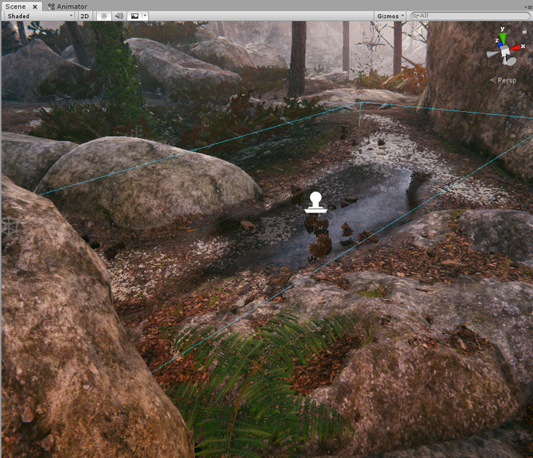

# Understand decals

The High Definition Render Pipeline (HDRP) includes the following ways to create decals in a Scene.

- Use a Decal Mesh and manually position the decal.
- Use the [Decal Projector](decal-projector-reference.md) component to project the decal.

To use these methods, you need to create a decal Material. A decal Material is a Material that uses the Decal Shader or Decal Master Stack. You can then place or project your decal Material into a Scene.

Refer to [Use decals](use-decals.md) for more information.

## Decal Projector

When the Decal Projector component projects decals into the Scene, they interact with the Scene’s lighting and wrap around Meshes. You can use thousands of decals in your Scene simultaneously because HDRP instances them. This means that the rendering process is not resource intensive as long as the decals use the same Material.

The Decal Projector also supports [Decal Layers](use-decals.md#decal-layers) which means you can control which Materials receive decals on a Layer by Layer basis.

## Limitations

- A Decal Projector can only affect transparent Materials when you use the [Decal Shader](decal-material-inspector-reference.md).

- The Decal Shader does not support emissive on Transparent Materials and does support Decal Layers.

- Decal Meshes can only affect opaque Materials with either a [Decal Shader](decal-material-inspector-reference.md) or a [Decal Master Stack](decal-master-stack-reference.md).

- Decal Meshes do not support Decal Layers.

### Migration of data previous to Unity 2020.2

When you convert a project from 2020.2, Mesh renderers and Terrain do not receive any decals by default.

This is because, before Unity 2020.2, the default value for the **Rendering Layer Mask** for new Mesh Renderers and Terrain doesn't include Decal Layer flags.
