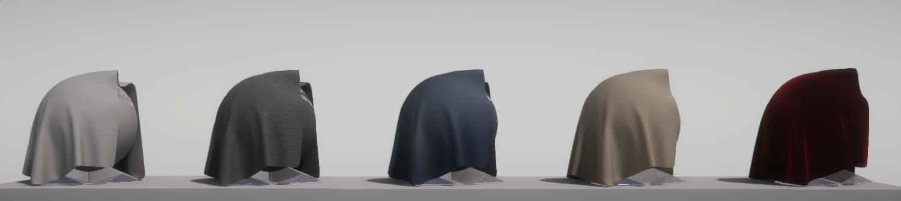
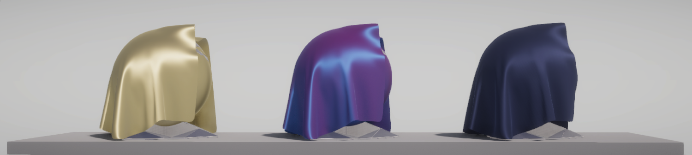

# Understand fabrics

## Cotton/Wool shader

The Cotton/Wool shader is your starting point for rendering diffuse fabrics in the High Definition Render Pipeline (HDRP). You can use the Cotton/Wool shader to create fabrics like cotton, wool, linen, or velvet.

The type of fibers that make up the fabric, as well as the fabric's knit or weave, influence the appearance of the fabric. Natural fibers are typically rougher so they diffuse light.

The Cotton/Wool shader is a pre-configured Shader Graph. To learn more about the Cotton/Wool shader implementation, or to create your own Fabric shader variant, see the Shader Graph documentation about the [Fabric Master Stack](fabric-master-stack-reference.mdd).

Refer to [Create a fabric material](create-a-fabric-material.md) for more information.

## Silk shader

The Silk shader is your starting point for rendering anisotropic fabrics in the High Definition Render Pipeline (HDRP). You can use the Silk shader to create fabrics like silk, satin, nylon, and polyester.

Silk and other synthetic fibers are usually smoother than natural fibres because they're produced as a single smooth filament. When these fibres are woven together, it produces a fabric with anisotropic specular highlights.

The Silk shader is a pre-configured Shader Graph. To learn more about the Silk shader implementation, or to create your own Silk shader variant, see the Shader Graph documentation about the [Fabric Master Stack](fabric-master-stack-reference.md).

Refer to [Create a fabric material](create-a-fabric-material.md) for more information.

## Fabric Shader Graph

The Fabric Master Stack enables you to render various types of fabric in the High Definition Render Pipeline (HDRP). It uses either cotton wool or anisotropic silk as its base, and supports various additional effects such as [Subsurface Scattering](skin-and-diffusive-surfaces-subsurface-scattering.md) to create realistic looking fabrics.

Refer to [Create a fabric material](create-a-fabric-material.md) for more information.

[!include]

[!include]
