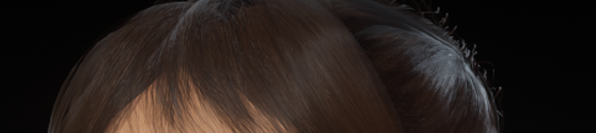

# Understand hair and fur

You can use the Hair shader or the Hair Shader Graph as a starting point for rendering hair and fur in the High Definition Render Pipeline (HDRP). To create a realistic looking hair effect, the Hair shader and the Hair Shader Graph use layers called hair cards. Each hair card represents a different section of hair. If you use semi-transparent hair cards, you must manually sort them so that they're in back-to-front order from every viewing direction.

The Hair shader is a pre-configured Shader Graph.

Refer to [Create hair](create-a-hair-and-fur-material.md) for more information.
